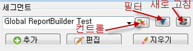
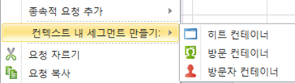
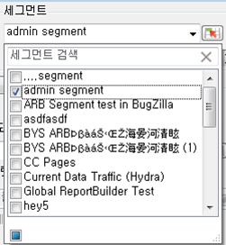
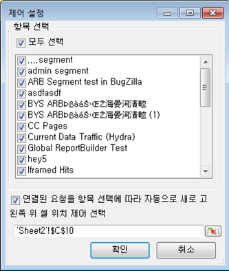
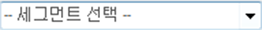
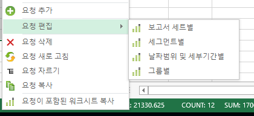

# 세그먼트 관리

Report Builder에서 Adobe Analytics 세그먼트 추가, 편집, 적용 및 필터링 방법

Report Builder는 요청 마법사의 1단계에 세그멘테이션 패널을 제공합니다. 이 패널에서 다음을 수행할 수 있습니다. 세그먼트를 만들고 관리합니다.

## 세그먼트 추가 또는 편집 {#section_B2BC136F9A53498D90C7C2ECC5DB892B}

>[!NOTE]
>
>세그먼트를 추가하거나 편집하려면 리포트 빌더 세그먼트 인터페이스가 Microsoft Internet Explorer 창에서 Analytics 세그먼트 빌더를 실행합니다. Report Builder 세션은 활성 상태를 유지합니다. Internet Explorer 이외의 브라우저는 이 작업에 지원되지 않습니다.

1. 요청 마법사 1단계의 세그먼트 패널에서 **[!UICONTROL 추가를 클릭합니다]**.
1. Internet Explorer 창이 표시되면서 Analytics 세그먼트 빌더 인터페이스가 열립니다. 세그먼트 빌드 방법에 대한 자세한 내용은 [https://marketing.adobe.com/resources/help/en_US/analytics/segment/](https://marketing.adobe.com/resources/help/en_US/analytics/segment/)를 참조하십시오.
1. 세그먼트를 정의하고 저장한 후에 요청 마법사로 돌아갑니다.
1. 새로 고침 아이콘을 클릭하여 세그먼트 목록을 새로 고칩니다.

>[!IMPORTANT]
>
>새로 고침을 수행하지 않으면 이 목록은 캐시되고 새로 만든 세그먼트는 나타나지 않습니다.

## 컨텍스트 내 세그먼트 만들기 {#section_6DD2C663B2854469AA1075438F907678}

세그먼트로 전환하려는 특정 보고서 차원 조합이 있을 수 있습니다. Report Builder 인터페이스에서 이러한 세그먼트를 만들 수 있습니다. 예를 들어 페이지 요청 출력에서 몇 개의 페이지를 선택하고 이러한 값을 기준으로 세그먼트를 만듭니다.

1. 세그먼트로 전환할 보고서 출력 항목을 선택합니다.
1. 마우스 오른쪽 단추를 클릭하여 **[!UICONTROL 컨텍스트 내 세그먼트 만들기]를 선택하고 적절한 컨테이너(히트 컨테이너, 방문 컨테이너, 방문자 컨테이너)를 지정합니다.**

   

   컨테이너에 대한 자세한 내용은 [세그멘테이션 가이드](https://marketing.adobe.com/resources/help/en_US/analytics/segment/)를 참조하십시오.

1. 이제 세그먼트 빌더 UI가 Internet Explorer에서 시작됩니다. 세그먼트 빌더 UI는 사용자가 지정한 컨테이너 및 필터로 초기화됩니다.
1. 세그먼트에 이름 및 설명을 추가한 후에 저장합니다.
1. Report Builder로 돌아간 후 새로 고침 아이콘을 클릭하여 세그먼트 목록을 새로 고칩니다.
1. 이제 이 세그먼트를 적용할 수 있습니다.

## 세그먼트 검색 및 적용 {#section_CACA269B48E94CFD91C2D5A15E9C77B7}

Reports &amp; Analytics, Ad Hoc Analysis, Report Builder 또는 Data Warehouse에서 만든 모든 세그먼트가 이 세그먼트 목록에 표시됩니다. To refresh the list, click the Refresh icon ( .

지정된 요청에 하나 또는 여러 개의 세그먼트를 적용할 수 있습니다. 여기에는 순차적 세그먼트가 포함됩니다.

1. **[!UICONTROL 세그먼트]** 드롭다운 목록으로 이동하고** 세그먼트[!UICONTROL 선택]** 상자에 있는 작은 아래쪽 화살표를 클릭하여 모든 세그먼트를 표시합니다.

   

1. 적용할 세그먼트를 선택합니다.

>[!NOTE]
>
>관리자 또는 관리자가 아닌 경우 리포트 빌더에서 소유하는 세그먼트와 사용자와 공유된 세그먼트만 볼 수 있습니다. (마케팅 Reports &amp; Analytics 사용자 인터페이스에서 관리자는 조직의 모든 세그먼트를 볼 수 있습니다.)

## 세그먼트 필터링 {#section_376E986D3E684999A7CDB08E53854159}

필터 아이콘을 클릭하여 세그먼트를 **필터링**&#x200B;합니다.

사용 가능한 필터:

| 필터 이름 | 설명 |
|---|---|
| 태그 | 특정 태그가 있는 세그먼트만 필터링할 수 있습니다. 태그 필터는 AND 연산자를 사용합니다. 두 태그를 선택하면 오른쪽 창에 **두** 태그가 모두 지정된 세그먼트가 표시됩니다. |
| 소유자 | 소유자별로 세그먼트를 필터링할 수 있습니다. 소유자 필터는 OR 연산자를 사용합니다. 두 명의 소유자를 선택하면 오른쪽 창에 **둘 중 하나의** 소유자가 소유한 세그먼트가 표시됩니다. |
| 기타 필터 &gt; *보고서 세트 이름*&#x200B;만 | If you apply the "Only *report suite name*" filter in the Segment Builder in [!DNL marketing reports & analytics], and then display the Advanced Filter in [!DNL report builder], the Advanced filter will display the segment for the selected report suite only. |
| 기타 필터 &gt; 내 세그먼트 | 소유한 모든 세그먼트를 표시합니다. |
| 기타 필터 &gt; 나와 공유 | 다른 사람이 사용자와 공유한 모든 세그먼트를 표시합니다. |
| 기타 필터 &gt; 즐겨찾기 | 즐겨찾기로 표시한 모든 세그먼트를 표시합니다. |
| 기타 필터 &gt; 승인됨 | 공식적으로 승인한 모든 세그먼트를 표시합니다. |

## 통합 문서에 세그먼트 컨트롤 추가 {#section_E3E5149A8464441FA5445A98DBD520AC}

세그먼트 컨트롤을 추가하면 요청 마법사로 이동할 필요 없이 통합 문서 내에서 세그먼트 간을 전환할 수 있습니다.

1. Click the Control icon ( ) next to the segment drop-down.

   

1. 세그먼트 컨트롤에 표시할 모든 세그먼트를 선택하거나 **[!UICONTROL 모두 선택을 선택합니다]**.
1. **[!UICONTROL 연결된 요청을 항목 선택에 따라 자동으로 새로 고칩니다. 옵션을 확인합니다]**.

   * 이 옵션이 선택되어 있으면 이 컨트롤을 사용하는 모든 요청이 새로 고쳐집니다.
   * 이 옵션이 선택되어 있지 않으면 연결된 요청 매개 변수가 업데이트되지만 요청은 새로 고쳐지지 않습니다.

1. 세그먼트 컨트롤의 왼쪽 위 셀 위치를 지정합니다.
1. **[!UICONTROL 확인]을 클릭하면 지정된 위치에 세그먼트 컨트롤이 나타납니다.**

   

## 세그먼트 목록 새로 고침 {#section_22E4A86789444B4A998532396B476EFB}

Any time you add a new segment or edit an existing one, you should click the Refresh icon (  to refresh the cached list of segments.

## 요청에 있는 세그먼트 관리 {#section_C3D63FCBE1A94369A319243313B03C93}

Report Builder v5.4 이전에는 여러 요청에서 세그먼트를 변경했습니다. 그렇지만 이 프로세스를 수행하면 항상 기존 세그먼트가 변경되었습니다. 사용자가 각 요청에 새 세그먼트를 한 개 추가하려고 해도 세그먼트를 추가하면 각 요청에 이미 할당된 이전 세그먼트 집합이 삭제되므로 이 방법을 사용할 수 없었습니다.

Report Builder 5.4에서는 여러 요청에 대해 세그먼트 추가, 제거, 바꾸기 및 모두 바꾸기를 수행할 수 있습니다.

1. 통합 문서에서 여러 요청을 선택합니다.
1. Right-click and select **[!UICONTROL Edit Requests]** &gt; **[!UICONTROL By Segment]**.

   

1. 그룹 편집 대화 상자에서 다음 네 가지 옵션 중 하나를 선택합니다.

   | 옵션 | 설명 |
   |---|---|
   | 세그먼트 추가 | 현재 세그먼트 목록에 추가할 세그먼트를 한 개 이상 선택합니다. |
   | 세그먼트 바꾸기 | 한 개 이상의 세그먼트로 교체할 세그먼트를 선택합니다. |
   | 다음으로 모든 세그먼트를 바꾸기 | 현재 세그먼트를 대체할 한 개 이상의 세그먼트를 선택합니다. |
   | 세그먼트 제거 | 요청에서 세그먼트를 제거합니다. |

