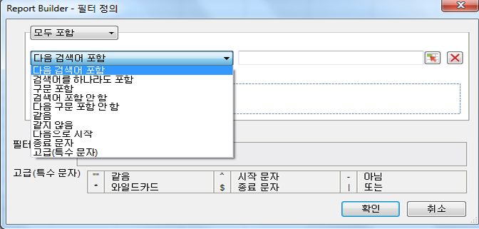

# 차원 필터링 개요

행 레이블 그리드에 추가할 차원을 필터링할 수 있습니다. 필터는 요청으로 반환된 데이터의 범위를 좁히며, 피벗 또는 사용자 지정 레이아웃에서 적용할 수 있습니다. 피벗 레이아웃에서 차원 필터링을 구성할 때 셀의 항목 수를 추가로 지정할 수 있습니다.

선택한 필터 양식이 Report Builder 요청에서 선택한 요소 및 지표를 기반으로 채워집니다.

## Define filter - values and special characters {#section_15840216A4044C40974945FAA435AD93}

Information about filters in the **[!UICONTROL Most Popular Filter]** &gt; **[!UICONTROL Define Filter]** panel.

다음 표에는 필터에 대한 예제와 정보가 나와 있습니다.

<table id="table_8AC3A26FF02143DBA949B30F2A46CF11"> 
 <thead> 
  <tr> 
   <th colname="col1" class="entry"> 필터 </th> 
   <th colname="col02" class="entry"> 설명 </th> 
   <th colname="col2" class="entry"> 필터 예 </th> 
   <th colname="col3" class="entry"> 일치 결과 </th> 
  </tr> 
 </thead>
 <tbody> 
  <tr> 
   <td colname="col1"> 
다음 검색어 포함 
 </td> 
   <td colname="col02"> 
모든 순서의 공백으로 구분된 모든 값을 포함합니다. 
 </td> 
   <td colname="col2"> 
a b c 
 </td> 
   <td colname="col3"> 
matches  A B CAND B A C등. 
 </td> 
  </tr> 
  <tr> 
   <td colname="col1"> 
검색어를 하나라도 포함 
 </td> 
   <td colname="col02"> 
필터 중 하나 이상(공백으로 구분)을 포함합니다. 
 </td> 
   <td colname="col2"> 
A B C 
 </td> 
   <td colname="col3"> 
matches  a 1,  b 2,  c 3이지만  d 4는 아닙니다. 
 </td> 
  </tr> 
  <tr> 
   <td colname="col1"> 
구문 포함 
 </td> 
   <td colname="col02"> 
검색 필터를 포함하며 다른 검색어도 포함할 수 있습니다. 
 </td> 
   <td colname="col2"> 
abc 
 </td> 
   <td colname="col3"> 
matches  ABC 및  ABC def. 
 </td> 
  </tr> 
  <tr> 
   <td colname="col1"> 
검색어 포함 안 함 
 </td> 
   <td colname="col02"> 
입력하는 값이 포함되지 않은 경우 모든 검색을 반환합니다. 
 </td> 
   <td colname="col2"> 
a b c 
 </td> 
   <td colname="col3"> 
matches  D E F 이지만  C D E F는 아닙니다. 
 </td> 
  </tr> 
  <tr> 
   <td colname="col1"> 
다음 구문 포함 안 함 
 </td> 
   <td colname="col02"> 
해당 구문을 포함하지 않는 모든 검색을 반환합니다. 
 </td> 
   <td colname="col2"> 
abc 
 </td> 
   <td colname="col3"> 
excludes  ABC,  ABC DEF 및 일치  DEF 
 </td> 
  </tr> 
  <tr> 
   <td colname="col1"> 
같음 
 </td> 
   <td colname="col02"> 
완전 일치 검색을 반환합니다. 
 </td> 
   <td colname="col2"> 
abc 
 </td> 
   <td colname="col3"> 
  abc 가 반환되고 다른 항목이 없습니다. 
 </td> 
  </tr> 
  <tr> 
   <td colname="col1"> 
같지 않음 
 </td> 
   <td colname="col02"> 
해당 항목과 정확히 일치하지 않는 모든 검색을 반환합니다. 
 </td> 
   <td colname="col2"> 
a 
 </td> 
   <td colname="col3"> 
일치하지 않음  a. 
 
Matches  a b c. 
 
Matches  abc. 
 </td> 
  </tr> 
  <tr> 
   <td colname="col1"> 
다음으로 시작 
 </td> 
   <td colname="col02"> 
특정 값으로 시작하는 결과를 반환합니다. 
 </td> 
   <td colname="col2"> 
abc 
 </td> 
   <td colname="col3"> 
matches  abcd but not  1 abc 
 </td> 
  </tr> 
  <tr> 
   <td colname="col1"> 
다음으로 끝남  
 </td> 
   <td colname="col02"> 
특정 값으로 끝나는 결과를 반환합니다. 
 </td> 
   <td colname="col2"> 
xyz 
 </td> 
   <td colname="col3"> 
matches  wxyz 하지만  wxyz 0는 아님 
 </td> 
  </tr> 
  <tr> 
   <td colname="col1"> 
고급(특수 문자)  
 </td> 
   <td colname="col02"> 
정규 표현식 문자를 사용할 수 있습니다. 
 
 <code> "", ^, -, *, $, | </code> 
 </td> 
   <td colname="col2"> 
"^Home*Page$" | sports 
 </td> 
   <td colname="col3"> 
 여기서는  Home, 그런 다음 0 개 이상의 문자를 찾은 다음  페이지로 끝납니다. 
 
 또한 스포츠가 포함된 모든 페이지 
 
몇 가지 일치하는 예는 다음과 같습니다. 
 
    <ul id="ul_72D76C5AFEAF405E8A0E4E3C604D10AE"> 
     <li id="li_4D490059B667450DA8A0103167C7B391">HomePage </li> 
     <li id="li_1351619156274092AEB2771D882AD357">Home 및 (다른 문자) Page </li> 
     <li id="li_940EAA99A8CF49308E8471065EB317B1">Home sports </li> 
     <li id="li_50A895F14A454BE9BF06EE0F07F99B3B">sports Page </li> 
     <li id="li_F3CE0D07941D4C2485D2DE0B73E00677">sports </li> 
     <li id="li_E84C15C061824A5D922D9900392F2996">xyz sports abc </li> 
    </ul> </td> 
  </tr> 
 </tbody> 
</table>

<table id="table_8BBB06C8860745DEA41B39673699DC0F"> 
 <thead> 
  <tr> 
   <th colname="col1" class="entry"> 특수 문자 </th> 
   <th colname="col2" class="entry"> 용도 </th> 
   <th colname="col3" class="entry"> 내용 </th> 
  </tr> 
 </thead>
 <tbody> 
  <tr> 
   <td colname="col1"> " " </td> 
   <td colname="col2"> 같음 </td> 
   <td colname="col3"> 
다른 따옴표와 짝이 맞지 않는 한 이스케이프되지 않습니다. 예를 들어  17 "표시는 구문이 아닙니다. 
 </td> 
  </tr> 
  <tr> 
   <td colname="col1"> * </td> 
   <td colname="col2"> 와일드카드 </td> 
   <td colname="col3"> 
정규 표현식에서 사용되는 별표와 동일합니다. 
 </td> 
  </tr> 
  <tr> 
   <td colname="col1"> ^ </td> 
   <td colname="col2"> 다음으로 시작 </td> 
   <td colname="col3"> </td> 
  </tr> 
  <tr> 
   <td colname="col1"> $ </td> 
   <td colname="col2"> 다음으로 끝남 </td> 
   <td colname="col3"> </td> 
  </tr> 
  <tr> 
   <td colname="col1"> - </td> 
   <td colname="col2"> 아님 </td> 
   <td colname="col3"> </td> 
  </tr> 
  <tr> 
   <td colname="col1"> | </td> 
   <td colname="col2"> 또는 </td> 
   <td colname="col3"> 
지원되는 경우에만  고급 (특수 문자) 필터를 참조하십시오. 
 </td> 
  </tr> 
 </tbody> 
</table>