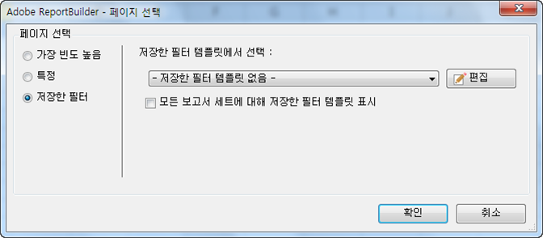

# 저장된 필터

Report Builder에서 필터나 다른 매개 변수를 저장하고 다른 워크시트 또는 통합 문서에서 사용할 수 있습니다. 이 매개 변수들은 Analytics에 저장되어 다른 Report Builder 사용자들이 다른 컴퓨터에서 사용할 수 있습니다.

필터를 만들면 [!UICONTROL 페이지 선택] 양식에서 필터를 저장합니다. 이 절차의 예가 필요하면 [특정 필터](../../../../analyze/report-builder/layout/c-filter-dimensions/t-specific-filters.md#task_AD91873FD9FF4399A62EAB495DFFA12C).

