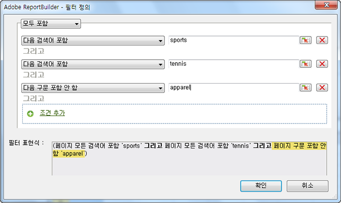
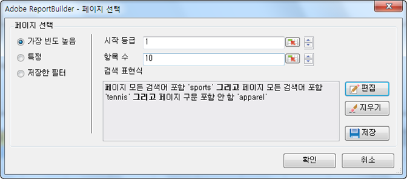

# 가장 자주 사용하는 필터링

AND/OR 검색 표현식과 함께 부울 로직을 사용하여 구성하는 등급 및 조건부 필터.

Most Popular filters are expression filters that you configure using Boolean logic with AND/OR conditions, such as [!UICONTROL Page does not contain]*`<product name>`* with conditions or groups of conditions like [!UICONTROL Includes All], [!UICONTROL Includes Any], or [!UICONTROL Excludes All]. 이 통합 문서 또는 다른 통합 문서에서 다른 요청에 대해 이러한 표현식을 [저장](/help/analyze/report-builder/layout/c-filter-dimensions/saved-filters.md)할 수 있습니다.

**가장 자주 사용하는 필터를 만드는 방법**

1. 요청을 만들거나 편집한 다음 [!UICONTROL Request Wizard: Step 2]로 진행합니다.

   

1. On the [!UICONTROL Request Wizard: Step 2], click the link next to the dimension in the grid, then choose **[!UICONTROL Filter]**.
1. 양식에서 [!UICONTROL Choose Page] 활성화 **[!UICONTROL Most Popular]**&#x200B;후 다음 옵션을 구성합니다.

   **시작 등급:** 차원의 시작 등급. 기본 등급 1은 보고된 데이터 목록에서 맨 위에 있는 항목을 가리킵니다. For example, for the dimension [!UICONTROL Page], a starting mark of 1 indicates the single most requested page of your site. 10 또는 다른 값을 시작 등급 셀로 지정할 수 있으며 이렇게 되면 최상위 보고서로서 10으로 시작하는 보고서가 만들어집니다. 지표는 활동이 가장 큰 라인 항목이 목록에서 먼저 보고되도록 내림차순으로 배열됩니다. 하나의 요청에 50,000개가 넘는 페이지 이름이 필요하지만 보고할 페이지는 수천 개만 보유하고 있을 경우 요청을 복사하고 시작 등급을 변경하여 50,000개의 블록에서 적절한 데이터를 검색할 수 있습니다.

   **항목 수:** ( [!UICONTROL Pivot Layout] 전용) 날짜 범위 동안 특정 지표에 대해 보고되는 항목 수를 정의합니다. 일부 지표의 경우 한 지표에 대해 수백 개의 항목이 나열될 수 있는 반면 어떤 지표들에 대해서는 단 몇 개만 표시됩니다. For example, for the dimension [!UICONTROL Site Section], a number of entries of 25 indicates that the report shows the 25 most visited pages.

   화살표를 사용하면 시트에서 첫 번째 데이터 포인트의 [!UICONTROL Starting Rank] 및 [!UICONTROL Number of Entries] 을 변경할 수 있습니다. 기본적으로 [!UICONTROL Starting Rank] 는 1로, 그리고 [!UICONTROL Number of Entries] 는 10으로 설정됩니다. 이 값들은 특정 지표들에 대해 최소값 1에서부터 최대값 50,000까지 조정할 수 있습니다. 각 지표에는 자체 천장이 [!UICONTROL Number of Entries]있습니다. 이 필드에 음수 값이나 0은 사용할 수 없습니다. If you choose a [!UICONTROL Starting Rank] as 15 and [!UICONTROL Number of Entries] as 10, data requests for the metric return the 10 most visited pages, where the first most visited page is number 15 in the list for the specific date range. 15번에서 25번까지 등급이 지정된 가장 많이 요청 받은 페이지는 모두 내림차순으로 나열됩니다.

   >[!NOTE]
   >
   >필터를 기존 요청에 적용하면 표시된 데이터가 변경됩니다. 상위 10개의 셀을 $A$1에서 $A$10 [!UICONTROL Pages] 까지의 셀에 매핑하고, 1은 1 [!UICONTROL Starting Rank] 이고, 10은 10으로 매핑한다고 [!UICONTROL Number of Entries]가정합니다. If you change these values to show 1 for [!UICONTROL Starting Rank] and only 3 for [!UICONTROL Number of Entries], the data previously filling cells $A$4 through $A$10 will no longer appear.

1. To create a search expression, click **[!UICONTROL Add]**.

   

1. On the [!UICONTROL Define Filter] form, configure the conditions appropriate for your needs.

   : 셀의 값에 정의된 조건을 찾을 수 있도록 해줍니다.

   **조건 추가:** 표현식에 조건을 추가합니다. 추가할 수 있는 조건 수에는 제한이 없습니다.

1. 클릭 **[!UICONTROL OK]**.

   

1. 양식에서 을 클릭하여 표현식을 [!UICONTROL Choose Page] **[!UICONTROL Save]** 저장합니다.
1. 클릭 **[!UICONTROL OK]**.
