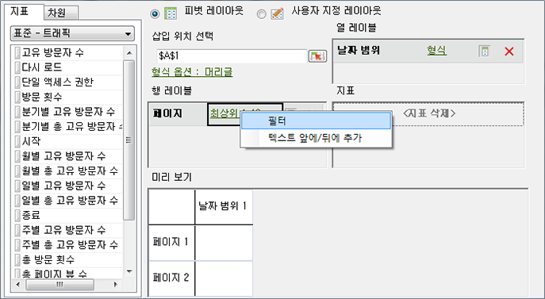
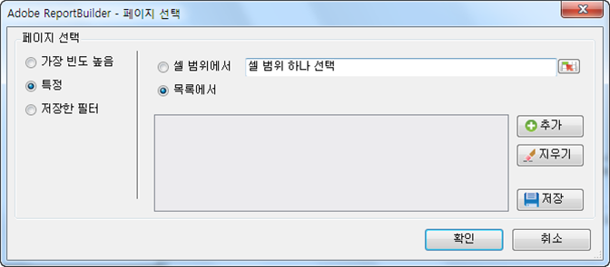

# 특정 필터

특정 차원 용어를 적용하는 필터.

정확한 기준을 만족하는 필터를 만들어 특정 차원 항목에서 검색할 수 있습니다. For example, you can create the following type of filter: page in [!DNL homepage.htm], [!DNL contact_us.html], [!DNL corporate_info.html].

**특정 필터 만드는 방법**

1. Create or edit a request, and advance to the [!UICONTROL Request Wizard: Step 2].

   

1. On the [!UICONTROL Request Wizard: Step 2], click the link next to the dimension in the grid, then choose **[!UICONTROL Filter]**.

   

1. **[!UICONTROL 특정]**&#x200B;옵션을 활성화한 다음 다음 옵션 중 하나를 활성화합니다.

   * **셀 범위에서:** 셀에서 데이터를 선택할 수 있도록 해줍니다. 다음 항목을 선택할 수 있습니다.
   * **범위의 모든 셀:** 범위의 모든 셀을 매핑할 수 있도록 해줍니다. 설명 텍스트가 선택해야 하는 셀 그룹의 수를 알려줍니다. 셀 그룹을 두 개 이상 매핑하려면 Ctrl 키를 눌러 연속적으로 선택합니다. 매핑해야 하는 범위에 셀이 하나만 있을 경우 이 선택 사항은 사용할 수 있는 유일한 선택 사항입니다.
   * **범위의 첫 번째 셀:** 범위의 상단 왼쪽 셀만 선택한 다음 데이터의 방향을 선택합니다. 그리고 요청에 여러 기간이 있을 경우에는 기간의 방향을 선택하고 기간 사이에 있는 설정된 셀 수를 건너뛸지 여부를 선택합니다.
   * **목록에서:** 데이터를 추가할 수 있는 목록에서 데이터를 선택할 수 있도록 해줍니다.
1. **목록에서**&#x200B;를 사용하는 경우 사용할 수 있는 나열된 항목들을 선택하거나 **[!UICONTROL 추가를 클릭합니다]**.

   **[!UICONTROL 추가]**&#x200B;를 클릭하면, [!UICONTROL 목록에서 선택] 양식에 현재 요청 날짜 범위에 대해 사용할 수 있고 처음 10,000개 항목으로 제한되는 차원 값 목록을 표시합니다. 이 항목들에서 검색하거나 **[!UICONTROL 자세히 ...]**&#x200B;를 클릭하여, [!UICONTROL 검색 양식]을 표시하고 더욱 상세한 차원 검색 기준을 만들 수 있습니다.
1. On the [!UICONTROL Select From List], click **[!UICONTROL OK]**.
1. On the [!UICONTROL Choose Page] form, save your Specific filter if you want, then click **[!UICONTROL OK]**.
