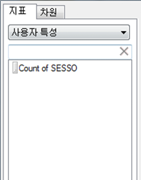
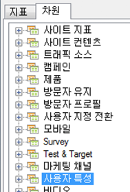

# 고객 속성

사용자 특성은 VisAttr이라는 새로운 유형의 요소에 저장되며 이것은 차원이나 지표로 구성할 수 있습니다.

사용자 특성을 업로드하는 방법에 대한 자세한 내용은 [Experience Cloud 도움말](https://marketing.adobe.com/resources/help/en_US/mcloud/attributes.html)을 참조하십시오.

* VisAttr을 지표로 구성하는 경우 "차원"과 지표 모두로 노출됩니다.

    

* eVar와 동일한 분류를 지원합니다(모두를 무엇으로든 분류 가능).
* VisAttr은 모든 eVar 지표를 지원합니다.
* 지표로서의 VisAttr은 "버킷화"(0~30, 31~60 등 사이트에서 보낸 시간)를 지원합니다.
* VisAttr은 세그멘테이션 차원으로 사용할 수 있습니다.

