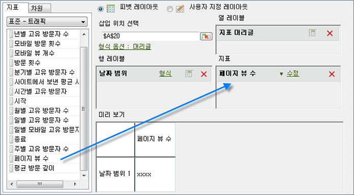
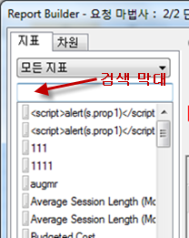
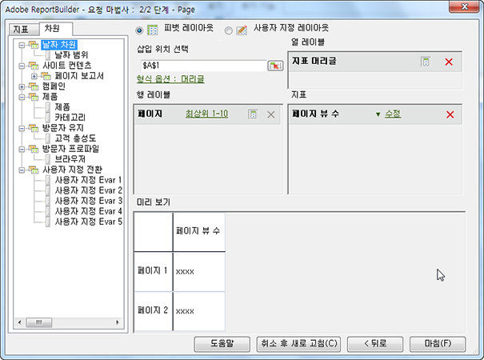

# 지표 및 차원 추가

지표 및 차원을 요청에 추가하는 절차.

1. [요청 마법사에서 데이터 요청을](../../../../analyze/report-builder/data-requests/data-requests.md#concept_E14C1E6B63C44D02BF8D80021B4B0F89) [!UICONTROL 만듭니다. 1 단계]. 다음을 클릭합니다 ****.
1. [!UICONTROL 요청 마법사: 2단계]에서 지표를 두 번 클릭하거나 지표를 원하는 위치로 드래그합니다.

   

   요청 내에서 지표를 여러 번 표시할 수 있으므로 지표를 추가하면 이 지표는 [!UICONTROL 지표] 탭에서 제거되지 않습니다. 예를 들어, 각 값 이외에도 지표 소계를 표시할 수 있습니다. 하지만 사용할 수 있는 지표 목록은 차원을 추가 또는 제거할 때마다 달라집니다.

   [!UICONTROL 지표] 레이아웃 섹션에는 지표만 추가할 수 있습니다. 지표가 [!UICONTROL 열 레이블] 레이아웃에 [!UICONTROL 지표 머리글]로 추가되었습니다. [!UICONTROL 열 레이아웃]에서 [!UICONTROL 행 레이아웃]으로 [!UICONTROL 지표 머리글]을 이동하면 해당 위치에 표시되며 분류에 대한 지표로 사용됩니다.

   검색 창은 지표 목록 바로 위 지표 탭에 표시됩니다.

   

   다음 사항에 주의하십시오.

   * 검색어를 입력하면 목록이 자동으로 업데이트되어 레이블이 검색어와 일치하는 지표만 표시합니다.
   * 일치 항목은 대/소문자를 구분하지 않으며 검색어를 포함하는 값을 검색합니다.
   * 전체 단어 검색, 또는 다른 특수 검색 플래그(다음으로 시작, 다음으로 끝남, AND, OR 등)는 지원되지 않습니다.

      요청 마법사를 종료하거나(즉, [마침] 또는 [취소]를 클릭하면) 요청 마법사 1단계로 돌아가거나 또는 지표 카테고리를 변경하면 검색어가 지워집니다.

      다음의 경우에는 검색어가 지워지지 않습니다.

   * 목록에서 지표 항목 중 하나를 끌어다 놓아서(또는 두 번 클릭해서) [피벗 레이아웃/사용자 지정 레이아웃 지표] 패널에 추가하는 경우.
   * [피벗 레이아웃/사용자 지정 레이아웃 지표] 패널에서 지표 항목을 제거하는 경우.
   * [차원] 탭을 클릭한 다음 [지표] 탭으로 돌아오는 경우.
   * 종료 시 바로 요청 마법사 2단계로 돌아가는 다른 하위 양식(양식 또는 모드 없음)을 호출하는 경우. 이러한 양식의 예는 다음과 같습니다.

      * 차원 필터 양식
      * 날짜 범위 형식 양식
      * 형식 옵션 양식
      * 텍스트 앞에/뒤에 추가 양식
      * 출력 범위 위치 양식

1. (선택 사항) 지표별로 요청을 정렬하려면 지표 레이블을 클릭하면 됩니다.
1. 지표를 추가하는 것과 같은 방식으로 차원을 추가합니다.

[!UICONTROL 차원] 탭에서 시스템은 분류되거나 1단계와 보고서 세트의 구성에서 선택하는 모든 기본 보고서의 분류가 되는 차원을 표시합니다. 차원을 레이아웃 격자에 놓으면 트리 보기에서 차원이 제거되고 사용할 수 있는 남은 차원의 목록이 다시 계산됩니다.

[!UICONTROL 날짜] 차원이 자동으로 추가됩니다. 사용할 수 있는 날짜 차원은 [!UICONTROL 요청 마법사: 1단계]에서 선택한 세부기간에 따라 달라집니다. (유효한 값:

    * hour
    * day
    * week
    * month
    * year
    * date range (세부기간을 지정하지 않은 경우)

1. Modify metrics and dimensions by configuring [format options](../../../../analyze/report-builder/layout/t-format-display-headers.md#task_45C7C4938C2C47FCB02634A1248AA831) and filters.
1. **[!UICONTROL 마침을 클릭합니다]**.
다음 예에서는 [!UICONTROL 페이지] 지표와 관련된 차원입니다. 여기에서 [!UICONTROL 참조 도메인] 차원은 [!UICONTROL 페이지]와 [!UICONTROL 참조 도메인] 간 분류 보고서를 만듭니다. 분류 보고서에 추가할 수 있는 차원들로만 [!UICONTROL 차원] 탭이 업데이트됩니다.

