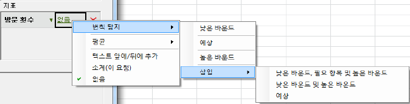
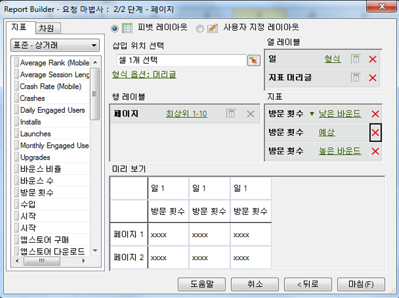

# 예외 항목 탐지 요청 구성

Report Builder에서 예외 항목 탐지 요청을 만드는 방법을 설명하는 단계

1. **사이트 지표** &gt; **[!UICONTROL 트래픽]** 보고서 등과 같이 트렌드 보고서를 선택합니다.
1. In the [!UICONTROL Apply Granularity] menu, select **[!UICONTROL Day]**.

   >[!NOTE]
   >
   >[!UICONTROL 예외 항목 탐지] 메뉴는 일 세부기간을 선택하는 경우에만 사용할 수 있습니다. 선택하는 날짜 범위에 관계없이 통계 데이터 교육 기간으로 이전 30일의 데이터가 사용됩니다.

1. After configuring date ranges, click **[!UICONTROL Next]**.

   단계 결과 1. On the Request Wizard: Step 2 of 2, add a metric, such as **[!UICONTROL Visits]**.

   단계 결과 1. For the added metric, click the **[!UICONTROL None]** link.

   

1. **[!UICONTROL 예외 항목 탐지]** &gt; **[!UICONTROL `<selection>`]**&lt; 선택 항목 &gt;를 선택합니다.

   

   이러한 옵션 중 하나를 선택하면 원래 지표의 예외 항목 탐지 복사본이 만들어집니다. 예를 들어 방문 지표의 경우 하한 방문 지표가 [!UICONTROL 지표] 그룹에 추가됩니다.
1. **[!UICONTROL 마침을]** 클릭하고 Excel로 출력할 셀을 선택합니다.

   See [Anomaly Detection](../../../analyze/analysis-workspace/virtual-analyst/c-anomaly-detection/anomaly-detection.md#concept_9476D6C093334B1A8044AE63835BDBE7) for definitions.
