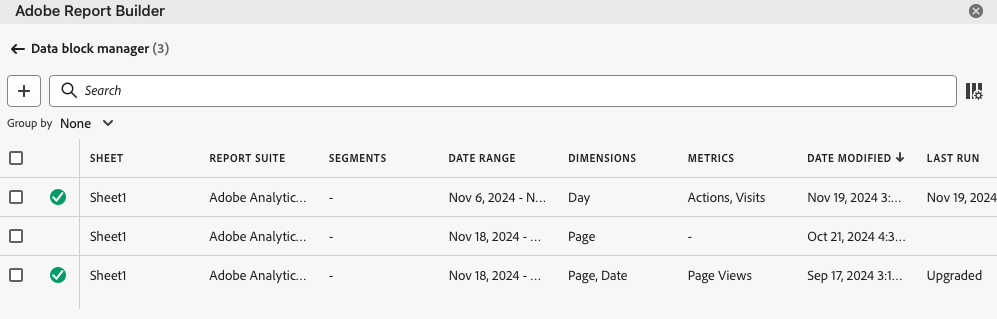

# Report Builder에서 데이터 블록 관리

데이터 블록 관리자를 사용하여 통합 문서의 모든 데이터 블록을 보고 관리할 수 있습니다. 데이터 블록 관리자는 특정 데이터 블록을 신속하게 찾을 수 있는 검색, 필터 및 정렬 기능을 제공합니다. 하나 이상의 데이터 블록을 선택한 후 선택한 데이터 블록을 편집, 삭제 또는 새로 고칠 수 있습니다.

## 데이터 블록 보기

통합 문서의 모든 데이터 블록 목록을 보려면 **관리**&#x200B;를 클릭합니다.

데이터 블록 관리자는 통합 문서에 있는 모든 데이터 블록을 나열합니다. 

## 데이터 블록 목록 정렬

표시된 열을 기준으로 데이터 블록 목록을 정렬할 수 있습니다. 예를 들어 보고서 세트, 차단 목록, 날짜 범위 및 기타 변수를 기준으로 데이터 세그먼트를 정렬할 수 있습니다.

데이터 블록 목록을 정렬하려면 열 제목을 클릭합니다.

## 데이터 블록 목록 검색

검색 필드를 사용하여 데이터 블록 테이블에서 원하는 항목을 찾습니다. 예를 들어 데이터 블록이나 보고서 세트에 포함된 지표를 검색할 수 있습니다. 날짜 범위, 수정된 날짜 또는 마지막 실행 날짜 열에 표시되는 날짜를 검색할 수도 있습니다.

## 데이터 블록 편집

보고서 세트, 날짜 범위 또는 하나 이상의 데이터 블록에 적용된 세그먼트를 편집할 수 있습니다.

예를 들어 하나 이상의 데이터 블록에서 기존 세그먼트를 새 세그먼트로 바꿀 수 있습니다.

1. 업데이트할 데이터 블록을 선택합니다. 최상위 확인란을 선택하여 모든 데이터 블록을 선택하거나 개별 데이터 블록을 선택할 수 있습니다.

   

1. 편집 아이콘을 클릭하여 빠른 편집 창을 표시합니다.

   

1. 보고서 세트, 날짜 범위 또는 세그먼트를 업데이트하려면 세그먼트 링크를 선택합니다.

   

## 데이터 블록 새로 고침

새로 고침 아이콘을 클릭하여 목록의 데이터 블록을 새로 고칩니다.

데이터 블록이 새로 고쳐졌는지 확인하려면 새로 고침 상태 아이콘을 표시합니다.

성공적으로 새로 고침된 데이터 블록이 녹색 원에 확인 표시를 표시합니다. 를 참조하십시오.

새로 고침에 실패한 데이터 블록에는 경고 아이콘이 표시됩니다. .이렇게 하면 데이터 블록에 오류가 있는지 쉽게 식별할 수 있습니다.

## 데이터 블록 삭제

선택한 데이터 블록을 삭제하려면 휴지통 아이콘을 클릭합니다.

## 그룹 데이터 블록

**그룹화 기준** 드롭다운 메뉴를 사용하여 데이터 블록을 그룹화하거나 열 제목을 클릭할 수 있습니다. 데이터 블록을 열별로 정렬하려면 열 제목을 클릭합니다. 데이터 블록을 그룹별로 그룹화하려면 **그룹화 기준** 드롭다운 메뉴에서 그룹 이름을 선택합니다. 예를 들어 아래 스크린샷에 시트별로 그룹화된 데이터 블록을 표시됩니다. Sheet1 및 Sheet2로 그룹화된 데이터 블록이 표시됩니다.  이 기능은 예를 들어 세그먼트 교체 사용 사례에 유용합니다. 각 데이터 블록에 여러 세그먼트가 적용된 경우 바꾸려는 모든 데이터 블록이 포함된 그룹을 만드는 것이 좋습니다. 그러면 모두 한번에 쉽게 선택하고 편집할 수 있습니다.

## 데이터 블록 관리자 보기 수정

데이터 블록 관리자 창에 표시되는 열을 수정할 수 있습니다.

열 목록 클릭  데이터 블록 관리자에 나열된 열을 선택하는 아이콘입니다. 열 이름을 선택하여 열을 표시합니다. 열 이름을 선택 해제하여 보기에서 열을 제거합니다.

