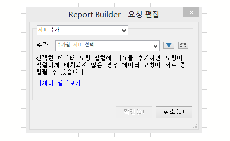
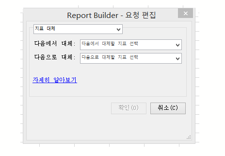
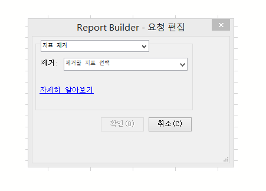

# 여러 요청에서 지표 편집

여러 요청에 대한 지표 편집 기능을 사용하면 기존 요청 또는 여러 요청에 대한 지표를 쉽게 추가, 제거 또는 교체할 수 있습니다.

## Add metrics {#section_3FBDA9668039404895059618D70FCBCD}

주의 사항

* 지표는 피벗 레이아웃 요청에만 추가할 수 있습니다. 선택한 요청 중 일부가 사용자 지정 레이아웃인 경우에는 지표를 추가할 수 없습니다. 레이아웃이 사용자 지정되어 있어서 스프레드시트에서 새 지표를 배치할 위치를 Report Builder가 알지 못하기 때문입니다.
* 따라서 사용자 지정 레이아웃 요청만 선택한 경우 **[!UICONTROL 지표 추가]옵션을 사용할 수 없습니다.**
* 지표를 추가하면 요청 크기가 증가하고 이 요청이 다른 요청과 겹칠 수 있습니다. 지표를 추가할 수 있는 충분한 공간이 요청에 있는지 확인하십시오.
* 추가된 지표가 이미 선택된 요청 중 하나에 있으면 해당 요청에 추가되지 않습니다.

하나 이상의 지표를 추가하려면 다음을 수행하십시오.

1. Excel에서 하나 이상의 요청을 선택하고 마우스 오른쪽 단추를 클릭하여 **[!UICONTROL 지표 편집을 선택합니다]**. (Or, click **[!UICONTROL Manage]** &gt; **[!UICONTROL Edit Multiple]** &gt; **[!UICONTROL[choose metric]]** &gt; **[!UICONTROL Edit Group]** **** to select the group of requests to modify.)

1. Select **[!UICONTROL Add Metric(s)]**and select the metrics to add.

   

1. 요청을 새로 고침하여 실제 데이터를 확인합니다. 새로 고칠 때까지 오프라인 데이터가 표시됩니다.

## Replace metric {#section_D773AAC7B30C4FBEBDB66B203C217818}

주의 사항

* 1:1 대체만 허용되고, 1:다 또는 다:1 대체는 허용되지 않습니다.
* 바꾸도록 선택한 지표가 선택된 요청 중 하나에 없으면 이 요청은 변경되지 않습니다.
* 새 지표는 대체되는 지표와 동일한 위치에 배치됩니다. 이것은 다음을 의미합니다.

   * **피벗 레이아웃**&#x200B;에서: 피벗 레이아웃 요청이 날짜, 방문, 방문자 수, 일간 고유 수를 출력하고 "방문자 수"가 "수입"으로 대체되면 업데이트된 요청 레이아웃은 날짜, 방문, 수입, 일간 고유가 됩니다.
   * **사용자 지정 레이아웃**&#x200B;에서: "방문자 수" 지표가 셀 F11에 출력된 경우 업데이트된 요청 레이아웃은 동일한 셀 F11에 "수입"을 표시합니다.

* 대체되는 지표에 적용된 작업(평균, 앞에 추가되는 텍스트, 뒤에 추가되는 텍스트, 마이크로차트)이 있는 경우 해당 작업은 새 지표에도 적용됩니다.

지표를 바꾸려면 다음을 수행하십시오.

1. Excel에서 하나 이상의 요청을 선택하고 마우스 오른쪽 단추를 클릭하여 **[!UICONTROL 지표 편집을 선택합니다]**. (Or, click **[!UICONTROL Manage]** &gt; **[!UICONTROL Edit Multiple]** &gt; **[!UICONTROL[choose metric]]** &gt; **[!UICONTROL Edit Group]** **** to select the group of requests to modify.)

1. **[!UICONTROL 지표 바꾸기를 선택합니다]**.

   

1. 바꿀 지표와 이를 바꾸는 데 사용할 지표를 선택합니다.
1. 요청을 새로 고칩니다. 새로 고칠 때까지 오프라인 데이터가 표시됩니다.

## Remove metrics {#section_D3CD5BAC7670416593B633B2B8423C60}

주의 사항

* 제거하도록 선택한 지표가 선택된 요청 중 하나에 없으면 이 요청은 변경되지 않습니다.
* 피벗 레이아웃에서 지표를 제거하면 제거된 지표 다음에 있는 지표에 대해 레이아웃이 이동합니다.

   **예**: 피벗 레이아웃 요청이 날짜, 방문 수, 방문자 수, 일간 고유 수를 출력하고 "방문 수"를 제거하는 경우, 요청에 대한 업데이트된 레이아웃에 날짜, 방문자 수, 일간 고유가 표시됩니다.

지표를 제거하려면 다음을 수행하십시오.

1. Excel에서 하나 이상의 요청을 선택하고 마우스 오른쪽 단추를 클릭하여 **[!UICONTROL 지표 편집을 선택합니다]**. (Or, click **[!UICONTROL Manage]** &gt; **[!UICONTROL Edit Multiple]** &gt; **[!UICONTROL[choose metric]]** &gt; **[!UICONTROL Edit Group]** **** to select the group of requests to modify.)

1. Select **[!UICONTROL Remove Metric(s)]**.

   

1. 요청에서 제거할 지표를 하나 이상 선택합니다.
1. 요청을 새로 고칩니다. 새로 고칠 때까지 오프라인 데이터가 표시됩니다.

