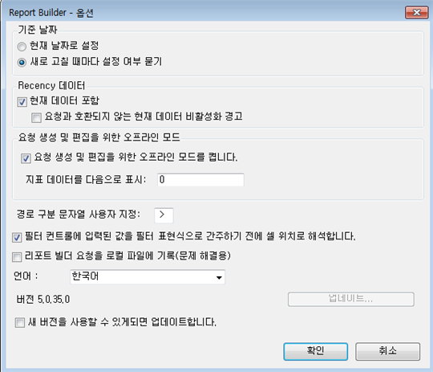
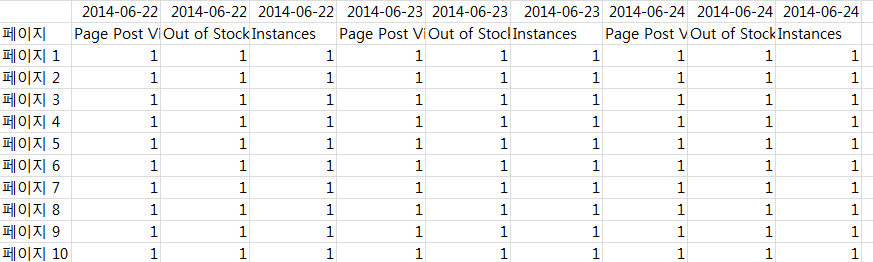

# 요청을 만들고 편집하기 위한 오프라인 모드

오프라인 모드는 요청을 만들고 편집하는 과정을 가속하는 자리 표시자 데이터를 반환합니다.

새 요청을 만들거나 편집할 때 응답을 가져오기 위한 보고서 API 호출이 수행됩니다. 이 경우 다음 단계로 이동하기 전에 데이터가 반환되기 기다려야 하므로 요청 생성 프로세스가 느려집니다. 오프라인 모드는 자리 표시자 데이터만 반환하므로 API 호출이 수행될 필요가 없습니다.

오프라인 모드를 활성화하려면

1. Click **[!UICONTROL Options]** in the Report Builder menu.

   

1. 옆에 있는 확인란을 **[!UICONTROL Turn on offline mode for creating and editing requests]**&#x200B;선택합니다.
1. In the **[!UICONTROL Display Metric Data as]** field, enter the placeholder data that you want returned in your request. 예를 들어 &quot;1&quot;을 입력합니다.
1. 클릭 **[!UICONTROL OK]**.
1. 이제 요청 마법사를 사용하여 오프라인 모드에서 요청을 만들고 실행합니다.
1. 자리 표시자로 &quot;1&quot;을 지정하면 요청이 다음과 같이 표시됩니다.

   

   >[!IMPORTANT]
   >
   >실제 데이터로 요청을 실행하려면 먼저 오프라인 모드를 비활성화해야 합니다. To do so, just go back to **[!UICONTROL Options]** and remove the checkmark.

