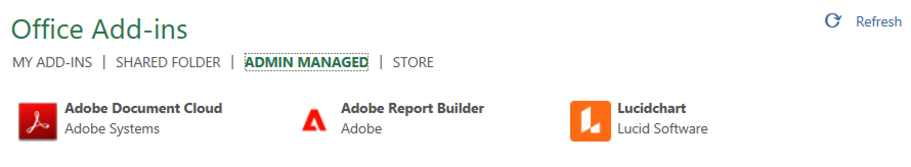
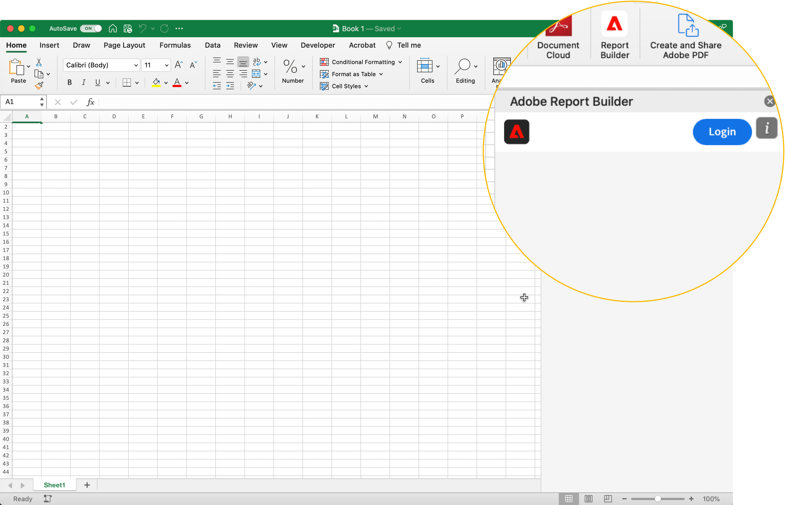
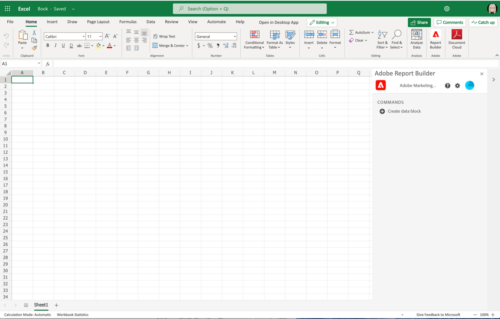

# Report Builder 설치

이 문서에서는 Microsoft Excel에서 Report Builder for Adobe Analytics을 사용하기 위한 요구 사항을 간략하게 설명합니다. 및 추가 기능 설치 및 설정 방법

## 요구 사항

Report Builder for Adobe Analytics은 다음 운영 체제 및 웹 브라우저에서 지원됩니다.

### macOS

- macOS 버전 10.x 이상
- 모든 Microsoft Excel 버전

### Windows

- Windows 10, 버전 1904 이상
- Excel 버전 2106 이상

  모든 Windows 데스크탑 Excel 사용자는 추가 기능을 사용하려면 Microsoft Edge Webview2를 설치해야 합니다. 컨트롤러를 설치하려면:

   1. <https://aka.ms/webview2installer>로 이동합니다.
   1. Evergreen 독립 실행형 설치 관리자를 선택하고 다운로드합니다.
   1. 설치 프롬프트의 안내를 따릅니다.

### 웹 Office

- 모든 브라우저 및 버전 지원

## Report Builder Excel 추가 기능

Report Builder용 Report Builder을 사용하려면 Adobe Analytics Excel 추가 기능을 설치해야 합니다. Report Builder Excel 추가 기능을 설치하면 열려 있는 Excel 통합 문서 내에서 Report Builder에 액세스할 수 있습니다.

### Report Builder 추가 기능 다운로드 및 설치

Report Builder 추가 기능을 다운로드하고 설치하려면

1. Excel을 시작하고 새 통합 문서를 엽니다.

1. **[!UICONTROL 삽입]** > **[!UICONTROL 추가 기능 가져오기]**&#x200B;를 선택합니다.

1. Office 추가 기능 대화 상자에서 스토어 탭을 선택합니다.

1. &quot;Report Builder&quot;를 검색하고 **[!UICONTROL 추가]**&#x200B;를 클릭합니다.

1. 라이선스 사용 약관 및 개인정보 처리방침 대화 상자에서 **[!UICONTROL 계속]**&#x200B;을 클릭합니다.

**스토어 탭이 표시되지 않는 경우**

1. Excel에서 파일 > 계정 > 설정 관리를 선택합니다.

1. “선택적으로 연결된 경험 활성화” 옆의 확인란을 선택합니다.

1. Excel을 다시 시작합니다.

**조직에서 Microsoft Store에 대한 액세스를 차단하는 경우**

Report Builder 추가 기능에 대한 승인을 요청하려면 IT 또는 보안 팀에 연락하십시오. 승인을 받은 후 Office 추가 기능 대화 상자에서 관리자 관리 탭을 선택합니다.

Report Builder 추가 기능을 설치하면 Report Builder 아이콘이 홈 탭 아래의 Excel 리본에 표시됩니다.

## Report Builder에 로그인

운영 플랫폼 또는 브라우저에 Report Builder for Excel 추가 기능을 설치한 후 다음 단계에 따라 Report Builder에 로그인합니다.

1. Excel 통합 문서를 엽니다.

1. Report Builder를 실행하려면 Report Builder 아이콘을 클릭합니다.

1. Adobe Report Builder 도구 모음에서 **[!UICONTROL 로그인]**&#x200B;을 클릭합니다.

   

1. Adobe Experience ID 계정 정보를 입력합니다. 계정 정보는 Adobe Analytics 자격 증명과 일치해야 합니다.

   

로그인하면 로그인 아이콘과 조직이 패널 맨 위에 나타납니다

## 조직 전환

처음 로그인하면 프로필에 할당된 기본 조직에 로그인됩니다.

1. 로그인할 때 표시되는 조직의 이름을 클릭합니다.

1. 사용 가능한 조직 목록에서 조직을 선택합니다. 액세스 권한이 있는 조직만 표시됩니다.

   

## 로그아웃

사용자 프로필에서 Report Builder에서 로그아웃할 수 있습니다.

1. 열려 있는 통합 문서에 변경 사항을 저장합니다.

1. 아바타 아이콘을 클릭하면 사용자 프로필이 표시됩니다.

   

1. **로그아웃**&#x200B;을 클릭합니다.
