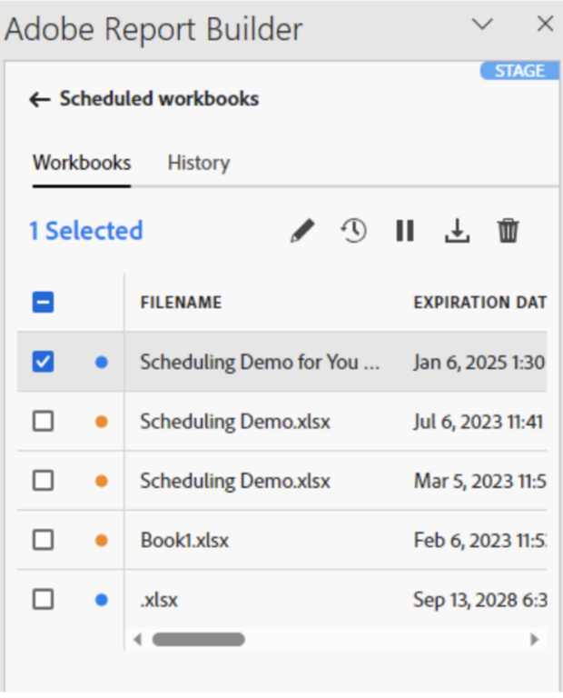

# 통합 문서 예약

통합 문서를 저장하고 분석을 완료한 후에 예약 기능을 사용하여 팀의 다른 구성원들과 통합 문서를 쉽게 공유할 수 있습니다. 예약 기능을 사용하여 통합 문서의 데이터를 자동으로 새로 고치고 특정 날짜 및 시간에 Excel 통합 문서 .xlsx 파일을 지정된 대상자에게 이메일 첨부 파일로 보내는 일정을 만들 수 있습니다. 예약을 설정하면 정기 업데이트가 자동으로 수신자에게 제공됩니다. 예약 기능을 사용하여 자동 업데이트를 예약하지 않고도 통합 문서를 한 번에 전송할 수도 있습니다.

단일 통합 문서에 여러 일정을 만들 수 있습니다. 예를 들어 일별로 통합 문서를 팀에 전송하고 두 개의 다른 일정을 만들어 일주일에 한 번 통합 문서를 관리자에게 보낼 수 있습니다.

예약 기능을 사용하여 통합 문서에 대한 암호 보호를 설정하고 이전에 예약한 통합 문서를 편집할 수도 있습니다.

>[!VIDEO](https://video.tv.adobe.com/v/3413079/?quality=12&learn=on)

## 통합 문서 예약

통합 문서 Excel 파일(.xlsx)을 개별 또는 그룹에 자동으로 배포할 수 있도록 Report Builder 허브의 예약 버튼을 사용하여 일정을 빠르게 만듭니다.

1. Report Builder 허브의 예약 버튼을 클릭합니다.

   ![일정을 만들려면 [일정] 단추를 클릭하세요.](./assets/schedule-button.png){width="55%"}

1. 왼쪽 상단의 예약 통합 문서 또는 더하기 버튼을 클릭하여 새로운 예약된 통합 문서를 만듭니다.

   {width="55%"}

   예약 창에는 통합 문서 이름과 통합 문서를 마지막으로 수정한 날짜 등 통합 문서에 대한 사전 정의된 일부 정보가 표시됩니다.

   {width="55%"}

1. (선택 사항) 파일 이름을 입력합니다.

   통합 문서 파일 이름에 통합 문서 이름이 기본적으로 표시되지만 원하는 경우 이름을 변경할 수 있습니다. 동일한 통합 문서를 여러 대상자에게 보내고 특정 대상자에게 좀 더 친숙한 이름을 지정하려는 경우 이름을 변경할 수 있습니다.

1. (선택 사항) **파일 이름에 타임스탬프 추가**&#x200B;를 선택합니다.

   타임스탬프를 파일 이름에 추가하여 통합 문서가 업데이트된 날짜를 식별할 수 있습니다. 특정 날짜에 전송된 통합 문서 버전을 빠르게 확인하는 데 도움이 됩니다. **파일 이름 미리보기**&#x200B;는 통합 문서 배포 시 통합 문서 파일 이름이 이메일에 어떻게 표시되는지 보여줍니다. 타임스탬프는 YYYY-MM-DD 형식입니다.

1. (선택 사항) **.zip 압축**&#x200B;을 선택하여 파일을 압축하고 파일에 암호 보호를 설정합니다.

   이 항목을 선택하면 파일을 여는 암호를 입력하라는 메시지가 표시됩니다. 데이터 보안에 대한 우려가 있고 통합 문서를 암호로 보호하려는 경우 유용합니다. 암호로 파일을 보호하려면 **.zip 압축**&#x200B;을 선택해야 합니다. 암호는 문자 길이가 8자 이상이고 숫자와 특수 문자를 포함해야 합니다.

   {width="55%"}

1. **수신자**&#x200B;를 입력합니다. 조직에서 인정받는 개인의 이름을 입력하거나 조직 내부 또는 외부 개인의 이메일 주소를 입력할 수 있습니다.

1. 이메일의 **제목** 및 수신자에 대한 설명을 입력합니다. 제목에 통합 문서 파일 이름이 기본적으로 표시되지만 필요한 경우 제목을 수정할 수 있습니다. 설명 섹션의 세부 정보를 추가할 수 있습니다.

   {width="55%"}

1. 예약 옵션을 설정하여 통합 문서를 수신자에게 이메일로 보낼 날짜 및 시간을 설정합니다.

   시작 및 종료 날짜와 시간대를 선택합니다. 이는 오늘 날짜 또는 예정된 날짜일 수 있습니다.

   드롭다운 메뉴에서 **빈도**&#x200B;를 선택합니다. 특정 날짜의 빈도를 시간대별, 일일, 주간, 월간 또는 연간으로 설정할 수 있습니다. 예를 들어 일정을 설정하여 월요일 아침 수신자가 받은 편지함에서 가장 먼저 이메일을 수신할 수 있도록 매월 첫 번째 일요일 밤에 통합 문서를 전송할 수 있습니다.

   {width="55%"}

1. 일정이 설정되면 **일정에 따라 보내기**&#x200B;를 클릭합니다.

   {width="55%"}

   확인 알림은 Report Builder 허브 하단에 표시되고 예약된 통합 문서는 통합 문서 탭 아래에 표시됩니다.

   {width="55%"}

## 전환된 통합 문서 예약 {#converted}

1. [전환된](/help/analyze/report-builder/convert-workbooks.md) 레거시 통합 문서를 예약합니다.

   기존 통합 문서의 예약 메타데이터를 사용하여 새 예약된 작업을 만들 것인지 묻는 팝업이 나타납니다.

1. **[!UICONTROL 사용]**&#x200B;을 선택하면 Report Builder이 자동으로 기존 예약 정보를 채웁니다.

1. 이 정보가 올바른지 확인하고 예약하십시오.

1. 통합 문서를 다른 일정으로 보내려면 완전히 새로 예약된 작업을 예약하십시오.

## 한 번만 통합 문서 보내기

통합 문서를 한 번만 보낼 수도 있습니다.

1. **예약 옵션 표시**&#x200B;를 선택 취소합니다.

   ![통합 문서를 한 번 보내려면 [예약 옵션 표시]를 선택 취소하세요.](./assets/send-now.png){width="40%"}

1. **지금 보내기**&#x200B;를 클릭합니다.

## 예약된 통합 문서 보기 및 편집 {#view-edit}

통합 문서 탭 아래의 한 곳에서 예약된 모든 통합 문서를 보고 관리할 수 있습니다.

1. Report Builder 허브의 예약 섹션에서 통합 문서 탭을 클릭합니다. 이 보기를 사용하여 예약된 모든 통합 문서 목록을 확인합니다.

1. 통합 문서를 선택합니다. 통합 문서를 편집하거나, 예약 작업을 편집하거나, 예약 작업을 일시 중지 및 다시 시작하거나, 예약된 작업 보고서를 다운로드하거나, 예약 작업을 삭제할 수 있는 몇 가지 도구가 표시됩니다.

   {width="20%"}

* (선택 사항) 연필 아이콘을 클릭하여 통합 문서 예약 작업을 편집합니다.

* (선택 사항) 시계 아이콘을 클릭하여 예약된 각 작업의 내역을 확인합니다.

* (선택 사항) 일시 중지 아이콘을 클릭하여 분배 예약 작업을 일시 중지하고 다시 시작합니다. 통합 문서를 보내기 전에 통합 문서를 수정해야 하는 경우 유용합니다. 배포를 다시 시작하려면 일시 중지 아이콘을 다시 클릭합니다.

* (선택 사항) 다운로드 아이콘을 클릭하여 통합 문서 예약 작업의 사본을 다운로드합니다.

* (선택 사항) 일정 작업을 삭제하려면 휴지통을 클릭합니다.

  {width="40%"}

## 예약된 작업 상태 검토 {#status}

내력 보기를 사용하여 예약된 각 작업의 상태를 검토할 수 있습니다. 예약된 각 작업의 상태 변경을 문서화하는 별도의 행이 있습니다. 아래 예에서 *새 시간별 일정*&#x200B;이 1월 5일 오후 3시 4분에 시작되었습니다. 오후 3시 5분까지 일정이 새로 고쳐지고 수신자에게 전송되었습니다. 다음 통합 문서인 *잘못된 통합 문서*&#x200B;에 새로 고침 프로세스 도중 오류가 발생했습니다. 통합 문서 전송이 실패한 경우 내역 탭을 통해 프로세스에서 오류가 발생한 위치를 표시하여 문제를 해결할 수 있습니다. 이 경우 일부 데이터 블록에 오류가 발생하여(구성 요소 누락) 통합 문서를 새로 고칠 수 없습니다.

녹색 확인 표시는 통합 문서 전송이 완료되었음을 나타냅니다. 빨간 삼각형으로 둘러싼 느낌표는 오류가 발생했음을 나타냅니다.

검색 창 오른쪽에 있는 열 설정 아이콘을 클릭하여 내역 탭에 표시할 열을 선택할 수 있습니다.

{width="55%"}

통합 문서 탭으로 이동하고, 통합 문서를 선택하고, 내역 아이콘을 클릭하여 예약된 단일 통합 문서의 내역만 조회하도록 내역을 필터링할 수 있습니다.

통합 문서 탭에서 특정 통합 문서의 내역을 조회할 수도 있습니다. 통합 문서 탭에서 통합 문서를 선택한 다음 내역 아이콘을 클릭합니다.

{width="55%"}

그러면 내역 상단에 통합 문서 필터가 표시됩니다. 예약된 모든 작업의 내역을 다시 조회하려면 필터 옆 x를 클릭합니다.

{width="55%"}
