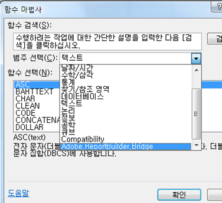
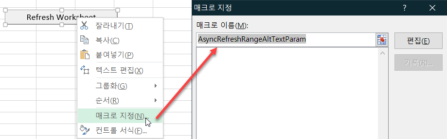
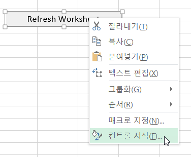
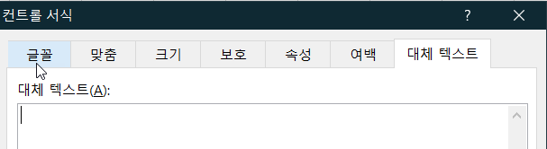

# Microsoft Excel 함수에서 Report Builder 기능 호출

이 기능을 사용하면 Report Builder 사용자 인터페이스에 액세스하지 않고도 일반 Excel 워크플로우 내에 Report Builder를 통합할 수 있습니다.

예를 들어, 다른 원본에서 Excel로 가져온 데이터를 기반으로 하는 입력 필터가 포함된 Report Builder 요청을 자동으로 새로 고치고 싶을 수 있습니다. 이제 string RefreshRequestsInCellsRange(..) 함수를 사용하여 이 작업을 수행할 수 있습니다. 모든 호출은 비동기 상태입니다. 즉, 결과를 즉시 반환하고 한 호출이 완전히 실행될 때까지 기다리지 않습니다.

>[!NOTE] 이 기능을 사용하려면 Report Builder 5.0 이상이 설치되어 있어야 합니다.

다음은 노출된 함수 목록을 포함하는 표입니다.

| 함수 이름 | 설명 |
|---|---|
| string AsyncRefreshAll() | 통합 문서에 있는 모든 Report Builder 요청을 새로 고칩니다. |
| string AsyncRefreshRange(string rangeAddressInA1Format) | 지정된 셀 범위 주소에 있는 모든 Report Builder 요청을 새로 고칩니다(&quot;Sheet1!A2:A10&quot;과 같이 A1 형식으로 셀 범위를 나타내는 문자열 표현식). |
| string AsyncRefreshRangeAltTextParam() | Ms 양식 컨트롤의 대체 텍스트를 통과하는 지정된 셀 범위에 있는 모든 Report Builder 요청을 새로 고칩니다. |
| string AsyncRefreshActiveWorksheet() | 활성 워크시트에 있는 모든 Report Builder 요청을 새로 고칩니다. |
| string AsyncRefreshWorksheet(string worksheetName) | 지정된 워크시트(탭에 나타나는 워크시트 이름)에 있는 모든 Report Builder 요청을 새로 고칩니다. |
| string AsyncRefreshWorksheetAltTextParam(); | Ms 양식 컨트롤의 대체 텍스트를 통과하는 특정 워크시트 이름에 있는 모든 Report Builder 요청을 새로 고칩니다. |
| string GetLastRunStatus() | 마지막 실행의 상태를 설명하는 문자열을 반환합니다. |

리포트 빌더 내에서 이러한 기능에 액세스하려면 [!UICONTROL Formulas] > [!UICONTROL Insert Function]로 이동하십시오. 카테고리 목록 아래쪽에서 Adobe.Report Builder.Bridge를 찾을 수 있습니다.



## 수식에서 이러한 함수 사용 {#section_034311081C8D4D7AA9275C1435A087CD}

예를 들어 다음 수식은

```
=IF(OR(ISTEXT(P5),ISBLANK(P5)),AsyncRefreshRange("P9"),"")
```

&quot;셀 P5의 값이 텍스트이거나 비어 있으면 셀 P9에 있는 범위를 새로 고칩니다.&quot;라는 의미입니다.

## Report Builder 함수와 컨트롤 서식 사용 {#section_26123090B5BD49748C8D8ED7A1C5ED84}

이제 만든 컨트롤에 매크로를 할당할 수 있으며 해당 컨트롤은 통합 문서 요청을 새로 고치는 함수가 될 수 있습니다. 예를 들어 함수 AsyncRefreshActiveWorksheet는 워크시트의 모든 요청을 새로 고칩니다. 그렇지만 전체가 아니라 특정 요청만 새로 고치고 싶은 경우가 있을 수 있습니다.

1. 매크로 매개 변수를 설정합니다.
1. Right-click the control and select **[!UICONTROL Assign Macro]**.
1. Report Builder 함수 이름을 입력합니다(매개 변수 또는 괄호 제외).



## 컨트롤 서식을 통해 리포트 빌더 함수로 매개 변수 전달 {#section_ECCA1F4990D244619DFD79138064CEF0}

매개 변수를 취하는 2개의 함수를 컨트롤 서식과 함께 사용할 수 있지만 대체 텍스트 필드를 통해서만 가능합니다.

* AsyncRefreshRange(string rangeAddressInA1Format)
* AsyncRefreshWorksheet(string worksheetName)

1. Right-click the control and select **[!UICONTROL Format Control]**.

   

1. Click the [!UICONTROL Alt Text] tab.

   

1. Under [!UICONTROL Alternative text], enter the cell range that you want refreshed.
1. > [!UICONTROL Formulas] > [!UICONTROL Insert Function]> [!UICONTROL Adobe.ReportBuilder.Bridge]아래에서 리포트 빌더 매개 변수 목록을 엽니다.

1. Pick one of the two functions that end with AltTextParam and click **[!UICONTROL OK]**.

