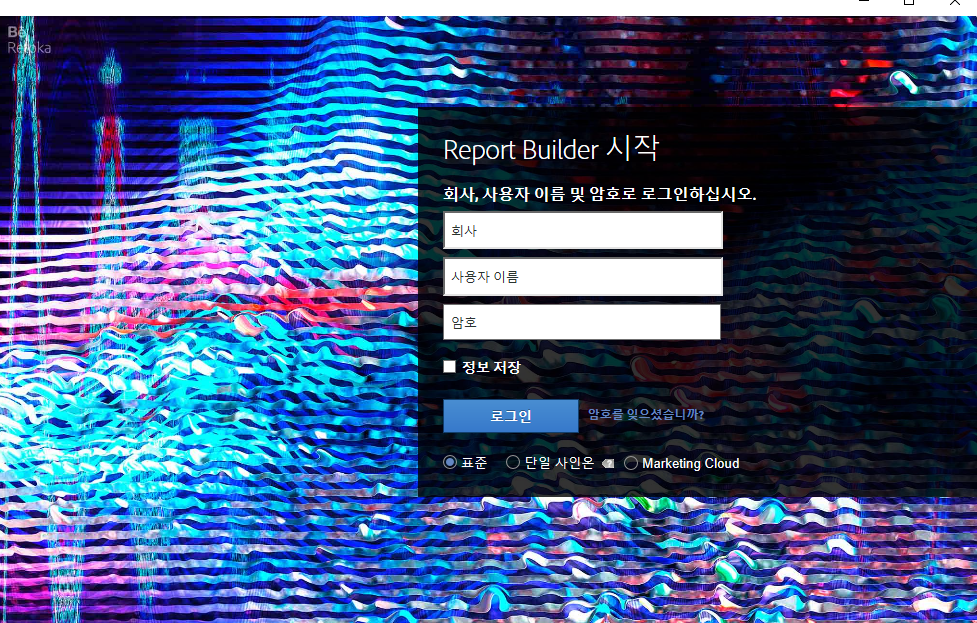
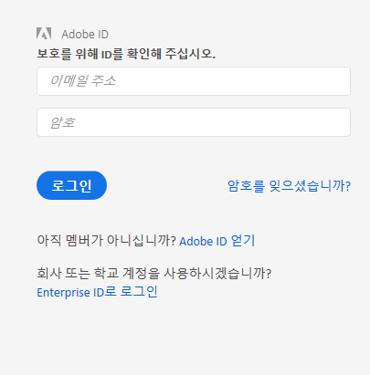

# Report Builder 로그인

Report Builder에 로그인하는 세 가지 방법에 대한 정보입니다.

현재 Report Builder **[!UICONTROL 로그인]을 클릭하면 다음 로그인 옵션이 표시됩니다.**

* [표준](../../../analyze/report-builder/setup/login.md#section_6D54B8ADAE7F416BB83F5082B3771CFA)
* [단일 사인온](../../../analyze/report-builder/setup/login.md#section_6970A5F926774976B85FFE576610E85F)
* [Experience Cloud 및 Single Sign-on](../../../analyze/report-builder/setup/login.md#section_1FA230F35AB54021A874A7A28DE4C850)

## 표준 {#section_6D54B8ADAE7F416BB83F5082B3771CFA}

Adobe Analytics 자격 증명을 사용하여 Report Builder에 로그인하려면 이 로그인을 사용합니다.

**리포트 빌더 로그인 - 필드 정의**

| 필드 | 정의 |
|--- |--- |
| 회사 | Adobe Analytics에 사용하는 회사 로그인 자격 증명입니다. |
| 사용자 이름 | Adobe Analytics에 사용하는 사용자 이름 로그인입니다. 사용자에 대한 예약된 작업은 이 사용자 이름에 연결되어 있습니다. 동일한 로그인 자격 증명으로 Report Builder에 로그인하면 어떤 컴퓨터에서든지 예약된 작업을 볼 수 있습니다. |
| 암호 | Analytics 암호. |
| 정보 저장 | 로그인 정보는 암호화되어 Report Builder가 설치되어 있는 시스템의 사용자 프로필 파일에 저장됩니다. 로그인 정보가 저장되므로 보고서가 들어 있는 스프레드시트를 여는, 보고서 작성자와 동일한 PC를 사용하는 모든 사용자는 데이터를 새로 고치고 편집할 수 있습니다. 컴퓨터를 다른 사람과 공유하면서 스프레드시트 데이터는 비공개로 유지하려면 이 선택 사항을 활성화하지 마십시오. To disable your automatic login setting, click **[!UICONTROL Log in With Different Credentials]** on the Toolbar and disable **[!UICONTROL Remember Me]**. |
| 프록시 서버 사용 | 프록시 서버를 통해 인터넷에 액세스하고 프록시 사용자 이름과 암호를 입력해야 할 경우 활성화합니다. |

## 단일 사인온 {#section_6970A5F926774976B85FFE576610E85F}

이 (이전)단일 사인온은 Adobe Analytics에만 로그인되며, 전체 Experience Cloud로 로그인되지 않습니다.

도메인에 입력할 수도 있으며 시스템에서 도메인을 인식하면 Adobe Analytics에 로그인하는 회사의 로그인 페이지로 리디렉션됩니다.

## Experience Cloud {#section_1FA230F35AB54021A874A7A28DE4C850}

Experience Cloud 로그인을 통해 Enterprise ID(이메일 및 암호)를 사용하여 Adobe Experience Cloud에 로그인할 수 있습니다. **[!UICONTROL 로그인]** &gt; **[!UICONTROL Enterprise ID]** 로 로그인을 클릭하여 회사의 단일 사인온 페이지로 리디렉션합니다. Enterprise ID에 대한 자세한 내용을 보려면 [여기](https://helpx.adobe.com/enterprise/kb/enterprise-id-faq.html#whatis)를 클릭하십시오.

>[!NOTE]
>
>Experience Cloud 로그인은 세션 기반이며 토큰이 30 일 후에 만료됩니다.

