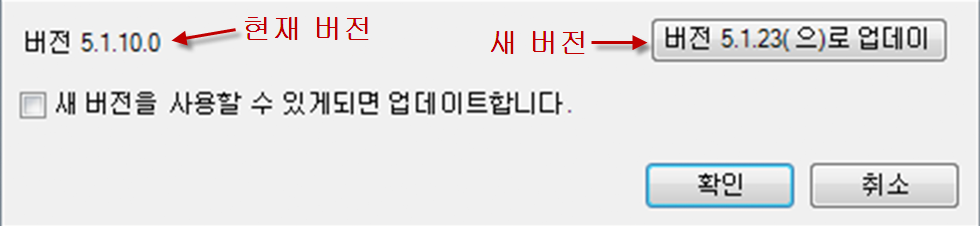
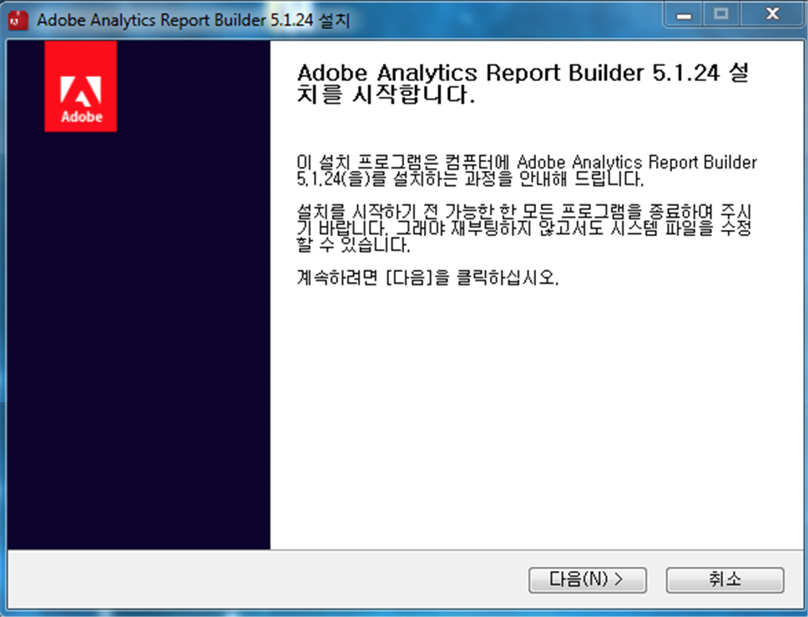

# Report Builder 업그레이드

Report Builder 업그레이드 절차 및 고려 사항입니다.

## 업그레이드 FAQ {#section_AFE40FF5544C418790A1C298C25CC18A}

**Q: 업그레이드 시 이전 버전의 Report Builder는 유지됩니까?**

A: 아니요. 이전 버전은 제거됩니다.

**Q: 기존 보고서를 잃게 됩니까?**

A: 아니요. 기존 보고서 모두 계속 작동합니다.

**Q: 새 버전으로 다시 인증해야 합니까?**

A: 아니요. 인증 설정을 포함한 모든 설정이 계속 작동합니다.

## Upgrade instructions {#section_73B8110A619549189A30079735E81867}

1. 현재 버전의 Report Builder에 로그인합니다.
1. **[!UICONTROL [옵션]]메뉴로 이동하여 최신 버전으로 업그레이드합니다.** 현재 버전 번호는 [옵션] 대화 상자의 하단 쪽에 표시됩니다.

   

1. If a new version is available, click **[!UICONTROL Update...]**. 이 단추는 "버전 5.0.50으로 업데이트"처럼 업데이트하게 될 버전을 보여줍니다.

   >[!NOTE]
   >
   >이 단추가 회색으로 표시되면 새 버전의 Report Builder를 사용할 수 없습니다.

1. Optionally select the **[!UICONTROL Update when a new version is available]**checkbox. 이렇게 하면 나중에 사용 가능한 새 버전이 있을 때 업데이트 프로세스가 자동으로 시작됩니다.
1. When the setup screen appears, click **[!UICONTROL Next &gt;]**.

   

1. 업그레이드가 완료되면 다시 Report Builder에 로그인합니다.

## Manual upgrade instructions {#section_27A0200010DC4747A718F1A65B180599}

Adobe Analytics에서 항상 최신 버전의 Report Builder를 가져올 수 있습니다.

1. Adobe Analytics에 로그인하고 **[!UICONTROL 도구로 이동합니다]**.
1. **[!UICONTROL Report Builder를 클릭합니다]**.
1. **[!UICONTROL [개요]]화면에서 32비트나 64비트 버전을 선택합니다.**
1. **[!UICONTROL 지금 다운로드!]**.

