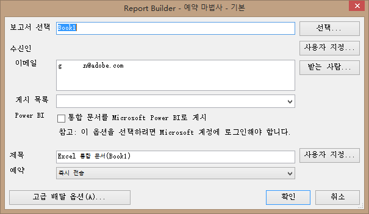

# 통합 문서 예약

통합 문서를 예약하고, 고급 배달 옵션을 지정하고, 수신자를 지정하고, 예약 내역을 볼 수 있습니다. 고급 배달 옵션을 사용하여 특정 시간에 또는 간격으로 전송할 통합 문서를 구성할 수 있습니다. 통합 문서를 보낼 파일 형식을 지정할 수도 있습니다.

For example, you can schedule workbooks to be delivered immediately or on a recurring schedule, and specify the file format in [!DNL Advanced Delivery Options]. 통합 문서 업로드는 파일 크기 제한이 5 MB 입니다.

Additionally, after you create a workbook schedule in Report Builder, you can view and edit the schedule in **[!UICONTROL Analytics]** &gt; **[!UICONTROL Reports]**. (Reports &amp; Analytics 도움말에서 [보고서 예약 및 배포](/help/analyze/reports-analytics/scheduling.md)를 참조하십시오.)

>[!NOTE]
>
>통합 문서를 예약하려면 Excel 2007 또는 호환성 팩이 설치되어 있어야 합니다. 리포트 빌더 라이선스당 최대 10 개의 예약된 통합 문서를 보유할 수 있습니다. 그렇지만 다른 라이센스에서 공제하여 이 수를 늘릴 수 있습니다. To do so, go to **[!UICONTROL Admin]** &gt; **[!UICONTROL Company Settings]** &gt; **[!UICONTROL Report Builder Reports]**. 예약된 (또는 통합 문서 라이브러리에 업로드) 28 개월 이상 수정 (업데이트, 교체) 되지 않은 통합 문서가 삭제됩니다.

>[!NOTE]
>
>사용자가 입력한 "배달 시간"/"하루 중 시간" 는 통합 문서가 실제로 배달되는 시간이 아니라 처리를 시작해야 하는 시간을 지정합니다. 통합 문서가 배달되는 실제 시간은 주로 처리 시간이 걸리는 시간을 기반으로 합니다. 복잡한 대형 통합 문서는 단순한 통합 문서보다 처리 시간이 오래 걸립니다. 예를 들어 통합 문서가 처리하는 데 15 분이 걸리는 경우 실제 배달 시간은 원래 지정한 "배달 시간"/"하루 중 시간" 이 지난 15 분 이상이 됩니다.
>또한 통합 문서가 실제로 배달되기 전에 지연을 더 높일 수 있는 다른 요인도 많이 있습니다.
>
> * **동일한 유형의 여러 다른 일정을 동시에 실행하면 시스템이** 로드되지 않을 수 있습니다. 예약 시스템에서는 한 유형의 통합 문서 (5-10 개) 만 동시에 실행할 수 있으므로 5-10 개 이상이 동시에 예약되어 있으므로 처리를 시작하려면 먼저 다른 통합 문서의 행에서 기다려야 합니다. 이 문제는 동시에 아니라 하루 또는 시간에 걸쳐 회사 통합 문서를 예약하여 완화할 수 있습니다.
> * 특정 통합 문서 유형 이외에, 통합 문서는 회사가 한 번에 예약된 모든 통합 문서 유형 (다른 모든 통합 문서 유형) 를 15-20 개 이상 보유하고 **있는 경우에도 행에서 대기합니다**. 이렇게 하면 많은 시간이 정확히 동시에 실행되던 것보다 일정에 오래 걸리는 시간으로 완화됩니다.
> * **스케줄러가 의존하는 다운스트림 서비스의** 문제는 통합 문서의 제공에 영향을 줄 수도 있습니다. 예를 들어 API를 사용하여 통합 문서를 실행하고 API 요청 큐를 채우는 경우 해당 리소스에 대해 경쟁하는 동안 예약된 통합 문서가 느리게 전달될 수 있습니다.
> * **보고서 세트 지연** (데이터 수집의 지연) 는 예약된 일부 통합 문서를 지연될 수도 있습니다.

## 통합 문서 예약

1. 통합 문서를 생성하고 저장합니다.
1. On the Report Builder Toolbar, click **[!UICONTROL Schedule]**.

   [!UICONTROL 예약된 보고서] 탭에 남은 작업의 수는 물론 생성한 모든 작업이 요약됩니다.
1. **예약된 보고서** 탭에서 **[!UICONTROL 새로 만들기를 클릭합니다]**.
1. 기본 예약 마법사가 표시됩니다. 

   

1. [!UICONTROL 기본 예약 마법사]에서 다음 옵션을 구성합니다. 

| 필드 | 설명 |
|--- |--- |
| 보고서 선택 | 통합 문서의 이름입니다. 새로운 예약된 보고서의 경우 이 필드에는 활성 상태의 통합 문서 이름이 입력되어 있습니다. |
| 선택 | 보고서 선택 페이지를 표시합니다. 서버(이전에 예약한 통합 문서가 저장된 곳)나 로컬 시스템에서 보고서를 선택할 수 있습니다. 로컬 드라이브에서 .xls 형식의 통합 문서를 선택하면 시스템이 파일을 .xlsx로 전환합니다. 이러한 전환 작업의 일부로서 파일은 Excel에서 열려서 활성화됩니다. 예약된 보고서에 대해 선택한 통합 문서의 파일 이름이 현재 Excel에 열려 있는 통합 문서와 동일하면 시스템은 이전에 업로드 한 파일 대신 로컬 파일을 선택합니다. 예약 저장소에서 보고서를 선택하면 통합 문서의 복사본이 서버에 만들어지고 파일 이름이 1로 업데이트됩니다. 새로 만든 예약된 보고서는 복사된 통합 문서를 사용합니다. |
| 사용자 지정 | 날짜 형식을 사용자 지정할 수 있습니다. |
| 받는 사람 | 사용할 수 있을 경우 Outlook 주소록을 표시합니다. |
| 수신인: 이메일 | 통합 문서의 이메일 수신자입니다. |
| 수신인: 게시 목록 | 이 회사용의 사용 가능한 배포 목록의 목록을 표시합니다. |
| Power BI | 자세한 내용은 [Microsoft Power BI에 통합 문서 게시](/help/analyze/report-builder/c-publish-power-bi/integration-power-bi.md)를 참조하십시오. |
| 제목 | 사용자 정의 설명. |
| 예약 | 통합 문서를 보낼 시기를 지정할 수 있습니다. (즉시, 시간별, 일별, 주별, 월별 및 연도별.) |

## 고급 배달 옵션

1. **[!UICONTROL 고급 배달 옵션을]** 클릭하여 파일 및 게시 옵션을 구성합니다.

| 필드 | 설명 |
|--- |--- |
| **예약 탭** |  |
| 전달 시간 | 통합 문서를 즉시 예약하거나 나중에 사용할 수 있도록 예약할 수 있습니다. 시각은 컴퓨터에 지정된 시간대를 기준으로 합니다. |
| 되풀이 패턴 | 선택한 내용에 따라 통합 문서를 전송합니다. |
| 되풀이 범위 | 통합 문서 수신을 시작 및 중지할 시기를 지정할 수 있습니다. 참고: 현재 기간 (주, 월, 분기 또는 년도) 의 첫 번째 날에 통합 문서를 예약하면 첫 날 데이터만 반환됩니다. |
| **파일 옵션 탭** |  |
| 파일 형식 | 전달 형식을 Excel 2007(.xlsx) 또는 2003 (.xls), .pdf, .csv, .mht, .txt 및 .xml 중에서 선택할 수 있습니다. |
| 파일 대상 | 이메일 또는 FTP를 지정합니다. 페이지의 선택 사항은 선택 내용에 따라 달라집니다. FTP의 경우 호스트를 외부에서 사용할 수 있도록 해야 합니다. |
| 게시 목록 | 예약된 통합 문서를 여러 게시 목록에 전송하면 통합 문서가 각 목록에 대해 한 번씩 실행됩니다. 변수 보고서 세트는 게시 목록에 지정된 보고서 세트로 대체됩니다. |
| 파일 내용 언어 | 첨부 설명에 사용할 언어를 지정합니다. 한국어, 중국어(간체 또는 번체), 독일어, 프랑스어, 일본어, 브라질 포르투갈어 또는 스페인어를 선택할 수 있습니다. |
| **게시 옵션 탭** |  |
| Power BI에 게시 | <ul><li>Power BI에 통합 문서 게시</li><li>모든 Report Builder 요청을 Power BI 데이터 세트로 게시</li><li>형식이 지정된 표를 모두 Power BI 데이터 세트로 게시</li></ul> |
| 이 Power BI 보고서를 다음과 같이 레이블 지정 | 레이블 지정 세부 사항 |

1. **[!UICONTROL 확인을]**&#x200B;클릭한 다음 **[!UICONTROL 종료를]**&#x200B;클릭합니다.

   Report Builder displays the scheduled workbook in the [Scheduled Task Manager](../../analyze/report-builder/r-arb-scheduled-reports.md#section_69306B8D833F4DF7BBFA53753B0E6C31).

