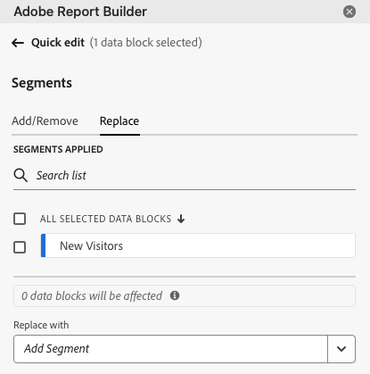
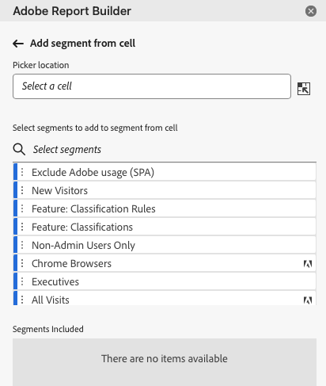
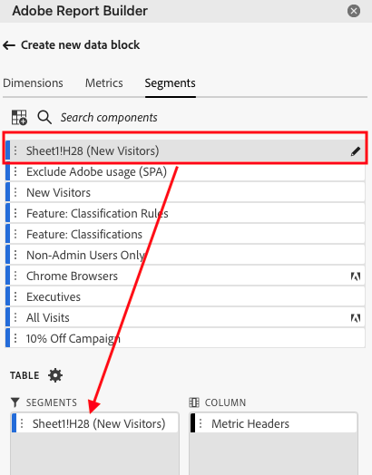

# Report Builder에서 세그먼트 작업

새 데이터 블록을 만들거나 명령 패널에서 **데이터 블록 편집** 옵션을 선택할 때 세그먼트를 적용할 수 있습니다.

## 데이터 블록에 세그먼트 적용

세그먼트를 전체 데이터 블록에 적용하려면 세그먼트를 두 번 클릭하거나 구성 요소 목록에서 테이블의 세그먼트 섹션으로 필터를 드래그 앤 드롭합니다.

## 개별 지표에 세그먼트 적용

세그먼트를 개별 지표에 적용하려면 세그먼트를 테이블의 지표로 드래그 앤 드롭합니다. 테이블 창에서 지표 오른쪽에 있는 **..** 아이콘을 클릭한 다음 **[!UICONTROL 세그먼트 지표]**&#x200B;을(를) 선택할 수도 있습니다. 적용된 세그먼트를 보려면 테이블 창에서 지표 위로 마우스를 이동하거나 선택합니다. 세그먼트가 적용된 지표에는 필터 아이콘이 표시됩니다.

## 세그먼트 빠른 편집

빠른 편집 패널을 사용하여 기존 데이터 블록의 세그먼트를 추가, 제거 또는 바꿀 수 있습니다.

스프레드시트에서 셀 범위를 선택하면 빠른 편집 패널의 **[!UICONTROL 세그먼트]** 링크에 해당 선택 항목의 데이터 블록이 사용하는 세그먼트의 요약 목록이 표시됩니다.

빠른 편집 패널을 사용하여 세그먼트를 편집하려면

1. 하나 이상의 데이터 블록에서 셀 범위를 선택합니다.

   

1. **[!UICONTROL 세그먼트]** 아래의 링크를 클릭하여 빠른 편집 - 필터 패널을 시작합니다.

   

### 세그먼트 추가 또는 제거

추가/제거 옵션을 사용하여 세그먼트를 추가하거나 제거할 수 있습니다.

1. 빠른 편집 세그먼트 패널에서 **[!UICONTROL 추가/제거]** 탭을 선택합니다.

   선택한 데이터 블록에 적용된 모든 세그먼트가 빠른 편집 세그먼트 패널에 나열됩니다. 선택 항목의 모든 데이터 블록에 적용된 세그먼트는 **[!UICONTROL 선택한 모든 데이터 블록에 적용됨]** 머리글 아래에 나열됩니다. 모든 데이터 블록이 아닌 일부에 적용된 세그먼트는 **[!UICONTROL 선택한 하나 이상의 데이터 블록에 적용됨]** 머리글 아래에 나열됩니다.

   선택한 데이터 블록에 여러 세그먼트가 있는 경우 **[!UICONTROL 필터 추가]** 검색 필드를 사용하여 특정 세그먼트를 검색할 수 있습니다.

   

1. **[!UICONTROL 세그먼트 추가]** 드롭다운 메뉴에서 세그먼트를 선택하여 세그먼트를 추가하십시오.

   검색 가능한 세그먼트 목록에는 선택한 데이터 블록 중 하나 이상에 있는 보고서 세트에 액세스할 수 있는 모든 세그먼트와 조직에서 전역적으로 사용할 수 있는 모든 세그먼트가 포함됩니다.

   세그먼트를 추가하면 선택 항목의 모든 데이터 블록에 세그먼트가 적용됩니다.

1. 세그먼트를 제거하려면 **[!UICONTROL 적용된 세그먼트]** 목록에서 세그먼트 오른쪽에 있는 삭제 아이콘 **x**&#x200B;을(를) 클릭합니다.

1. **[!UICONTROL 적용]**&#x200B;을 클릭하여 변경 사항을 저장하고 허브 패널로 돌아갑니다.

   Report Builder은 적용된 세그먼트 변경 사항을 확인하는 메시지를 표시합니다.

### 세그먼트 바꾸기

기존 세그먼트를 다른 세그먼트로 대체하여 데이터 세그먼트 방식을 변경할 수 있습니다.

1. 빠른 편집 세그먼트 패널에서 **[!UICONTROL 바꾸기]** 탭을 선택합니다.

   

1. **[!UICONTROL 검색 목록]** 검색 필드를 사용하여 특정 세그먼트를 찾습니다.

1. 바꿀 세그먼트를 하나 이상 선택합니다.

1. 다음으로 바꾸기 필드에서 하나 이상의 세그먼트를 검색합니다.

   필터를 선택하면 **[!UICONTROL 다음으로 바꾸기]**... 목록에 필터가 추가됩니다.

   ![바꾸기 탭에서 [앱의 사용자] 데이터 블록을 선택하고 바꾸기 목록에서 [앱의 사용자]를 업데이트하여 수정했습니다.](./assets/replace_screen_new.png)

1. **[!UICONTROL 적용]**&#x200B;을 클릭합니다.

   Report Builder은 세그먼트 목록을 업데이트하여 교체를 반영합니다.

### 셀에서 데이터 블록 세그먼트 정의

데이터 블록은 셀의 세그먼트를 참조할 수 있습니다. 여러 데이터 블록이 세그먼트에 대해 동일한 셀을 참조할 수 있으므로 한 번에 여러 데이터 블록의 세그먼트를 쉽게 전환할 수 있습니다.

셀에서 세그먼트를 적용하려면

1. 데이터 블록 만들기 또는 편집 프로세스의 2단계로 이동합니다. [데이터 블록 만들기](./create-a-data-block.md)를 참조하세요.
1. 필터를 정의하려면 **[!UICONTROL 세그먼트]** 탭을 클릭하십시오.
1. **[!UICONTROL 셀에서 세그먼트 만들기]**&#x200B;를 클릭합니다.

   

1. 데이터 블록이 세그먼트를 참조할 셀을 선택합니다.

1. 세그먼트를 두 번 클릭하거나 세그먼트를 포함된 세그먼트 섹션으로 끌어다 놓아 셀에 추가하려는 세그먼트 선택을 추가합니다.

   참고: 주어진 셀에 대해 한 번에 하나의 선택만 선택할 수 있습니다.

   

1. 참조 셀을 만들려면 **[!UICONTROL 적용]**&#x200B;을 클릭합니다.

1. **[!UICONTROL 세그먼트]** 탭에서 새로 만든 참조 셀 세그먼트를 데이터 블록에 추가합니다.

   

1. **[!UICONTROL 마침]**&#x200B;을 클릭합니다.

   이제 이 셀은 세그먼트의 다른 데이터 블록에서 참조할 수 있습니다. 참조 셀을 세그먼트로 다른 데이터 블록에 적용하려면 세그먼트 탭에서 해당 세그먼트에 셀 참조를 추가하면 됩니다.

#### 참조 셀을 사용하여 데이터 블록 세그먼트 변경

1. 스프레드시트에서 참조 셀을 선택합니다.

1. 빠른 편집 메뉴에서 **[!UICONTROL 셀의 세그먼트]** 아래의 링크를 클릭합니다.

   

1. 드롭다운 메뉴에서 세그먼트를 선택합니다.

   

1. **[!UICONTROL 적용]**&#x200B;을 클릭합니다.
