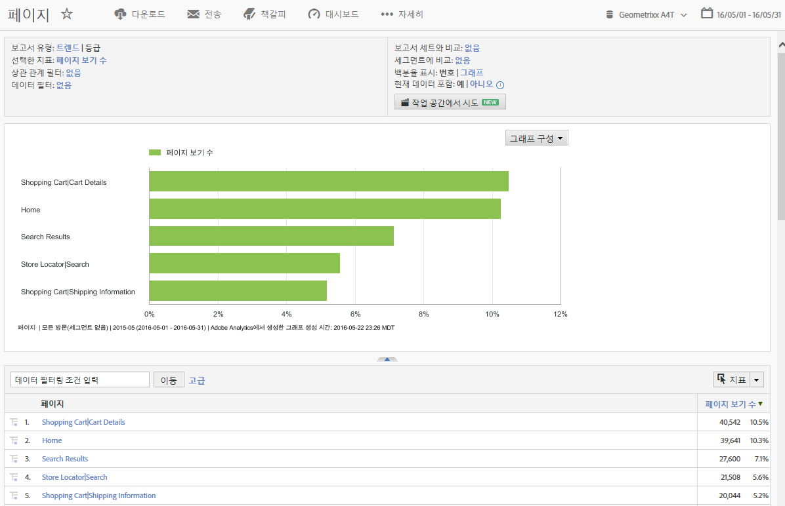

# 보고 및 분석 시작하기

보고 및 분석을 사용하기 전에 이러한 기본 로그인 및 설정 작업과 계정 정보에 액세스하는 방법을 이해해야 합니다.

## 보고 및 분석 시작하기

Reports &amp; Analytics을 사용하려면 먼저 이러한 기본적인 로그인 및 설정 작업과 계정 정보에 액세스하는 방법에 대해 이해합니다.

보고 기능을 통해 모바일, 비디오 및 소셜 네트워킹과 같이 계속 변화하는 채널을 물론 종래의 웹 기반 채널들에 대해서도 통찰력을 가질 수 있습니다. 마케팅 보고의 일부 예에는 다음과 같습니다.

* 사이트 방문자 수
* 해당 방문자 중 고유 방문자 수(한 번만 카운트)
* 방문자의 사이트 방문 경로(예: 링크를 따라 사이트를 방문했는지 또는 사이트에 직접 방문했는지 여부)
* 방문자가 사이트 컨텐츠를 검색하는 데 사용한 키워드
* 특정 페이지 또는 전체 사이트에서 머문 시간
* 방문자가 클릭한 링크와 사이트를 떠난 시점
* 매출 생성이나 전환 이벤트 생성에 가장 효과적인 마케팅 채널
* 비디오 보는 데 걸린 시간
* 방문자가 사이트를 방문하는 데 사용한 브라우저 및 장치

## 브라우저 및 시스템 요구 사항

Reports &amp; Analytics 인터페이스에 로그인하기 위한 브라우저 및 시스템 요구 사항.

* 브라우저:

   * 권장: 최신 버전의 Firefox, Chrome, Safari 또는 Edge.
   * 최신 버전의 Microsoft Internet Explorer 11

      >[!NOTE]
      >
      >Adobe는 2018년 11월 13일에 Adobe Analytics 내에서 Internet Explorer 11에 대한 지원을 종료했습니다. 가능한 빨리 Microsoft Edge 또는 다른 지원되는 브라우저로 전환하십시오.

* 쿠키와 JavaScript가 활성화되어 있어야 합니다.
* 16비트 색상 깊이(이상)의 1024x768 모니터 해상도

## 보고 및 분석에 로그인

인터페이스에 액세스하려면 먼저 계정 관리자 또는 Adobe 고객 지원 센터에 문의하여 회사 계정을 설정하십시오.

## Experience Cloud를 사용하여 로그인

Adobe Experience Cloud를 통해 로그인하는 방법을 설명하는 단계입니다.

1. 인터넷에 액세스할 수 있는 컴퓨터에서 브라우저를 시작합니다.
1. Go to [!DNL https://login.experiencecloud.adobe.com/].
1. On the [!UICONTROL Sign In] page, click **[!UICONTROL Single Sign-On]**.
1. Complete the following information, then click **[!UICONTROL Sign In]**.

   **[!UICONTROL 회사]**: 회사 ID를 지정합니다.

   **[!UICONTROL 사용자 이름]**: 계정 ID를 지정합니다.

   **[!UICONTROL 암호]**: 계정 암호를 지정합니다.
1. Experience Cloud 홈 페이지에서 Analytics &gt; **보고서로 이동합니다**.

   Experience Cloud는 활동하지 않는 시간이 30분이 지나면 자동으로 로그아웃됩니다.

## 보고서 실행

보고서를 생성하는 방법을 설명하는 단계입니다.

1. Log in to [!UICONTROL Reports &amp; Analytics].

   보고서 메뉴가 표시되거나 [대시보드가](../../analyze/reports-analytics/dashboard.md#concept_8CD3ACA2830A4994A68A31D8773B57E0) 표시됩니다.

1. Click **[!UICONTROL Site Content]** &gt; **[!UICONTROL Pages]** (for example).

   

   See [Report Features](../../analyze/reports-analytics/overview/report-overview.md#concept_AEA3BBC8167040198E0FECEAB2E0A677) for information about interface features of a report.

## 사용자 계정 설정 편집

사용자 계정 편집, 사용자 암호 재설정 및 연락처 정보 편집에 대한 정보입니다.

연락처 정보를 보고 편집하고, 암호를 지정하고, 웹 서비스 정보를 볼 수 있습니다. 또한 이 컴퓨터를 데이터 수집에서 제외할 수 있습니다.

Click the Account icon at the top right, then click the **[!UICONTROL Account Settings]** (wheel) icon next to your login name.

모든 사용자는 [!UICONTROL 계정 정보] 페이지에 대한 액세스 권한을 가지고 있습니다. 다음 정보는 보거나 편집할 수 있습니다.

<table id="table_58F5D292485F45F9902B372E4E1E3103"> 
 <thead> 
  <tr> 
   <th colname="col1" class="entry"> 정보 종류 </th> 
   <th colname="col2" class="entry"> 정의 </th> 
  </tr> 
 </thead>
 <tbody> 
  <tr> 
   <td> 
연락처 
 </td> 
   <td> 
자신의 계정에 대해 다음 개인 정보를 지정하십시오. 
 
    <ul id="ul_7925E35904EB47E3AC648FA80A09EF91"> 
     <li id="li_CDD8D7B73A1D4C78A41FF02BD0E5E788">이름(필수) </li> 
     <li id="li_7255F50ABFFA4EE8A0A9D04F92BE432D">성(필수) </li> 
     <li id="li_3DF6107291CC4D46AAA0E4A13D59128F">제목 </li> 
     <li id="li_B5BE95E0FE594939A2D4C6680A6B8BDD">이메일 주소(필수) </li> 
     <li id="li_B764239241CE4F1CA74F77D796E7AB1D">전화번호 </li> 
    </ul> </td> 
  </tr> 
  <tr> 
   <td> 
 로그인 
 </td> 
   <td> 
계정 사용자 이름이 표시되면 계정 암호를 바꿀 수 있습니다. 
 
<a href="https://helpx.adobe.com/analytics/kb/How-to-Reset-Report-and-analytics-password.html" format="html" scope="external">Reports &amp; Analytics 계정 암호를 재설정하는 방법</a>을 참조하십시오. 
 </td> 
  </tr> 
  <tr> 
   <td> 
웹 서비스 
 </td> 
   <td> 
이 계정과 연결된 웹 서비스 사용자 이름과 공유 암호가 표시됩니다. 웹 서비스 API를 통해 Experience Cloud에 액세스할 때 이러한 자격 증명을 사용합니다. 자세한 내용은 <a href="https://marketing.adobe.com/developer" scope="external" format="https">Developer Connection</a>을 참조하십시오. 
 
 
참고: 이 정보는 계정이 웹 서비스 사용자로 인증되는 경우에만 표시됩니다. 
 
 </td> 
  </tr> 
  <tr> 
   <td> 
 이 컴퓨터 제외 
 </td> 
   <td> 
쿠키를 현재 컴퓨터에 적용하여 데이터 수집에서 제외합니다. 이 기능은 도메인에서 페이지 보기나 방문자 수에 영향을 주는 온라인 활동을 원하지 않는 경우 유용합니다. 
 
 
참고: 이 기능을 사용하려면 브라우저에 쿠키 기능이 활성화되어 있어야 합니다. 컴퓨터에서 쿠키를 삭제하는 경우 제외 쿠키를 재설정해야 합니다. 
 
 </td> 
  </tr> 
 </tbody> 
</table>

## 인터페이스 언어 변경

인터페이스 언어를 변경하는 방법을 설명하는 단계입니다. 선택한 언어로 Reports &amp; Analytics 인터페이스를 볼 수 있습니다.

1. Analytics에 로그인하고 보고서 **[!UICONTROL 탭을 선택합니다]** .
1. 페이지 바닥글의 언어 메뉴에서 활성 **[!UICONTROL 언어를]** 클릭한 다음 원하는 언어를 선택합니다.

Adobe Experience Cloud에서 설명서 및 홈 페이지에 액세스할 수 있습니다. ( **[!UICONTROL Help]** &gt; **[!UICONTROL Help Home]**.)
