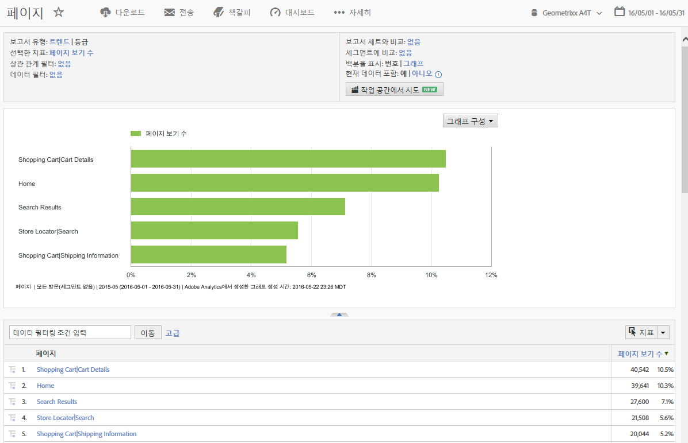
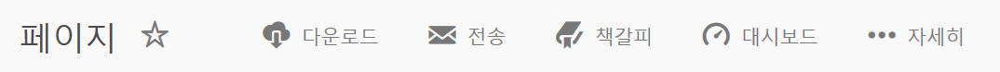
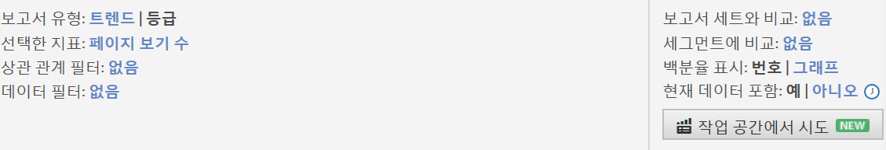
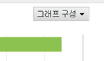
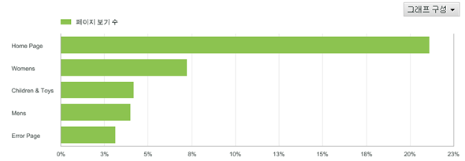
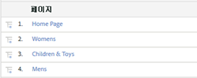

# 보고서 기능

도구 모음, 달력 및 세부 사항 테이블을 포함한 보고서 기능에 대한 소개입니다.

This example shows a [!UICONTROL Pages Report]. The configuration options may vary, depending on the report that you run. For example, rather than selecting Trended or Ranked in a [!UICONTROL Site Content] report, you might specify the granularity and page name for a [!UICONTROL Site Metrics] report.

## 페이지 보고서 예 {#section_288CC85536684C2DB184141358481EF0}

페이지 보고서의 예( **[!UICONTROL Reports]** > **[!UICONTROL Site Content]** > **[!UICONTROL Pages Reports]** > **[!UICONTROL Pages]**).

{width=&quot;672px&quot;}

## 보고서 도구 모음 {#section_0D674177AE6C4A71B07234DB25910ECD}

데이터를 기반으로 사이트 또는 마케팅 전략을 변경할 수 있는 의사 결정권자와 보고서 데이터를 공유합니다.

{width=&quot;672px&quot;}

[보고서 사용자 지정](/help/analyze/reports-analytics/reports-customize/customizing-reports-overview.md)을 참조하십시오.

## 보고서 헤더 및 설정 {#section_12A90FAE02EC43FB9F11F0E2CE8FAE8F}

보고서 설정을 표시하고, 보고서 유형을 구성하고 지표를 선택하는 등의 작업을 수행할 수 있습니다. 이 그룹에서 사용할 수 있는 옵션은 실행하는 보고서에 따라 달라집니다. 

{width=&quot;672px&quot;}

자세한 내용은 [보고서 사용자 지정](/help/analyze/reports-analytics/reports-customize/customizing-reports-overview.md)을 참조하십시오.

## 달력 {#section_8C6C4AD84D9043E8ABD53FF8F645AAB1}

[달력] 단추를 클릭하고 날짜 범위를 선택하여 날짜를 지정합니다. 성과를 비교하기 위해 두 개의 시간 범위를 선택할 수도 있습니다.

{width=&quot;672px&quot;}

[날짜 또는 날짜 범위 선택](/help/analyze/reports-analytics/reports-customize/customizing-reports-overview.md) 및 [날짜 비교](/help/analyze/reports-analytics/reports-customize/customizing-reports-overview.md)를 참조하십시오.

## 그래프 유형 {#section_8B9CBA4096E64FC3B744E2E06EB83C19}

표시할 그래프 또는 차트의 유형을 선택합니다:

[보고서 그래프 변경](/help/analyze/reports-analytics/reports-customize/t-reports-graphs.md)을 참조하십시오.

## 그래프 표시 {#section_4C78ADC82C234CC6841AC92C803636F4}

선택한 그래프 유형에 따라 일반적으로 세부 사항 목록의 상위 항목이 여러 개 나타납니다. 그래프가 다른 기간을 보여주는 트렌드 그래프인 경우에는 모든 기간이 표시됩니다:

[보고서 사용자 지정](/help/analyze/reports-analytics/reports-customize/customizing-reports-overview.md)을 참조하십시오.

## 지표 {#section_8B8F9EC72B864E29B91039E7B7381EAD}

지표를 보고서에 추가합니다. 관리자는 기본 지표를 지정할 수 있습니다.

[지표](/help/analyze/reports-analytics/metrics.md)를 참조하십시오.

## 세부 사항 테이블 {#section_449A5DC848744F65A10DA12E189B835D}

세부 사항은 많은 양의 보고서 데이터입니다. 이 경우, 페이지가 나열되며 페이지 보기 횟수(해당 기간 동안 로드되는 횟수)를 기준으로 측정됩니다:

세부 사항 테이블에서 데이터를 필터링하고, 분류를 만들고, 지표를 추가하는 등의 작업을 수행할 수 있습니다.

[보고서 사용자 지정](/help/analyze/reports-analytics/reports-customize/customizing-reports-overview.md)을 참조하십시오.
