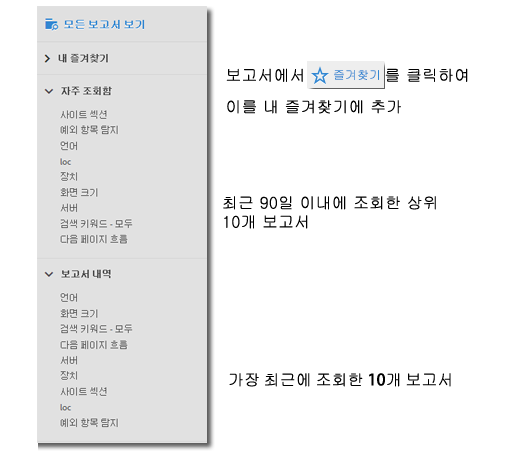
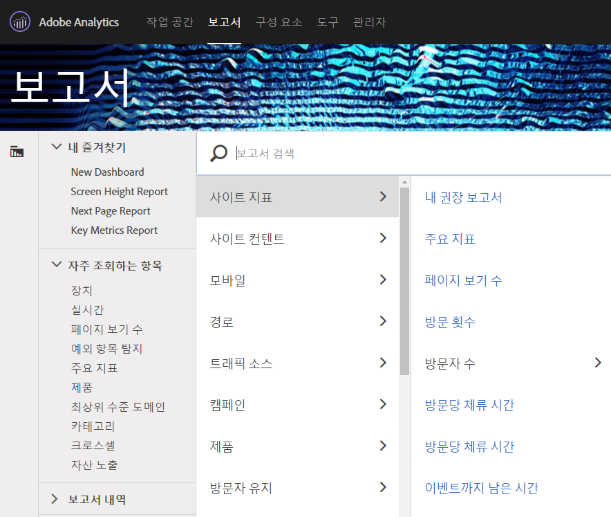
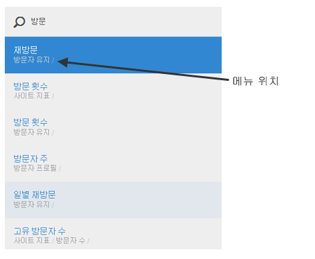
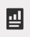

# 보고서 메뉴{#reports-menu}

Reports &amp; Analytics의 보고서 메뉴에 대한 개요.

보고서 메뉴에서 제공하는 사항:

* 전체 보고서 세트에 대한 액세스 권한
* 빠른 액세스를 위한 보고서 즐겨찾기 설정 기능
* 자주 본 보고서
* 향상된 검색

[내 즐겨찾기], [자주 조회함], 및 [보고서 내역]은 모두 보고서 세트에 따라 다릅니다. 보고서 세트를 변경하는 경우 세 가지 목록도 모두 변경됩니다.

보고서는 계층적 열 보기를 사용하여 표시됩니다. Click **[!UICONTROL View All Reports]**, or press the Forward Slash key (/), and then press the Down Arrow key (?) to quickly display and navigate the menu using the Arrow keys. Esc 키를 눌러 현재 보고서를 변경하지 않고 메뉴를 닫거나, Enter 키를 눌러 선택한 보고서를 로드합니다.

{width="672px"}

개별 보고서에 대한 자세한 내용은 [보고서 설명](https://marketing.adobe.com/resources/help/en_US/reference/reports_descriptions.html)을 참조하십시오.

## 보고서 검색 {#section_E5EF11E36CB9451AA7B079E585CA7DB6}

보고서 메뉴에서는 향상된 검색 환경을 제공합니다. Click **[!UICONTROL View All Reports]** , or press the Forward Slash key (/) , and then begin typing to quickly find a report. 분석 왼쪽 탐색 영역(관리, 구성 요소 등)의 모든 항목을 포함하도록 보고서 검색이 확장되었습니다.

보고서 목록에서 찾으려면 탭 키 또는 아래쪽 화살표 키(?)를 누릅니다. Esc 키를 눌러 현재 보고서를 변경하지 않고 검색을 닫거나, Enter 키를 눌러 선택한 보고서를 로드합니다.

>[!NOTE]
>
>prop, eVar 및 이벤트 번호별로 보고서 목록을 검색할 수도 있습니다. 검색 창에서 prop, eVar 또는 이벤트 번호를 입력합니다.

## 탐색 개요 {#section_A6A0A369207149BABE504753B48A42D7}

<table id="table_3BA295966BBC4C94ABDC3718D1894698"> 
 <thead> 
  <tr> 
   <th colname="col1" class="entry"> 메뉴 항목 </th> 
   <th colname="col2" class="entry"> 설명 </th> 
  </tr>
 </thead>
 <tbody> 
  <tr> 
   <td colname="col1">Experience Cloud 솔루션 메뉴  </td> 
   <td colname="col2"> 이 아이콘을 클릭하면 Experience Cloud 메뉴가 확장되어 다른 Marketing Could 솔루션에 액세스할 수 있습니다. </td> 
  </tr> 
  <tr> 
   <td colname="col1">보고서 메뉴 전환  </td> 
   <td colname="col2"> 이 단추를 클릭하면 [보고서] 메뉴가 확장되거나 축소되어 보고서를 브라우저 창의 전체 너비로 볼 수 있습니다. </td> 
  </tr> 
  <tr> 
   <td colname="col1">세그먼트  </td> 
   <td colname="col2">세그먼트를 추가 또는 관리할 수 있도록 해주는 세그먼트 레일을 표시합니다. 세그먼트 레일에서는 <a href="https://marketing.adobe.com/resources/help/en_US/analytics/segment/seg_build_ui.html" format="http" scope="external">세그먼트 빌더</a> 및 <a href="https://marketing.adobe.com/resources/help/en_US/analytics/segment/seg_manage.html" format="http" scope="external">세그먼트 관리자</a> 인터페이스에 액세스할 수도 있습니다. </td> 
  </tr> 
  <tr> 
   <td colname="col1">지표  </td> 
   <td colname="col2"> 지표 및 계산된 지표를 추가 또는 관리할 수 있도록 해주는 지표 레일을 표시합니다. </td> 
  </tr> 
  <tr> 
   <td colname="col1"> 모든 보고서 보기 </td> 
   <td colname="col2">모든 보고서 세트별 보고서, 대시보드, 책갈피, 계산된 지표 및 타겟이 모든 보고서 보기 섹션에 들어 있습니다. 언제든지 여기를 클릭하면 사용 가능한 모든 내용을 탐색할 수 있습니다. </td> 
  </tr> 
  <tr> 
   <td colname="col1">모든 보고서 보기 내 검색 막대 </td> 
   <td colname="col2"> 
 필요한 리소스를 검색할 수 있습니다. "퍼지(fuzzy)" 검색을 사용하므로, 찾고 있는 단어를 정확히 입력할 필요가 없습니다. 검색 결과는 위쪽, 아래쪽, 왼쪽 및 오른쪽 화살표를 사용하여 탐색할 수 있는 연속 목록으로 표시됩니다. 검색 결과에서 Enter 키를 누르면 해당 보고서가 바로 표시됩니다. 
 </td> 
  </tr> 
  <tr> 
   <td colname="col1">내 즐겨찾기 </td> 
   <td colname="col2">이 영역에서 즐겨찾기로 지정으로 표시한 보고서를 쉽게 검색할 수 있습니다. 사용자 및 보고서 세트별로 10개의 즐겨찾기와 더 보기... 링크(즐겨찾기가 10개가 넘을 때)가 표시됩니다. 
[내 즐겨찾기]에서 보고서 이름은 변경할 수 있지만, 대시보드 이름은 변경할 수 없습니다. 
 
즐겨찾기는 책갈피와 유사하지만, 책갈피처럼 폴더에 저장하거나 <a href="../../../analyze/reports-analytics/bookmarks.md#concept_55B5E0DF20B14AAF8819CB8244464406" format="dita" scope="local"> 북마크 관리자</a>를 통해 관리할 수 없습니다. 
 </td> 
  </tr> 
  <tr> 
   <td colname="col1"> 자주 조회함 </td> 
   <td colname="col2"> Adobe Analytics에서는 지난 90일 동안 가장 자주 실행한 10개의 보고서를 계속 추적하고, 여기에 표시하고, 실행 빈도별로 정렬합니다. 90일이 넘도록 이 보고서 세트를 사용하지 않은 경우, 10개의 인기 있는 일반 보고서 목록으로 채웁니다. </td> 
  </tr> 
  <tr> 
   <td colname="col1"> 보고서 내역 </td> 
   <td colname="col2"> 여기에는 지난 90일간 액세스한 최근 10개의 보고서 또는 대시보드가 표시됩니다. 분석 또는 보고에서 이전 단계로 돌아가는 방법을 쉽게 알 수 있습니다. </td> 
  </tr> 
  <tr> 
   <td colname="col1"> 다운로드 </td> 
   <td colname="col2">보고서를 PDF, CSV, Excel 및 Word 형식으로 다운로드할 수 있습니다. </td> 
  </tr> 
  <tr> 
   <td colname="col1"> 보내기 </td> 
   <td colname="col2">보고서를 즉시 이메일로 전송하거나 이메일을 1회 또는 반복적으로 전송하도록 예약할 수 있습니다. 형식 옵션에는 PDF, CSV, Excel, HTML, Word 또는 Mobile(텍스트만)이 있습니다.</td> 
  </tr> 
  <tr> 
   <td colname="col1"> 책갈피... </td> 
   <td colname="col2">보고서에 책갈피를 <a href="../../../analyze/reports-analytics/bookmarks.md#concept_55B5E0DF20B14AAF8819CB8244464406" format="dita" scope="local"> 지정할</a> 수 있습니다. </td> 
  </tr> 
  <tr> 
   <td colname="col1"> 대시보드... </td> 
   <td colname="col2">Lets you add the report to a <a href="../../../analyze/reports-analytics/dashboard.md#concept_8CD3ACA2830A4994A68A31D8773B57E0" format="dita" scope="local"> dashboard</a>. </td> 
  </tr> 
  <tr> 
   <td colname="col1"> 자세히... </td> 
   <td colname="col2"> 인쇄, 데이터 추출, 경고 추가, 사용자 지정 보고서 생성, 그래프 복사, 이 보고서에 연결, 새 창 열기 작업 중 일부 또는 전부를 수행할 수 있도록 해줍니다. </td> 
  </tr> 
  <tr> 
   <td colname="col1">보고서 세트 선택기  </td> 
   <td colname="col2"><a href="https://marketing.adobe.com/resources/help/en_US/reference/report_suites_admin.html" format="https" scope="external">기본 보고서 세트</a>나 <a href="https://marketing.adobe.com/resources/help/en_US/reference/virtual-report-suites.html" format="https" scope="external">가상 보고서 세트</a>를 선택할 수 있도록 해줍니다. </td> 
  </tr> 
  <tr> 
   <td colname="col1">달력  </td> 
   <td colname="col2">보고 기간을 결정할 수 있도록 <a href="../../../analyze/reports-analytics/overview/report-overview.md#section_8C6C4AD84D9043E8ABD53FF8F645AAB1" format="dita" scope="local">달력</a>을 표시합니다. </td> 
  </tr> 
 </tbody> 
</table>

## 모든 보고서 메뉴 사용자 지정 {#section_7E47312747564FBE8A55EE5726B7DFF4}

관리자는 보고서 메뉴 내에 포함된 보고서를 변경할 수 있습니다. 관리 도움말에서 [메뉴 사용자 지정](https://marketing.adobe.com/resources/help/en_US/reference/customize_menus.html)을 참조하십시오.
