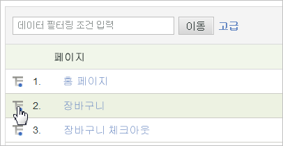

# 분류

보고서 항목 또는 세그먼트가 다른 보고서와 관련되는 방식에 대해 자세히 알아보려면 분류를 사용하십시오. 이러한 경우 특정 보고서를 다른 보고서로 “분류한다”고 합니다.

일례는 연령 그룹이라는 사용자 지정 트래픽 보고서에 대한 분류입니다. 이 보고서에서는 설문 조사를 통해 사이트 방문자의 연령을 수집했습니다. 이 보고서를 통해 사이트에서 가장 많은 트래픽을 발생시키는 연령 그룹을 확인할 수 있습니다. 그러나 방문자 연령과 같이 수집하기 어려운 경우 페이지 보기 이상의 정보가 필요할 수 있으므로 방문자들이 사용하는 검색 엔진 , 키워드 또는 지리적 위치에 대한 분류 보고서를 생성할 수 있습니다. 연령 그룹과 검색 엔진에 대해 상관 관계를 맺는다고 가정하겠습니다. 

만약에 *`Referrer Type`*&#x200B;별로 보고서를 분류할 경우 *`Inside Your Site`*&#x200B;에 대한 데이터 포인트가 표시될 수 있습니다. 이 값은 내부 URL 필터 목록에 있는 레퍼러 페이지를 나타냅니다. 관리 참조에서 [내부 URL 필터](/help/admin/admin/internal-url-filter-admin.md)를 확인하십시오.

Analytics 변수(eVar 또는 prop)는 다른 변수로 분류할 수 있습니다. 보고서 테이블의 **[!UICONTROL 분류 기준]** 메뉴는 표준 Analytics 보고 메뉴와 일치하여 선택 사항을 일관되게 유지합니다.

## 분류 보고서 실행을 참조하십시오 {#task_F685624830E64C829C8BE6435A107F69}

상세 분류 보고서를 실행하는 방법을 설명한 단계입니다.

<!-- 

t_reports_breakdown.xml

 -->

1. **[!UICONTROL Analytics]** > **[!UICONTROL 보고서]** > **[!UICONTROL 사이트 컨텐츠]** > **[!UICONTROL 페이지]**&#x200B;로 이동하여 보고서를 엽니다.
1. 보고서 테이블에서 **[!UICONTROL 분류 기준]** 아이콘을 클릭합니다.

   **[!UICONTROL 분류 기준]** 아이콘이 보이지 않을 경우 이 기능은 사용할 수 없으며 또는 활성화되지 않습니다.

   

   **[!UICONTROL 분류 기준]** 메뉴는 현재 보고서에 사용할 수 있는 모든 분류 옵션을 표시합니다.
