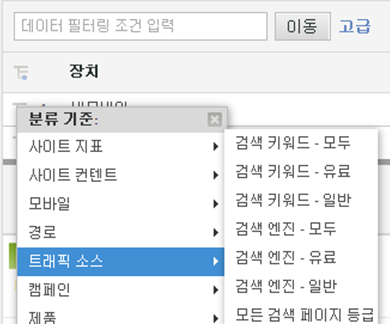
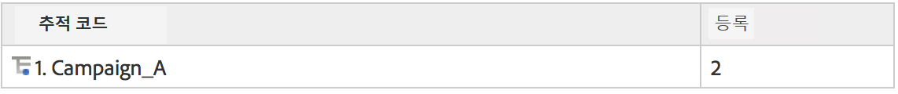
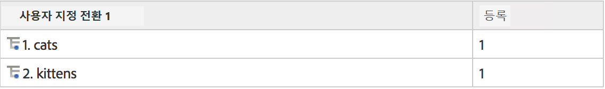
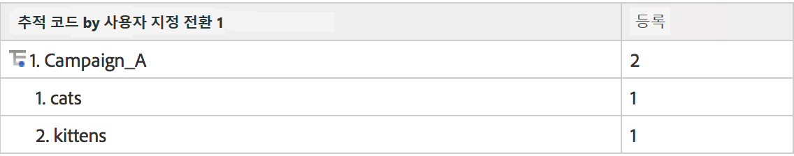
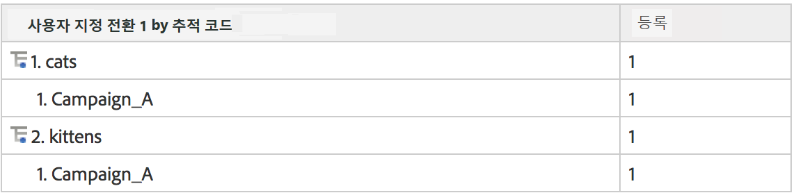
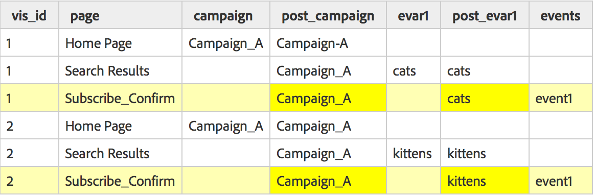

# 하위 관계

전체 하위 관계는 모든 전환 보고서에서 활성화되므로 다른 eVar로 eVar를 분류할 수 있습니다. 보고서 테이블의 분류 기준 메뉴는 표준 분석 보고 메뉴에 일치시켜 선택 사항을 일관되게 유지합니다.

## 하위 관계 작동 방식 {#section_5BD862BB74FE411B96B59204520E4631}

하위 관계가 작동 방식을 보여줄 수 있도록 하려면, 다음 예를 고려해 보십시오.

1. 사용자가 Campaign_A를 통해 사이트를 방문하며 홈 페이지에 도달합니다.
1. 사용자가 'cats'를 검색하고, 검색 결과가 표시됩니다. eVar1이 내부 검색어 추적을 유지합니다.
1. 사용자가 event1을 사용하여 추적되는 메일링 목록에 가입합니다.
1. 다른 사용자도 Campaign_A를 통해 사이트를 방문하며 홈 페이지에 도달합니다.
1. 이 사용자가 'kittens'를 검색하고, 검색 결과(eVar1)가 표시되며, 메일링 목록에도 가입합니다(event1).

추적 코드 보고서를 가져오면 다음을 볼 수 있습니다.

eVar1 보고서를 가져오면 다음을 볼 수 있습니다.

eVar1으로 캠페인 보고서와 하위 관계를 맺으면 다음을 볼 수 있습니다.

캠페인으로 eVar1 보고서와 하위 관계를 맺으면 다음을 볼 수 있습니다.

전환 변수의 지속적인 성질로 인해 eVar 값을 저장하는 데 사용되는 두 개의 데이터 열(종료된 값과 지속되는 값)이 있습니다. 이러한 예로 원시 데이터 내보내기를 살펴보면 다음과 같이 보입니다(이 예를 위해 간소화됨).

Adobe의 백엔드는 post_campaign 및 post_evar1이 캠페인 및 evar1에서 정의된 값을 유지하도록 허용함으로써 작동합니다. 하위 관리 보고서는 특히 성공 이벤트를 포함하는 히트만 표시합니다(옅은 노란색으로 강조 표시된 행). 그런 다음 지속적인 값을 기반으로 하위 관계 보고서를 채웁니다(이 경우 post_campaign 및 post_evar1, 진한 노란색으로 강조 표시된 셀).

본질적으로, 하위 관계는 다음 절차에 따라 보고서를 채웁니다.

* 보고서에서 보고 있는 성공 이벤트를 포함하는 이미지 요청을 분리합니다.
* 하위 관계에 사용된 각 전환 변수로부터 지속적인 값을 반환합니다.
* 하위 관계의 순서를 기반으로 값을 구성합니다. 변수에 지속적인 값이 없을 경우(eVar이 정의 또는 만료되지 않은 경우처럼), '없음' 아래에서 버킷으로 처리됩니다.

