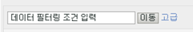
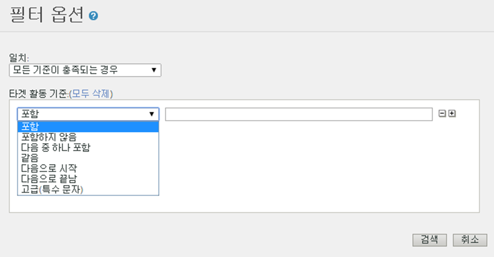

# Filter Report Data {#concept_09DC5B986A644738B12204DAC76A90E1}

필터 기능을 통해 필터에 일치하는 라인 항목을 포함하거나 제외하도록 보고서 범위를 세부적으로 조정할 수 있습니다.

## 단순 필터 {#section_5C4DE873F8D5484BB77F38A4AEB57B4A}



단순 필터는 대부분의 보고서에 표시되며 특정 라인 항목을 신속히 찾는 데 사용됩니다. Simple filters do not use any special characters, so `-, ", ', +` and other special characters match the literal value in the report. 공백을 사용하여 여러 용어가 들어 있는 라인 항목을 찾을 수 있습니다.

예:

```
help search
```

다음 페이지에 일치합니다.

```
help:Search
help:Paid Search Detection
help:Configure paid search detection
help:Search Keywords Report
help:Internal Search Term
```

## 고급 필터 {#section_E016626C084640E8A066B2FDA5B932BF}

고급 필터를 사용하면 필터 컬렉션을 사용하여 검색 범위를 제어할 수 있습니다. 모든 필터 또는 특정 필터에 일치하도록 선택할 수 있습니다.



**포함**

라인 항목에 해당 용어가 있으면 일치합니다. 단순 필터와 동일한 방식으로 작동합니다.

>[!NOTE]
>
>공백은 검색에서 구분 기호로 인식하기 때문에 필터에 공백을 사용할 수 없습니다.

**포함하지 않음**

라인 항목에 해당 용어가 없으면 일치합니다. You can filter "unspecified", "none", "keyword unavailable" and other [special values](https://marketing.adobe.com/resources/help/en_US/reference/none-unspecified-unknown-other.html) from reports using "does not contain".

다음을 포함하지 않음: `none`

더 구체적인 필터가 필요하면 고급(특수 문자) 필터를 사용할 수 있습니다.

* 고급(특수 문자)`-^none$` 위에 다음 코드를 추가할 것을 권장합니다.
* 고급(특수 문자): `-"keyword unavailable"`

예를 들어, 다음 라인 항목은 "포함하지 않음" 기준으로 필터링되지만, "고급(특수 문자)" 기준으로는 필터링되지 않습니다.

```
help:Rename the None classification key
```

**다음 중 하나 포함**

라인 항목에 공백으로 구분된 용어 중 하나라도 있으면 일치합니다. 다음 필터는 "mens" 또는 "sale"이 들어 있는 모든 페이지를 보여 줍니다.

다음 중 하나 포함`mens sale` 위에 다음 코드를 추가할 것을 권장합니다.

다음 페이지에 일치합니다.

```
Womens
Mens
Mens:Desk & TravelJewelry & Accessories:Accessories:Hats:Mens
Sale & Values
```

**같음**

공백과 기타 문자를 포함한 라인 항목 전체가 지정된 구와 일치하는 경우 일치합니다.

같음`mens:desk & travel` 위에 다음 코드를 추가할 것을 권장합니다.

`Mens:Desk & Travel`

**다음으로 시작**

공백과 기타 문자를 포함한 라인 항목이 지정된 구로 시작하는 경우 일치합니다.

다음으로 시작`mens` 위에 다음 코드를 추가할 것을 권장합니다.

다음 페이지에 일치합니다.

```
Mens
Mens:Desk & Travel
Mens:Apparel
Mens Perfume Spray
Mens Hemp/Bamboo Flip Flops
```

**다음으로 끝남**

공백과 기타 문자를 포함한 라인 항목이 지정된 구로 끝나는 경우 일치합니다.

다음으로 끝남`jean` 위에 다음 코드를 추가할 것을 권장합니다.

다음 페이지에 일치합니다.

```
Bell Bottom Jean
Velvet Dream Skinny Leg Jean
Dark Slimmer Jean
Bling Belt High Waist Jean
Ocean Blue Jean
```

## 고급(특수 문자) {#section_83DA3B6C23EB4C119DB6D74062DB501D}

고급 필터를 사용하면 와일드카드 및 기타 복잡한 검색을 수행할 수 있습니다.

| 고급(특수 문자) | 설명 |
|--- |--- |
| `" "` | 구에 정확하게 일치합니다. |
| `*` | 와일드카드, 임의 문자열입니다. <br>예를 들어 "Registration `r*p` Signup" 와 일치합니다. |
| `^` | 다음으로 시작. <br>특수 문자와 검색 구 사이에 공백이 있으면 안 됩니다. |
| `$` | 다음으로 끝남. <br>특수 문자와 검색 구 사이에 공백이 있으면 안 됩니다. |
| `-` | 아님. <br>특수 문자와 검색 구 사이에 공백이 있으면 안 됩니다. |
| `|` | Or<br>Note:  you must include a space on each side of the pipe character, `" | "`. |

## 보고서별 필터 만들기 {#task_DEBB0632411D4CA8AA0B3BA267A5B35F}

보고서에 대한 필터를 만드는 방법을 설명하는 단계입니다.

<!-- 

t_reports_filter_specific.xml

 -->

일부 보고서는 해당 보고서 고유의 필터를 가지고 있습니다. 예를 들어 [!UICONTROL 구매 전환 단계 보고서]를 사용하면 웹 페이지별로 필터링할 수 있습니다. [!UICONTROL 지리 특성 보고서]를 사용하면 지역별로 필터링할 수 있습니다. 그 외 보고서에도 해당 보고서 고유의 필터가 있습니다.

이러한 필터에 액세스하면 목록에 지정된 항목에 대한 보고서 지표를 볼 수 있습니다.

**보고서별 필터를 만들려면**

1. [!UICONTROL 구매 보고서와 같은 보고서를 생성합니다] ( **[!UICONTROL 사이트 지표]** &gt; **[!UICONTROL 구매]** &gt; **[!UICONTROL 구매 전환 단계]**).
1. 보고서 헤더에서 **필터** 링크를 클릭합니다.
1. [!UICONTROL 필터 선택기]**페이지에서[!UICONTROL 필터 적용]**&#x200B;을 클릭한 다음 필터 유형을 선택합니다.
1. 항목을 검색하려면 **검색** 필드에 문자열을 입력합니다.
1. **[!UICONTROL 확인을 클릭합니다]**.

## 상관 관계 필터 추가 {#task_065042E384DA4BF3864C58AF2B88D6E2}

상관 관계 필터를 추가하는 방법을 설명하는 단계입니다

<!-- 

t_reports_correlation_filter.xml

 -->

일부 보고서에서는 사용자 지정 상관 관계 필터를 추가할 수 있습니다. 예를 들어 사이트 섹션이 여성 페이지와 상관된 보고서 세트의 [!UICONTROL 페이지 보고서]를 보고 있는 경우 사이트 섹션과 여성이 동일할 때 가장 빈도가 높은 페이지를 표시하는 보고서를 생성하는 필터 규칙을 만들 수 있습니다.

사용 가능한 상관 관계를 사용하여 상관 관계 보고서에 표시되는 데이터를 필터링할 수 있습니다. 이 예제에서는 검색 엔진 상관 관계 필터를 추가하는 방법을 보여줍니다.

**상관 관계 필터 추가**

1. 상관 관계를 지원하는 보고서를 실행합니다. (See [Running a Breakdown Report](../../../analyze/reports-analytics/reports-customize/breakdowns.md#task_F685624830E64C829C8BE6435A107F69).)
1. In the report header, click the **[!UICONTROL Correlation Filter]** link.
1. [!UICONTROL 필터 규칙 작성기]에서 항목과 상호 연결할 카테고리를 선택합니다.
1. **[!UICONTROL 확인을 클릭합니다.]**
