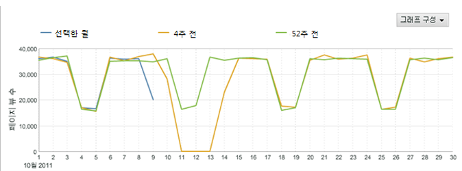
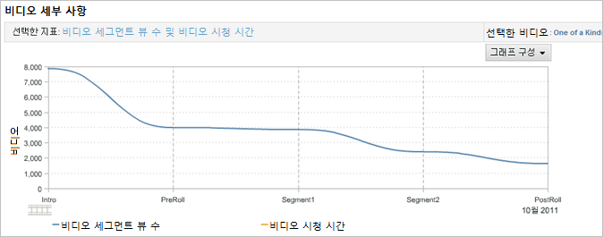
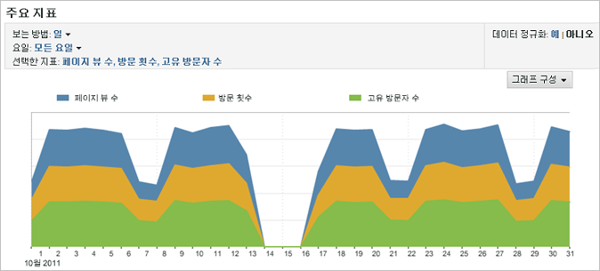
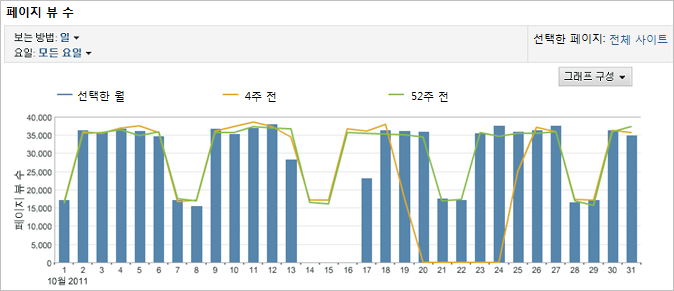
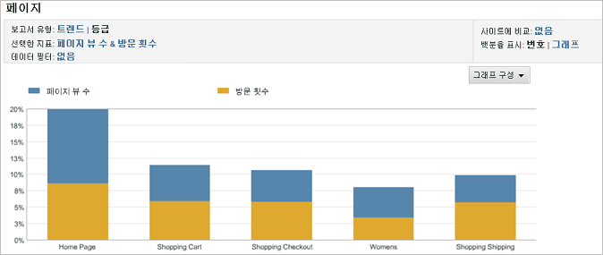
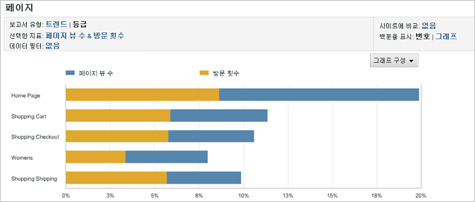
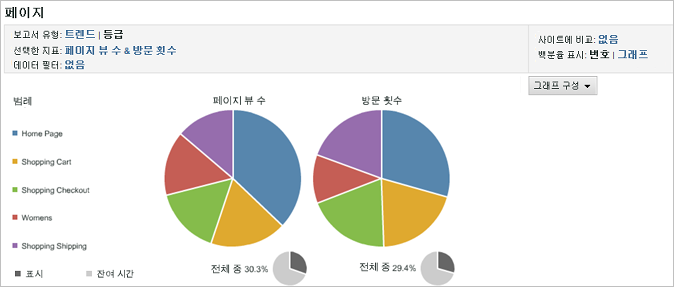
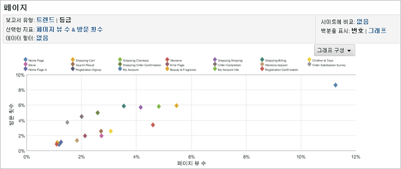
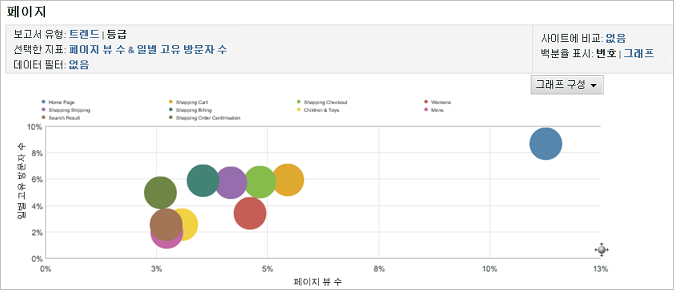

# 보고서 그래프 변경

그래프를 목표 대상에게 가장 유용한 방식으로 사용자 지정하는 방법을 설명하는 단계입니다.

사용 가능한 그래프 종류는 실행하는 보고서 유형에 따라 다릅니다. 예를 들어 트렌드 보고서에는 트렌드 라인 그래프를 사용하는 것이 효과적이지만, 일, 주, 월 등에 따른 트렌드를 보다 명확하게 표현할 수 있도록 트렌드 라인과 함께 세로 막대 그래프를 사용할 수도 있습니다. 또는 파이 차트를 사용하여 조회한 페이지에 대한 백분율을 표현할 수 있습니다.

**보고서 그래프를 변경하려면**

1. 보고서 실행.
1. Click **[!UICONTROL Configure Graph]**.
1. 그래프 유형을 선택합니다.

   **[!UICONTROL 트렌드 라인]**: 트렌드 라인은 보고서 지표에 대한 일일 트렌드를 보여주며 시간에 따라 라인당 한 개 지표의 트렌드를 분석하는 데 유용합니다.

   

   **[!UICONTROL 평활 라인]**: [!UICONTROL 비디오 상세 정보 보고서]에 이 그래프 유형을 사용합니다. 여기에는 특정 비디오 세그먼트에 대한 보기 수 또는 비율이 표시됩니다. 특정 비디오 세그먼트에 대한 보기 수가 상승하면 해당 비디오 섹션을 돌려가면서 여러 번 보았다는 것을 의미합니다. 백분율을 사용할 경우, 그래프에 표시된 백분율은 본 세그먼트 모두의 백분율입니다(세그먼트를 본 사람의 백분율이 아님). 예를 들어 그래프에서 모든 보고서 세그먼트의 합은 39입니다. 0 - 10초 세그먼트의 보기 수가 10이므로 이 세그먼트의 보기 백분율은 약 26%입니다.

   

   **[!UICONTROL 영역]**: 영역 그래프는 트렌드 라인 그래프와 비슷하지만 라인 아래 영역이 채워집니다. 영역 그래프는 트렌드 보고서를 볼 때만 표시됩니다.

   

   **[!UICONTROL 스택된 영역]**: 스택된 영역 차트는 일정 기간 동안 제품이나 캠페인 수의 트렌드를 추적하는 데 유용합니다. 예를 들어 매출액을 보여주는 상위 5개 제품의 트렌드를 추적하는 경우 일정 기간 동안 이러한 제품이 가져다 주는 총 매출액이 얼마인지 신속하게 확인할 수 있습니다. 특정 제품을 포함하거나 제외하는 검색 필터를 사용하여 보기를 세분화할 수 있습니다.

   

   **[!UICONTROL 세로 막대]**: 세로 막대 차트는 보고서 지표에 대한 상대적인 백분율을 보여줍니다.

   

   **[!UICONTROL 스택형 세로 막대]** 유사한 항목을 스택함으로써 항목이 전체에 미치는 영향을 신속하게 확인할 수 있습니다. 예를 들어 [!UICONTROL 캠페인 보고서]에서 유사한 성공 지표를 스택하고 성공률이 가장 높은 캠페인을 확인할 수 있습니다. 따라서 한 지표에서 상위 수행자가 되지 않고 결합 지표에서 상위 수행자가 될 수 있는 캠페인을 쉽게 찾을 수 있습니다.

   

   **[!UICONTROL 가로 막대]**: 가로 막대 차트는 가로 열 형태인 점을 제외하고 세로 막대 차트와 비슷합니다.

   

   **[!UICONTROL 스택형 가로 막대]** 스택형 가로 막대 차트는 가로 열 형태인 점을 제외하고 세로 막대 차트와 비슷합니다.

   

   **[!UICONTROL 파이]**: 파이 차트는 서로 관련된 상위 지표 비율을 보여주며 전체와 관련된 선택된 지표의 비율을 보여줍니다. 등급 보고서에 대한 파이 차트를 표시할 수 있습니다.

   

   **[!UICONTROL 분산형]**: 분산형 그래프는 서로 관련하여 선택하는 지표의 분산형 표시를 보여줍니다. 분산형 그래프를 사용하면 데이터를 2차원으로 시각화함으로써 어느 항목이 비정상적인지 식별할 수 있습니다.

   

   **[!UICONTROL 버블]**: 버블 그래프는 서로 관련하여 선택하는 지표의 버블 표시를 보여줍니다. 버블의 위치는 세로축과 가로축에 있는 지표 사이의 관계를 보여주며 버블 크기는 주요 보고서 지표를 보여줍니다. 버블 그래프를 사용하면 데이터를 2차원으로 시각화함으로써 어느 항목이 비정상적인지 식별할 수 있습니다.

   

