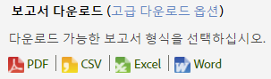
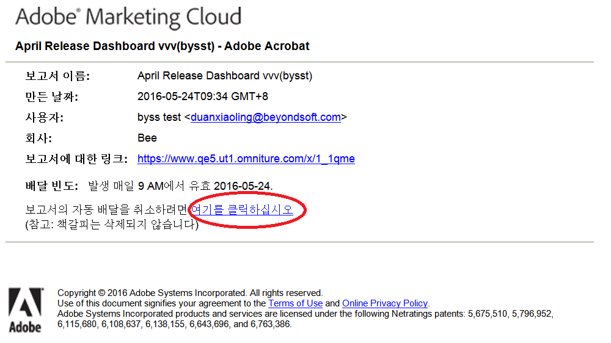

# 보고서 예약 및 배포

보고서 예약, 다운로드 및 배포에 대한 정보입니다.

## Report schedule and distribution {#concept_4EA333DFC7FD4E9CA086385A3DA10BE9}

보고서 예약, 다운로드 및 배포에 대한 정보입니다.

Adobe Analytics 애플리케이션에서 보고서 배달을 예약할 때 예약 및 배포 도구를 사용하여 어느 파일이 자동으로 전송되었는지 보고 배달을 수정하거나 종료할 수 있습니다.

처리 메커니즘과 플랫폼에 있는 차이로 인해 Adobe Analytics에서 사용할 수 있는 다양한 유형의 다운로드 가능한 보고서와 예약된 보고서에는 단일 요청에서 처리할 수 있는 최대 개수의 행에 대해 서로 다른 제한 사항이 있습니다. 각각의 제한 사항은 다음과 같습니다.

* Word, CSV, Excel, HTML 및 PDF: 보고서에 동일한 수의 행이 표시됩니다. 기본적으로 이 제한은 50개 행이지만 최대 200개까지 늘릴 수 있습니다. 분류 보고서에는 50개 행이라는 제한이 있습니다.
* 데이터 추출: 50,000개 행
* Data Warehouse: 제한 없음

이러한 제한 사항은 예약 및 다운로드한 개별 보고서용이며, 대시보드는 reportlet 내에서 사용할 수 있는 공간의 크기로 제한됩니다.

## 보고서 보내기 {#task_27642CD33D484FD0BF59EBD159EEF52C}

여러 가지 형식으로 보고서를 다운로드하고 이메일로 보내고, 보고서 배달을 예약하는 방법을 설명하는 단계입니다.

<!-- 

t_send_report.xml

 -->

1. Run a report, then click **[!UICONTROL More]** &gt; **[!UICONTROL Send]**.
1. 배달 옵션을 지정합니다.

   | 옵션 | 설명 |
   |--- |--- |
   | 형식 | PDF 또는 HTML을 선택합니다. |
   | 수신인 | 보고서를 받을 이메일 주소를 입력합니다. |
   | 제목 | 이메일 제목과 같습니다. |
   | 예약 | 보고서를 즉시 보낼지 또는 간격을 두고 보낼지 선택합니다. |

1. **[!UICONTROL 고급 배달 옵션을]** 클릭하여 배달 일정을 지정합니다.

   <table id="choicetable_2934E54FEE6E4D33B07EAC21F6DF628E"> 
   <thead class="chhead sthead"> 
   <th class="choptionhd"> 옵션 </th> 
   <th class="chdeschd"> 설명 </th> 
   </thead> 
   <tr class="chrow strow"> 
   <td class="choption"><strong>보고서 파일 이름</strong></td> 
   <td class="chdesc stentry"> 
보고서 이름을 지정합니다. 기본 형식은 <code>&lt;suite&gt;용 &lt;보고서 이름&gt; - &lt;보고서 날짜 범위&gt;</code>입니다. 
 
사용자 지정 이름을 지정하려면 사용자 지정을 선택합니다 . 
 </td> 
   </tr> 
   <tr class="chrow strow"> 
   <td class="choption"><strong>보고서 형식</strong></td> 
   <td class="chdesc stentry"> 
배달할 PDF, CSV, Excel, HTML, Word 또는 Mobile 형식을 지정할 수 있도록 해줍니다. CSV를 선택하는 경우 CSV용 인코딩도 지정할 수 있습니다. 
 
 
      <ul id="ul_4A2EB8D9512246589994052CF482BFD7"> 
      <li id="li_A4FC4D795A9D4F92AAB187ACDFBA180D"> 
  Shift-JIS: 일본어 문자 인코딩에 사용됩니다. 
 </li> 
      <li id="li_405C7EC97F994D649A50F84466FADA3D"> 
  EUC-JP: 확장 Unix 코드용으로 주로 일본어, 한국어 및 중국어 간체에 사용됩니다. 
 </li> 
      </ul> 
 </td> 
   </tr> 
   <tr class="chrow strow"> 
   <td class="choption"><strong>보고서 내용</strong></td> 
   <td class="chdesc stentry"> 
  표의 행 수: 전송하는 보고서의 테이블에서 표시되는 행의 수를 지정합니다. 
 
  머리글과 바닥글 언어: 머리글과 바닥글의 언어를 지정합니다. 
 
  설명: 보고서 시작 부분에 나타나는 텍스트를 지정합니다. 
 </td> 
   </tr> 
   <tr class="chrow strow"> 
   <td class="choption"><strong>디지털 서명 파일 전송</strong></td> 
   <td class="chdesc stentry"> 
책갈피가 표시된 보고서와 같은 보고서를 요청하거나 Data Warehouse 요청을 수행할 때 데이터 서명을 요청할 수 있습니다. Adobe의 디지털 서명은 데이터에 액세스할 수 있는 사용자를 제한하지 않으며 디지털 서명 파일(.sig)의 용도는 배달된 보고서 파일의 유효성을 확인하는 것입니다. 보고서 수신자는 디지털 서명을 사용하여 Adobe에서 파일을 보내고 해당 파일이 변경되지 않았는지 확인할 수 있습니다. 
 </td> 
   </tr> 
   <tr class="chrow strow"> 
   <td class="choption"><strong>보고서 대상</strong></td> 
   <td class="chdesc stentry"> 
  이메일: 이메일 주소 설정, 제목 줄 및 참고 정보를 구성할 수 있습니다. 
 
  FTP: 호스트, 포트, 디렉토리, 사용자 이름 및 암호를 포함하는 FTP 설정을 구성할 수 있습니다. 
 </td> 
   </tr> 
   </table>

1. **[!UICONTROL 예약 옵션을 클릭합니다]**.

   <table id="choicetable_589A39087F4C497D8913364FFF0125B7"> 
   <thead class="chhead sthead"> 
   <th class="choptionhd"> 옵션 </th> 
   <th class="chdeschd"> 설명 </th> 
   </thead> 
   <tr class="chrow strow"> 
   <td class="choption"><strong>지금 보고서 전송</strong></td> 
   <td class="chdesc stentry"> 
보고서를 즉시 전송합니다. 
 </td> 
   </tr> 
   <tr class="chrow strow"> 
   <td class="choption"><strong>나중으로 예약</strong></td> 
   <td class="chdesc stentry"> 
기간 및 배달 옵션을 지정할 옵션을 표시합니다. 
 </td> 
   </tr> 
   <tr class="chrow strow"> 
   <td class="choption"><strong>보고서 기간</strong></td> 
   <td class="chdesc stentry"> 
  고정: 시간이 경과해도 날짜가 변경되지 않습니다. 
 
  롤링: 시간이 경과함에 따라 날짜가 변경됩니다. 몇 가지 고려 사항: 
 
 
      <ul id="ul_5CDCCBEFEB364800A428614183A0E6A1"> 
      <li id="li_37B8F32A9E3B4979B5239A58F0C5A71C"> 
시작 날짜와 종료 날짜에 대해 연속을 선택하고 이전 날짜에 대한 매일 보고서를 선택하면 이전 날짜의 보고서가 있는 이메일을 매일 받게 됩니다. 
 </li> 
      <li id="li_83FFD2400C6A453783CDD9BB3B9BA3F9"> 
시작 날짜에 대해 고정을 선택하고 종료 날짜에 대해 연속을 선택하면 첫 날에 이전 날짜에 대한 보고서를 받게 됩니다. 두 번째 날에는 이전 2일에 대한 보고서를 받고 세 번째 날에는 이전 3일에 대한 보고서를 받게 됩니다. 
 </li> 
      <li id="li_28F8552D699841BC942058247D39DBB9"> 
시작 및 종료 날짜 모두에 대해 고정을 선택하는 경우 매일 지정된 날에 동일한 보고서를 받게 됩니다. 
 </li> 
      <li id="li_A594A6E2A4044ED6AC0A80F88EB203B3"> 
연속 시작 날짜와 고정 종료 날짜는 선택할 수 없습니다. 
 </li> 
      </ul> 
 </td> 
   </tr> 
   <tr class="chrow strow"> 
   <td class="choption"><strong>배달 빈도</strong></td> 
   <td class="chdesc stentry"> 
  시간별: 매시간, 2시간 또는 다른 시간 간격으로 이메일을 배달합니다. 
 
  일별: 매일, 2일, 3일 또는 다른 날짜 간격으로 이메일을 전송합니다. 평일마다 전송할 수도 있습니다. 
 
  주별: 매주, 2주, 3주 또는 다른 주 간격으로 이메일을 전송합니다. 전송할 요일도 지정할 수 있습니다. 
 
  월별: 월 간격을 지정할 수 있으며 전송할 해당 월의 날짜 또는 해당 월 특정 주의 요일을 선택할 수도 있습니다. 
 
  연간: 보고서를 전송할 해당 연도의 날짜를 지정하거나 해당 연도 주의 특정 날짜에 전송할 수 있습니다. 
 
  하루 중 시간: 선택한 보고서 세트에 첨부된 시간대에 적용됩니다. 
 </td> 
   </tr> 
   <tr class="chrow strow"> 
   <td class="choption"><strong>배달 종료 옵션</strong></td> 
   <td class="chdesc stentry"> 
  종료 안 함: 종료되지 않는 것으로 지정합니다. 
 
 &lt;value&gt;회 발생 후 종료: 배달을 종료하기 전 발생 횟수를 지정합니다. 
 
  종료일: 특정 날짜를 지정할 수 있도록 해줍니다. 
 
보고서 데이터와 같은 날짜에 데이터를 처리하고 싶은 경우 보고서에는 보고서가 전송된 시간에 데이터베이스에 저장된 데이터만 포함됩니다. 한 날짜에 대한 전체 처리에 최대 24시간이 걸릴 수 있기 때문에 전체 데이터는 보고서를 전송할 때는 사용할 수 없습니다. 전체 데이터의 경우 항상 보고 기간이 끝난 후에 24시간 동안 처리 시간을 설정하십시오. 
 </td> 
   </tr> 
   </table>

## 보고서 인쇄 {#task_0F7CF6D6ED54462CAE4A793E271AF7E5}

보고서를 인쇄하는 방법을 설명하는 단계입니다.

<!-- 

t_reports_print.xml

 -->

1. 보고서 실행.
1. **[!UICONTROL 자세히]** &gt; **[!UICONTROL 인쇄를]**&#x200B;클릭합니다. 

## 기본 옵션을 사용하여 보고서 다운로드 {#task_43660107A1C9485D92981CD75B562577}

PDF, CSV, Excel 또는 원시 데이터 내보내기 형식으로 특정 보고서에 대한 세부 정보를 다운로드합니다.

<!-- 

t_download-report.xml

 -->

1. **분석** &gt; **[!UICONTROL 보고서]**&#x200B;에서 보려는 보고서를 선택합니다.
1. ****&#x200B;다운로드를 클릭합니다.

   

1. 다음에서 보고서에 대한 원하는 형식을 선택합니다.

   * **[!UICONTROL PDF]**: 보고서가 Adobe PDF로 다운로드되도록 지정하여 수신자가 실행하고 있는 컴퓨터 시스템에 관계없이 다른 사용자와 보고서를 공유할 수 있습니다.
   * **[!UICONTROL CSV]**: 보고서가 ( [!DNL .csv] 쉼표로 구분된 값 형식) 다운로드되도록 지정합니다.
   * **[!UICONTROL Excel]**: 보고서가 Microsoft Excel 형식으로 다운로드되도록 지정하여 스프레드시트 프로그램에서 보고서를 열 수 있는 다른 사용자와 보고서를 공유할 수 있습니다.
   * **[!UICONTROL Word]**: 보고서가 Microsoft Word 형식으로 다운로드되도록 지정합니다.
   >[!NOTE]
   >
   >Raw 내보내기 형식 중 하나를 사용하여 보고서를 다운로드하고 페이지 이름이 비어 있으면 Adobe Analytics에서 데이터를 처리할 시간이 충분하지 않은 것입니다. 해당 보고서를 나중에 다운로드하십시오.

## 예약된 보고서 관리 {#task_C17677C543454FF2B06D10EA5652DFBC}

예약된 보고서 관리에 대한 정보입니다.

<!-- 

t_schedule_manage.xml

 -->

[!UICONTROL 예약 보고서 관리자]에서 반복되는 보고서 배달을 편집하고 삭제할 수 있습니다. 이메일이나 FTP를 통해 지정된 주소로 보고서를 전송하는 배달 예약을 작성할 수 있습니다. 특정 시간 동안 또는 무한정으로 지정된 간격에 따라 보고서를 자동 전송하도록 하거나 되풀이되는 보고서 배달을 중지하도록 예약을 구성할 수 있습니다.

[!UICONTROL 보고서 예약 관리자]는 특정 사용자가 만든 항목을 보여줍니다. 애플리케이션에서 사용자 계정이 비활성화된 경우 모든 예약된 배달이 중지됩니다.

1. To access the manager, click **[!UICONTROL Analytics]** &gt; **[!UICONTROL Components]** &gt; **[!UICONTROL Scheduled Reports]**.

## 보고서 링크 공유 {#task_9711DDE9E140451B8C914EC5513E21EC}

보고서 링크(URL)를 생성하여 다른 사용자에게 보내어 보고서를 공유하는 방법을 설명하는 단계입니다.

<!-- 

t_reports_share_link.xml

 -->

수신자가 링크를 클릭하면 시스템이 회사 이름, 사용자 이름 및 암호와 같은 로그인 자격 증명을 요청합니다. 로그인한 수신자는 원래 사용자가 만든 보고서를 볼 수 있습니다. 표준 권한 제한이 적용됩니다.

**보고서 링크를 공유하려면**

1. 보고서 실행.
1. **[!UICONTROL 자세히]** &gt; 이 보고서에 **[!UICONTROL 대한 링크를 클릭합니다]**.

## 예약된 보고서에서 가입 해지 {#concept_6B48360F935740B6851BA85D32DEF637}

예약된 보고서에서 가입을 해지할 수 있습니다. 동일한 사용자 이름은 예약된 보고서에 다시 추가되더라도 더 이상 보고서를 받지 않게 됩니다.

<!-- 

t_schedule_unsubscribe.xml

 -->

>[!IMPORTANT]
>
>보고서를 다시 받으려면 새 일정을 만들어야 합니다.

예약된 보고서에서 가입을 해지하려면,

1. 가입을 해지할 보고서에 대한 링크가 있는 이메일을 표시합니다. 

   

1. Click the **[!UICONTROL click here]** link next to **[!UICONTROL To cancel automatic delivery of this report]**.

1. 보고서 배달 취소를 확인합니다.

   >[!NOTE]
   >
   >이 워크플로우는 보고서 스케줄러 또는 보고서 수신자와 동일합니다.

보고서의 가입을 해지해도 예약된 보고서가 취소되지 않습니다.

예약된 보고서를 취소하려면, [예약 관리자]로 이동하고, 보고서 이름 옆에 있는 빨간색 X를 클릭합니다. [더 보기...](../../analyze/reports-analytics/scheduling.md#task_C17677C543454FF2B06D10EA5652DFBC)
