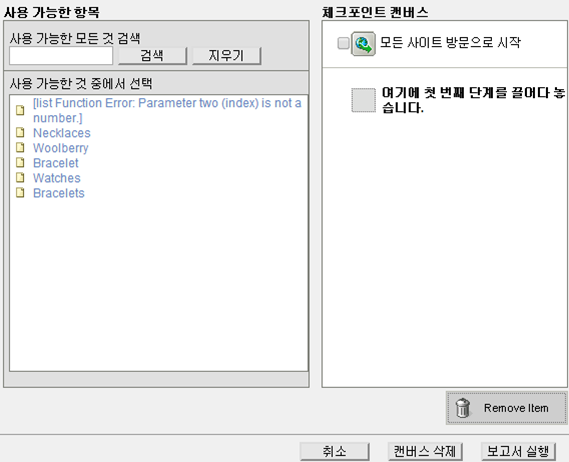
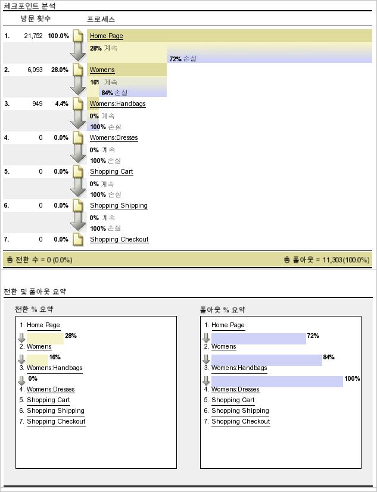
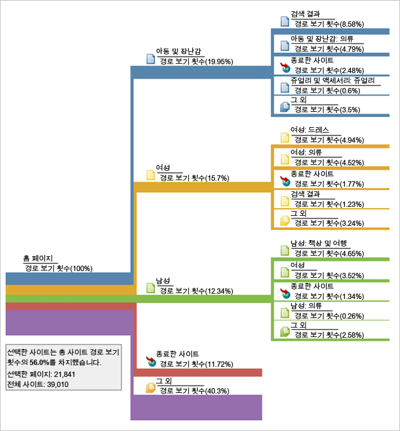
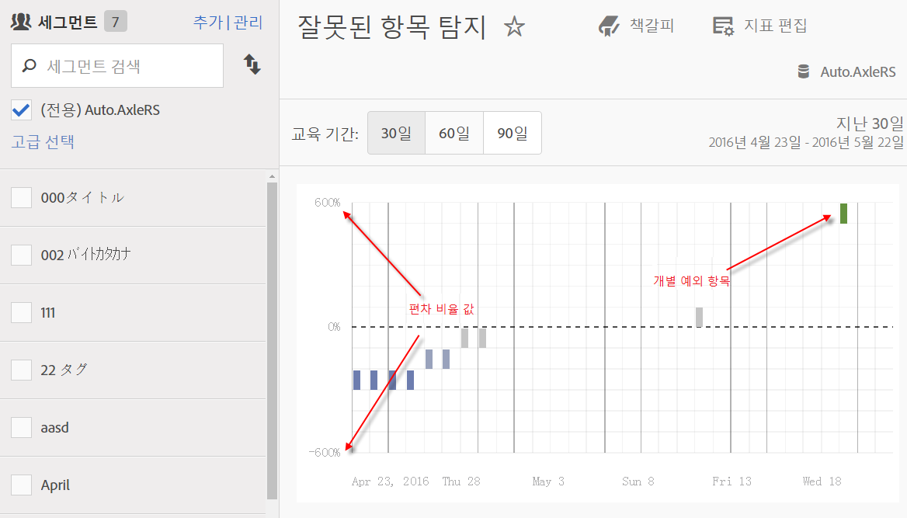
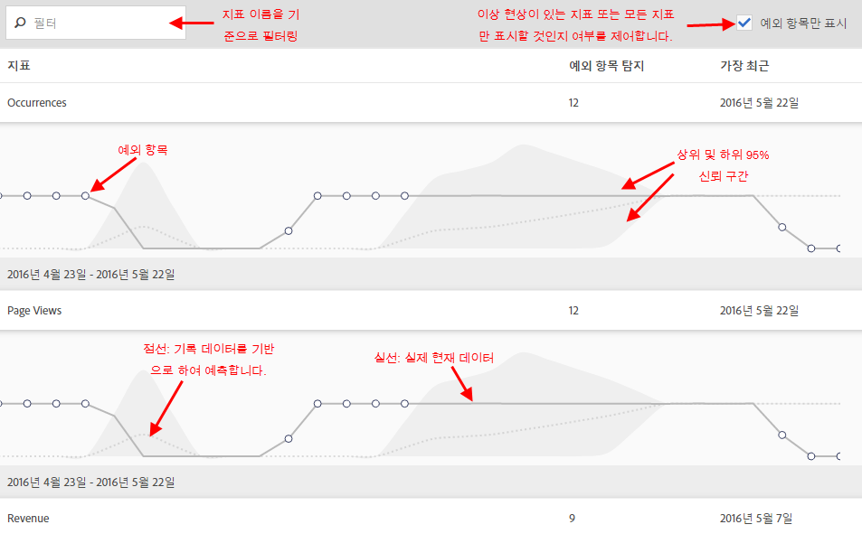
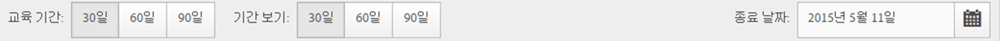
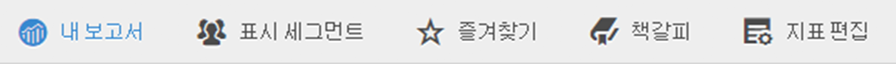
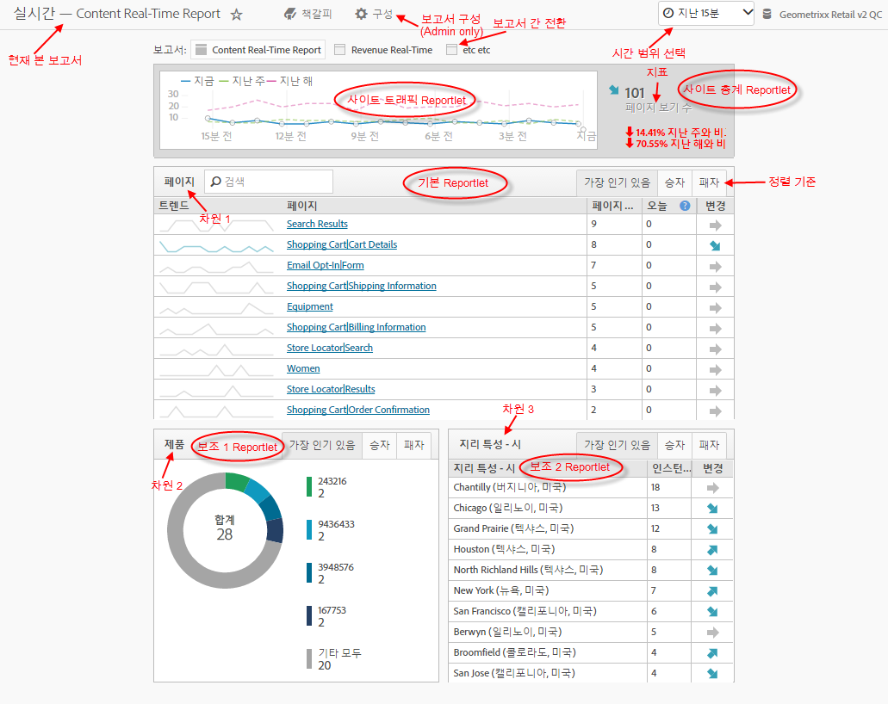
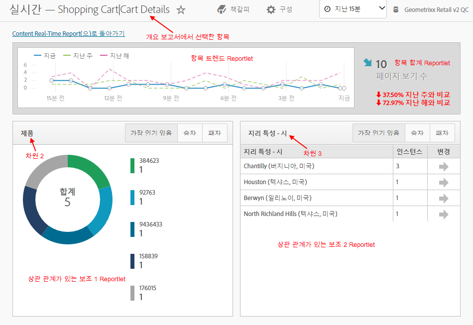

# 다른 보고서 유형 실행

다른 보고서 유형을 실행하는 절차.

## 등급 보고서 실행 {#task_C570BA4A213F4F2EB7B30E012934BE7D}

등급 보고서의 테이블은 숫자나 백분율에 따라 해당 지표와 관련된 보고서 페이지의 등급을 보여줍니다. 등급 보고서는 한 보고서에 여러 지표를 표시할 수 있습니다.

<!-- 

t_reports_ranked.xml

 -->

1. [!UICONTROL 페이지 보고서] ( **[!UICONTROL 보고서]** &gt; **[!UICONTROL 사이트 컨텐츠]** &gt; **[!UICONTROL 페이지]**) 와 같은 보고서를 생성합니다.
1. 보고서 헤더에서 **[!UICONTROL 등급]을 클릭합니다.**
1. 보고서의 등급을 지정하려면 테이블의 열 제목을 클릭합니다.

   등급 보고서의 테이블에는 최대 200개의 항목(예: 제품, 카테고리, 웹 페이지 등)과 10개의 지표(매출액, 주문, 보기 등)를 표시할 수 있습니다.

## 트렌드 보고서 실행 {#task_F03B4E760B9E4EA29FC3F654E6316887}

트렌드 보고서는 일정 기간 동안의 지표를 표시합니다. 한 기간에서 다음 기간까지 세그먼트 성과를 조회하고 싶을 때 이 유형의 보고서를 사용합니다.

<!-- 

t_reports_trended.xml

 -->

대부분의 전환 및 트래픽 보고서에서 트렌드 보기를 사용할 수 있습니다. [!UICONTROL 달력]을 사용하면 매달 지정된 일, 연중 주간, 분기별 주간, 연중 월간 등을 포함하여 세부 분류된 기간에 따른 개선 사항을 표시할 수 있습니다. 트렌드 보고서는 최대 5개 항목(예: 제품, 카테고리, 웹 페이지 등)에 대한 1개의 지표(매출, 주문, 보기 등)에 대한 트렌드를 보여줍니다.

**트렌드 보고서를 실행하려면**

1. **[!UICONTROL 보고서]** &gt; **[!UICONTROL 사이트 컨텐츠]** &gt; **[!UICONTROL 페이지와 같은 전환 또는 트래픽 보고서를 실행합니다]**.
1. **[!UICONTROL 보고서 유형에서]****[!UICONTROL 트렌드를 클릭합니다.]**

## 전환 단계 보고서 실행 {#task_B926A74AA6A641138C2986C1635120CB}

전환 단계 보고서에는 원하는 작업을 수행하기 위해 일련의 이벤트를 거친 방문자의 수가 백분율로 표시됩니다. 예를 들어 웹 페이지 방문, 장바구니에 품목 추가 및 품목 구매 단계를 거친 방문자 수를 파악할 수 있습니다. 이 보고서에서 각 단계에서 폴아웃된 방문자 수도 확인할 수 있습니다.

<!-- 

t_reports_conversion_funnel.xml

 -->

To run this report, select a report, such as a Pages report ( **[!UICONTROL Reports]** &gt; **[!UICONTROL Campaigns]** &gt; **[!UICONTROL Tracking Code]** &gt; **[!UICONTROL Campaign Conversion Funnel]**).

설명은 [전환 보고서](https://marketing.adobe.com/resources/help/en_US/reference/index.html?f=reports_conversion)를 참조하십시오.

## 폴아웃 보고서 실행 {#task_8FD97C8260464F9DA731A93DB8F80184}

[!UICONTROL 폴아웃 보고서]는 순서가 미리 정해진 페이지들의 방문자 수를 보여줍니다. 이는 또한 각 단계 간 전환 및 폴아웃 비율을 보여주기도 합니다.

<!-- 

t_reports_fallout.xml

 -->

Analysis Workspace에서 새 [폴아웃 분석](https://marketing.adobe.com/resources/help/en_US/analytics/analysis-workspace/fallout_flow.html) 패널을 확인하십시오!

1. [!UICONTROL Adobe Analytics]에서 **[!UICONTROL 보고서]** &gt; **[!UICONTROL 경로]** &gt; **[!UICONTROL 페이지]** &gt; **[!UICONTROL 폴아웃을 클릭합니다]**.
1. [!UICONTROL 폴아웃 보고서] 페이지에서 폴아웃 보고서 빌더 **[!UICONTROL 시작을 클릭합니다]**.

   

1. [!UICONTROL 체크포인트 정의] 페이지에서 보고서에 사용할 체크포인트를 지정합니다.
1. Click **[!UICONTROL Run Report]**.

   

>[!MORE_LIKE_THIS]
>
>* [폴아웃 보고서 설명](https://marketing.adobe.com/resources/help/en_US/reference/index.html?f=reports_fallout)

## 페이지 흐름 보고서 실행 {#task_133E8B87C3F04DA0A42D10CBA499305B}

페이지 흐름 보고서는 방문자가 페이지를 액세스하여 사이트를 탐색하는 순서를 보여줍니다. 이 보고서는 응답하는 데 도움이 됩니다.

<!-- 

t_reports_page_flow.xml

 -->

Analysis Workspace에서 새 [흐름 시각화](https://marketing.adobe.com/resources/help/en_US/analytics/analysis-workspace/flow.html)를 확인하십시오!

[경로](https://marketing.adobe.com/resources/help/en_US/reference/index.html?f=reports_paths) 보고서를 실행합니다.

For example, click **[!UICONTROL Reports]** &gt; **[!UICONTROL Paths]** &gt; **[!UICONTROL Pages]** &gt; **[!UICONTROL Next Page Flow]**.

이 보고서를 선택한 페이지에서 시작하여 왼쪽에서 오른쪽으로 읽습니다. 선택한 페이지 이후에 본 페이지는 오른쪽으로 확장되는 분기로 표시됩니다.

페이지 이름 옆에 각 후속 페이지를 본 백분율이 표시됩니다. 다음 각 페이지에 연결된 라인 너비는 이러한 상대적 백분율을 나타냅니다.

**[!UICONTROL 경로 보기 횟수]**: 표시된 경로에 한정되어 있을 때 페이지를 본 횟수를 나타냅니다.

예를 들어 개인정보 보호정책 페이지에는 총 10,000개의 페이지 보기가 있을 수 있지만 이 페이지 중 500페이지만이 홈 페이지 바로 다음에 발생했습니다. 따라서 경로 보기라는 용어가 사용됩니다.

상대 백분율은 라인의 상대적 너비로 설명됩니다. 기본적으로 이 보고서에는 5개의 2차 수준 분기와 5개의 3차 수준 분기가 표시됩니다. 분기 수를 확장하면 최대 10개의 2차 수준 분기와 6개의 3차 수준 분기를 볼 수 있습니다. 이렇게 하면 보고서 높이가 증가하므로 일반적으로 전체 그래프를 보려면 스크롤해야 합니다.

## 단계 보고서 실행 {#task_2BBF6FACD48F479E8B2EE458919941CB}

성공 이벤트를 선택하고 [!UICONTROL 구매 전환 단계] 보고서나 [!UICONTROL 제품 전환 단계] 보고서에 추가할 수 있습니다.

<!-- 

t_reports_funnel.xml

 -->

1. **[!UICONTROL 보고서]** &gt; **[!UICONTROL 제품]** &gt; [제품 전환 단계를 클릭합니다](https://marketing.adobe.com/resources/help/en_US/reference/index.html?f=reports_conversion_funnel).

## 마케팅 채널 보고서 실행 {#task_64ADED5CC75248319E06E3E029B47F78}

마케팅 채널 보고에서는 매출, 주문, 비용과 같은 표준 보고 지표와 함께 최초 및 마지막 접촉 채널 할당에 대한 개요 보고서를 제공합니다. 이 보고서를 사용하면 각 채널이 창출하는 매출액을 분석할 수 있습니다.

<!-- 

t_reports_marketing_channel.xml

 -->

자세한 내용은 [마케팅 채널](https://marketing.adobe.com/resources/help/en_US/mchannel/index.html) 도움말 시스템을 참조하십시오.

## 예외 항목 탐지 보고서 실행 {#task_4808C96327354D789C075823F5C3A049}

예외 항목 탐지에 있는 개별 지표 차트와 요약을 해석하는 방법에 대해 설명합니다.

<!-- 

t_anomaly_view.xml

 -->

Analysis Workspace에서 새[ 예외 항목 탐지 및 기여도 분석](https://marketing.adobe.com/resources/help/en_US/analytics/analysis-workspace/anomaly_detection.html) 기능을 확인하십시오!

**[!UICONTROL 보고서]** &gt; **[!UICONTROL 사이트 지표]** &gt; **[!UICONTROL 예외 항목 탐지]** .

>[!NOTE]
>
>분석 작업 공간 프로젝트 내에서 예외 항목 탐지를 실행할 수도 있습니다. [자세히...](https://marketing.adobe.com/resources/help/en_US/analytics/analysis-workspace/anomaly_detection.html)

예외 항목 탐지 설정에 대한 자세한 내용은 [참조 안내서](https://marketing.adobe.com/resources/help/en_US/sc/user/index.html#Setting_up_Anomaly_Detection)를 참조하십시오.

예외 항목 탐지에는 요약 차트와 개별 지표 차트, 이렇게 두 종류의 차트가 표시됩니다. 개별 지표 차트는 해당 지표에 대해 하나 이상의 예외 항목이 탐지된 경우에만 표시됩니다.

<table id="table_88163CD8FC164342855D90D01F9C581A"> 
 <thead> 
  <tr> 
   <th colname="col1" class="entry"> 
차트 종류 
 </th> 
   <th colname="col2" class="entry"> 
역할 
 </th> 
  </tr> 
 </thead>
 <tbody> 
  <tr> 
   <td colname="col1"> 
요약 차트 
 
 
 </td> 
   <td colname="col2"> 
 
     <ul id="ul_D26DA3024CD7468291369F549557B28A"> 
      <li id="li_1C22B6E02FFB479FB71EFAD89EB37A4E">각 상자는 아래 지표에 해당하는, 일별 추적된 하나의 예외 항목을 나타냅니다. </li> 
      <li id="li_8FC587D3FF4E452D83263CC7A10B6675">녹색은 꺾은 선형 위의 예외 항목을, 파란색은 꺾은 선형 아래의 예외 항목을 가리킵니다. </li> 
      <li id="li_25135AB691BF443599AF2A3A60E2E71A">예외 항목의 강도를 가리킵니다. 예외 항목이 클수록 데이터 포인트 색상은 어두워지고 꺾은 선형에서 멀어집니다. </li> 
      <li id="li_0C42AFA8897D420D8AB1A5D0F65B3B3A">개별 예외 항목을 클릭하면 해당 예외 항목의 개별 지표 차트(요약 차트 아래)가 맨 위에 표시됩니다. </li> 
      <li id="li_85C0F426952547B5A75D6BD31DE19CA5">편차 비율 값(차트의 왼쪽)은 다음과 같이 계산됩니다. 
       <ul id="ul_BEC0A88BFFAC4CF78BC9885FEB749694"> 
        <li id="li_1BAB2F50482745B69937DFAF1E09982E">상한과 예상 값이 동일하면, 편차 비율은 100%입니다. </li> 
        <li id="li_CA48064F5788448C8646CCE196161237">그 외의 경우 편차 비율은 ((실제 값 - 상한 값)/(상한 값 - 예상 값)) * 100 입니다. </li> 
        <li id="li_4090357A0D214BC7B1C3DE0615875554">하한과 예상 값이 동일하면 편차 비율은 -100% 입니다. </li> 
        <li id="li_EF694E1A4E874ECD94E1E8F7302E494F">그 외의 경우 편차 비율은 ((하한 값 - 실제 값)/(예상 값 - 하한 값)) * -100 입니다. </li> 
       </ul> </li> 
      <li id="li_5C05EF7023484CC993E96D63E842B65C">세그먼트 표시를 클릭하면 세그먼트를 예외 항목 탐지 보고서에 적용할 수 있도록 해주는 세그먼트 레일이 표시됩니다.  세그멘테이션 <a href="https://marketing.adobe.com/resources/help/en_US/analytics/segment/" format="http" scope="external">추가 정보</a>. </li> 
      <li id="li_1B41CABF13D1407886C68EE3BC201E60">지표 편집을 클릭하면 예외 항목을 탐지할 지표를 선택하거나 선택 취소할 수 있습니다. </li> 
     </ul> 
 </td> 
  </tr> 
  <tr> 
   <td colname="col1"> 
개별 지표 차트 
 
 
 </td> 
   <td colname="col2"> 
 
     <ul id="ul_739C5687013743A29B63089FDA763F45"> 
      <li id="li_456A0BDA4D4E46CE9CC1C3DBAA1E2220">개별 트렌드 지표에 대한 예외 데이터 포인트(계산된 지표 포함)를 점으로 표시합니다. </li> 
      <li id="li_89FD847C65F04F48BCA7CD38D0EC51CD">맨 위에는 최신 예외 항목이 표시되고 부차적으로 예외 항목 수별로 순위가 표시됩니다. </li> 
      <li id="li_98B97A9706DE4455B8D8850904CBDE03">현재 수집된 실제 데이터를 가리키는 실선이 표시됩니다. 이것은 데이터 포인트가 예외적인지를 추론하는 오차 예측 및 오차 범위와 비교됩니다. </li> 
      <li id="li_0EEA38DDDC344BF3879430E67D74EB72">내역 데이터(즉, 훈련 기간)를 기반으로 예측을 나타내는 점선이 표시됩니다. </li> 
      <li id="li_035BD2725D004AEDB630BF8DFF4DA4F3">위쪽 및 아래쪽 95% 신뢰 구간/제한을 회색 음영으로 표시합니다. </li> 
      <li id="li_021A3D1F2EDB4319B9B39620EF1C038A">지표 이름 옆에 있는 이중 상향 및 하향 화살표를 클릭하여 개별 보고서를 축소하거나 확장할 수 있습니다. </li> 
      <li id="li_722E4B9FC21047AC96D7B143197E293D">지표 차트가 개요 보고서(위 참조)에서 드릴다운에 반응하여 나타나는 순서를 변경합니다. </li> 
      <li id="li_A2441169B185475AA68A64F81E6E40B8">모든 페이지 관련 지표에 대해 "페이지" 등의 검색어를 사용하여 차트를 필터링할 수 있습니다. </li> 
      <li id="li_F1BBBFCA8E2A43C29658E4FCAA36C904">정의한 모든 지표나 예외 항목이 있는 지표만 표시할 수 있습니다. </li> 
     </ul> 
 </td> 
  </tr> 
 </tbody> 
</table>

## 예외 항목 탐지 설정 {#task_AF347B34F56E44A6AE70E019B6EB2F08}

예외 항목 탐지를 위한 보고서 세트, 지표 및 교육/보기 기간을 선택하는 절차입니다.

<!-- 

t_anomaly_config.xml

 -->

각 보고서 세트에 대해 독립적으로 예외 항목 탐지를 설정할 수 있습니다.

1. **[!UICONTROL Analytics &gt; 보고서 &gt; 사이트 지표 &gt; 예외 항목 탐지로]** 이동합니다.
1. 일일 예외 항목 탐지를 추적할 보고서 세트를 선택합니다. 보고서 세트 목록을 표시하려면, 보고서 세트 선택기 드롭다운 메뉴를 클릭합니다.
1. To select the metrics and/or define filtered metrics, click **[!UICONTROL Edit Metrics]**at the top right of the screen:  .

   모든 지표 목록(계산된 지표 포함) 또는 추적된 지표 목록에서 지표를 선택할 수 있습니다. 목록의 범위를 좁히려면 특정 용어로 필터링할 수도 있습니다. 1. Once the report has been generated, define the **[!UICONTROL Training Period]**and the **[!UICONTROL View Period]** for anomaly detection. (훈련 기간을 알고리즘에 대한 "학습 기간"으로 생각합니다.)

   

   주의 사항:

* 훈련 기간은 보기 기간이 시작되기 직전에 종료됩니다.
* 두 기간의 기본값은 모두 30일이며, 60일 또는 90일로 연장할 수 있습니다.
* 훈련 기간을 연장하면 데이터가 더 큰 컨텍스트에서 이해되므로 예외 항목의 크기를 줄일 수 있습니다.

   예외 항목 탐지 지표 보고서는 매개 변수를 변경할 때마다 새로 고침됩니다.
1. (Optional) Apply segments to the report by clicking **[!UICONTROL Show Segments]** and selecting one or more existing segments or creating a new segment and applying it.

   

   세그먼트 만들기나 관리에 대한 자세한 내용은 [분석 세그멘테이션 안내서](https://marketing.adobe.com/resources/help/en_US/analytics/segment/)를 참조하십시오. 1. (선택 사항) 보고서를 즐겨찾기 또는 책갈피로 추가합니다.
1. (선택 사항) 보기 기간의 종료 날짜를 변경합니다. 기본값은 어제입니다.
1. 이제 보고서 해석을 시작할 수 있습니다. [예외 항목 탐지 차트 보기를](../../analyze/reports-analytics/t-running-report-types.md#task_4808C96327354D789C075823F5C3A049)참조하십시오.

## 실시간 보고서 실행 {#task_5D25929C918E40B18965222FA94176B0}

실시간 보고서를 보고 해석하는 방법에 대해 설명합니다.

<!-- 

reports_realtime.xml

 -->

**[!UICONTROL 보고서 &gt; 사이트 지표 &gt; 실시간]** .

실시간 보고에서는 개요 보고서와 세부 사항 보고서, 이렇게 두 개의 기본 보고서를 제공합니다. 이 보고서들은 각각 많은 reportlet으로 구성됩니다.

실시간 보고서 구성에 대한 자세한 내용은 [Analytics 참조 안내서](https://marketing.adobe.com/resources/help/en_US/reference/index.html#RealTime_Reports_Configuration)를 참조하십시오.

1. **[!UICONTROL 개요]** 보고서 및 그 구성 요소를 살펴보십시오. 

   <table id="choicetable_8586BECF55E843B2B5CD41205567EA32"> 
   <thead class="chhead sthead"> 
   <th class="choptionhd"> UI 구성 요소 </th> 
   <th class="chdeschd"> 설명 </th> 
   </thead> 
   <tr class="chrow strow"> 
   <td class="choption"><strong>보고서 세트 선택</strong></td> 
   <td class="chdesc stentry"> 이 실시간 보고서가 다루는 보고서 세트를 보여 줍니다. 보고서 세트를 변경하려면, <a href="https://marketing.adobe.com/resources/help/en_US/reference/?f=t_realtime_admin" format="http" scope="external">실시간 보고서 구성</a>을 참조하십시오 . </td> 
   </tr> 
   <tr class="chrow strow"> 
   <td class="choption"><strong>보고서 간 전환</strong></td> 
   <td class="chdesc stentry"> 설정한 보고서(최대 3개) 간을 전환할 수 있습니다. </td> 
   </tr> 
   <tr class="chrow strow"> 
   <td class="choption"><strong>시간 범위 선택</strong></td> 
   <td class="chdesc stentry"> 보고서에 있는 모든 reportlet에서 사용할 전체 시간 범위를 선택할 수 있습니다. </td> 
   </tr> 
   <tr class="chrow strow"> 
   <td class="choption"><strong>보고서 구성</strong></td> 
   <td class="chdesc stentry"> 이 톱니바퀴 아이콘 링크는 관리자 권한이 있어야 볼 수 있습니다. 이 링크를 클릭하면 관리 도구 &gt; 보고서 세트 &gt; 설정 편집 &gt; 실시간 아래의 보고서 세트 관리자가 표시됩니다  . </td> 
   </tr> 
   <tr class="chrow strow"> 
   <td class="choption"><strong>전체 화면 보기</strong></td> 
   <td class="chdesc stentry"> 전체 화면 보기 아이콘은 모니터가 특정 종횡비(16:9 또는 16:10)이고, 브라우저가 이 종횡비를 지원하는 경우에만 볼 수 있습니다. 전체 화면 모드(종료하려면 Esc 키 누름)일 때에는 화면과 상호 작용할 수 없습니다. 전체 화면 모드는 시간 제한이 없습니다. </td> 
   </tr> 
   <tr class="chrow strow"> 
   <td class="choption"><strong>사이트 트래픽 Reportlet</strong></td> 
   <td class="chdesc stentry"> 파란색 꺾은 선형 데이터는 전체 사이트에 대한 트래픽 합계를 보여 줍니다. X 축에서는 실시간 표현으로 표시된 현재 값을 제외한 문자 레이블(15분 전, 10분 전)을 사용합니다. </td> 
   </tr> 
   <tr class="chrow strow"> 
   <td class="choption"><strong>사이트 총계 Reportlet</strong></td> 
   <td class="chdesc stentry"> 마지막 N분 동안 실시간 보고서에서 선택된 지표에 대한 사이트 총계의 카운트입니다. "N"은 시간 범위 선택기를 통해 구성할 수 있습니다. 
화살표 색상 및 방향은 다음 알고리즘을 기반으로 합니다. 
      <ul id="ul_9F40CEA33798467393CB1266BB36D500"> 
      <li id="li_CCD01A44F912487DA5681EA50113643C">큰 이득(상향 화살표): &gt; 100% </li> 
      <li id="li_7402491A9A614851B7F2AE0C77BD9A97">이득(오른쪽 상향 화살표): 5%와 100% 사이 </li> 
      <li id="li_BCA79C08B5714D4B9315068112C66107"> 차이 없음(오른쪽 화살표): 5%와 -5% 사이 </li> 
      <li id="li_234ECBD7D83A4AE680E4A70BF288681F"> 손실(오른쪽 하향 화살표): -5%와 -100% 사이 </li> 
      <li id="li_10C5EA8803604C1CA714D3DB27478B31"> 큰 손실(하향 화살표): &lt; 100% </li> 
      </ul> 
 
사이트 총계는 "인스턴스"에서 보고되며, 이 인스턴스는 기본 reportlet의 차원을 반영합니다. 인스턴스별 이름이 존재하는 경우("페이지 보기" 등) 사이트 총계에서는 이 이름을 보고합니다. 
 </td> 
   </tr> 
   <tr class="chrow strow"> 
   <td class="choption"><strong>기본 Reportlet</strong></td> 
   <td class="chdesc stentry"> 실시간 보고서의 기본 차원 및 그 지표에 대해 보고합니다. 선택 시간 범위 동안의 해당 요소에 대한 꺾은 선형을 보여 줍니다. 지표 합계는 전체 꺾은 선형에 대한 합계를 표현합니다. 화살표는 항목이 큰 이득을 내는지, 보통 이득을 내는지, 차이가 없는지, 보통 손실을 내는지, 큰 손실을 내는지를 가리킵니다. </td> 
   </tr> 
   <tr class="chrow strow"> 
   <td class="choption"><strong>검색 대화 상자</strong></td> 
   <td class="chdesc stentry"> 검색은 모든 reportlet에 영향을 줍니다. 검색은 보고서를 볼 때 유지됩니다. </td> 
   </tr> 
   <tr class="chrow strow"> 
   <td class="choption"><strong>정렬 기준... 가장 빈도가 높음/승자/ 패자</strong></td> 
   <td class="chdesc stentry"> 가장 빈도가 높음(기본값), 승자(대부분의 성장을 보여 주는 차원), 및 패자(하향 궤적에 있는 차원)을 기준으로 정렬하도록 전환할 수 있습니다. 
승자인지 패자인지를 결정하는 데 사용되는 공식이 있습니다. 실시간 기능은 가장 이른 샘플과 다음으로 최신인 샘플을 보고 간단한 “변경률” 계산을 수행합니다. 따라서 “지난 15분"을 선택하고 n이 현재 분을 나타내는 경우, n-1은 n-15와 비교됩니다. 현재 실시간에서는 가중치를 적용하지 않습니다. 현재 분은 완전하지 않고 잘못된 변경률을 산출할 수 있으므로 무시됩니다. 
 
이 공식은 실시간 보고서에 사용된 모든 지표에서 일관됩니다. 
 </td> 
   </tr> 
   <tr class="chrow strow"> 
   <td class="choption"><strong>보조 1 Reportlet</strong></td> 
   <td class="chdesc stentry"> 프로비저닝된 두 번째 보고서의 차원과 지표에 대한 실시간 보고서를 보여 줍니다. 
보조 1 reportlet은 상위 4개의 카테고리를 보여주며, 5번째 카테고리는 모든 나머지 값들의 집합입니다. 각 카테고리에 대해서는, 해당 카테고리의 총 원시 보기가 제공됩니다. 또한 중앙에는 모든 카테고리에 대한 합계가 표시됩니다. 
 
 마우스로 섹션을 가리키면 연결된 카테고리가 강조 표시되고, 도넛 아래에는 카테고리 꺾은 선형이 표시됩니다. 
 
 마우스로 라인 항목을 가리키면 라인 항목과 연결된 섹션이 강조 표시되고, 도넛 아래에는 카테고리 꺾은 선형이 표시됩니다. 
 </td> 
   </tr> 
   <tr class="chrow strow"> 
   <td class="choption"><strong>보조 2 Reportlet</strong></td> 
   <td class="chdesc stentry"> 프로비저닝된 세 번째 보고서의 차원과 지표에 대한 실시간 보고서를 보여 줍니다. 마우스로 항목 레이블의 상단을 가리키면 레이블이 오른쪽으로 이동되고, 마우스로 가리킨 항목에 대한 꺾은 선형이 표시됩니다. </td> 
   </tr> 
   </table>

1. Click a list item in the Primary Reportlet to launch the **[!UICONTROL Details]** view for that list item:  

   | **항목 트렌드 Reportlet** | 지난 N분 동안 개요 보고서에서 선택한 항목의 꺾은 선형을 보여 줍니다. N은 시간 범위 선택기를 통해 구성할 수 있습니다. |
   |---|---|
   | **항목 합계 Reportlet** | 지난 N분 동안 개요 보고서에서 선택한 항목의 총 지표 수를 보여 줍니다. N은 시간 범위 선택기를 통해 구성할 수 있습니다. |
   | **상관 관계가 있는 보조 1 Reportlet** | 이 reportlet은 보조 1 Reportlet과 매우 유사합니다. 유일한 차이는 이 보고서를 채우는 데 사용된 데이터 소스입니다. 이 예에서는, 특정 페이지(개요 보고서의 기본 reportlet에서 선택한 페이지)와 표시된 인스턴스 간 상관 관계(또는 분류)가 표시됩니다. |
   | **상관 관계가 있는 보조 2 Reportlet** | 이 reportlet은 보조 2 Reportlet과 매우 유사합니다. 유일한 차이는 이 보고서를 채우는 데 사용된 데이터 소스입니다. 이 예에서는, 특정 페이지(개요 보고서의 기본 reportlet에서 선택한 페이지)와 언어 차원 간 상관 관계(또는 분류)가 표시됩니다. |
