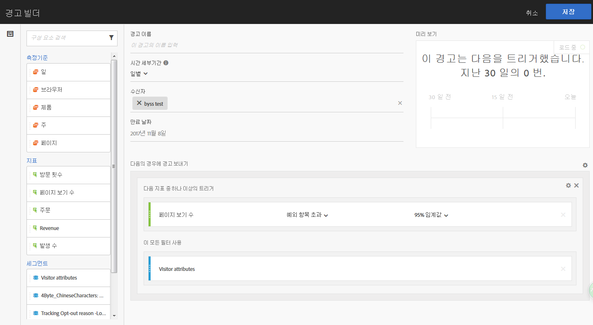
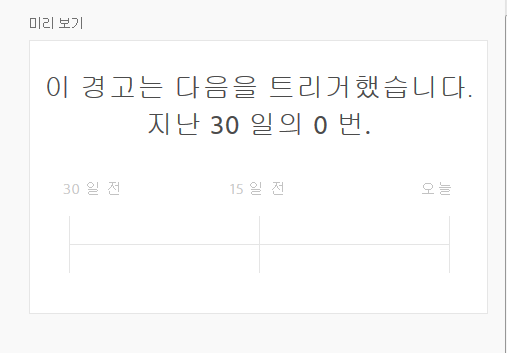

# 경고 빌더

>[!IMPORTANT]
>
>지능형 경고는 Adobe [!DNL Analytics] Prime 및 Adobe [!DNL Analytics] Ultimate 고객만 사용할 수 있습니다.

다음 네 가지 방법 중 하나로 경고 빌더에 액세스합니다.

* Analysis Workspace에서 다음의 바로 가기 사용:

   `ctrl (or cmd) + shift + a`
* **[!UICONTROL 작업 공간]** > **[!UICONTROL 구성 요소]** > **[!UICONTROL 새 경고]**&#x200B;로 이동.
* 하나 이상의 자유 형식 테이블 라인 항목을 선택하고, 마우스 오른쪽 단추로 클릭한 다음, **[!UICONTROL 선택 항목으로 경고 만들기 선택]**.
* [!UICONTROL Reports &amp; Analytics] 보고서에서 **[!UICONTROL 자세히]** > **[!UICONTROL 경고 추가]**&#x200B;로 이동합니다.

경고 빌더 인터페이스는 [!DNL Analytics]에 세그먼트 또는 계산된 지표를 만든 사용자에게 익숙합니다.

**경고 이름**

경고 이름을 지정합니다. 경고 이름에는 보고서 또는 지표 임계값 이름이 포함될 수 있습니다.

**시간 세부기간**

지표를 확인할 시기(시간별, 일별, 주별 또는 월별)를 지정합니다.

>[!NOTE] 사용자 지정 달력을 사용하는 보고서 세트에 대해, Adobe에서는 경고 빌더에서 월별 세부기간을 지원하지 않습니다.

**수신자**

경고를 전송할 대상을 지정합니다. 경고는 [!DNL Analytics] 사용자, [!DNL Analytics] 그룹, 원시 이메일 주소 또는 전화 번호에 보낼 수 있습니다.

>[!IMPORTANT]
>
>전화 번호 앞에는 &quot;+&quot;와 [국가 코드](https://countrycode.org/)가 있어야 합니다. 

**만료 날짜**

경고의 만료 날짜를 설정합니다. 

**다음의 경우에 경고 보내기...**

*... 다음 지표 중 하나 이상의 트리거*

* 트리거를 추가하는 지표를 캔버스에 드래그하여 놓습니다. 

   경고에 뜬 모든 구성 요소(지표/차원/세그먼트) 중 일부가 현재 선택된 보고서 세트와 호환하지 않을 경우 **&quot;호환하지 않는 구성 요소&quot;** 메시지가 표시됩니다.

* 경고를 설정하기 전에 지표가 초과되는 임계값을 결정합니다. 이 값을 임계값으로 설정한 후 다음 조건 중 하나로 설정할 수 있습니다. 

   * 예외 항목이 있음
   * 예외 항목이 예상 이상임
   * 예외 항목이 예상 미만임
   * 예외 항목 초과
   * 위 또는 같음
   * 아래 또는 같음
   * 변경

* &quot;예외 항목 초과&quot;는 기존(정적) 임계값을 초과하는 새로운 조건입니다. 트리거를 동적으로 정의하는 예외 항목 탐지 알고리즘을 가져옵니다. 90%, 95%, 99%, 99.75% 및 99.9%의 임계값을 설정할 수 있습니다.
* 시간 세분기간은 99.75% 임계값으로 설정되고 일별 세분기간은 99%로 설정됩니다.
* 계산된 지표를 사용할 수도 있습니다.

*... 다음 필터 사용*

세그먼트 또는 차원을 드래그하여 놓아 필터를 추가합니다. 예를 들어, &quot;모바일 장치만&quot; 세그먼트를 추가한다는 것은 모바일 장치에 대해서만 규칙이 트리거됨을 의미합니다. 

추가 필터를 적용하려면 AND 구문을 사용합니다.

**규칙 추가**

톱니바퀴 아이콘을 클릭하여 AND 또는 OR 규칙을 추가할 수 있습니다.

## 경고 미리 보기 {#section_10D75BA7B77E4C5FAF58A719C082E070}

대화형 경고 미리 보기에서는 경고가 과거의 경험을 기반으로 얼마나 자주 표시되는지를 근사적으로 보여 줍니다.

예를 들어, 시간 세부기간을 매일로 설정하는 경우, 미리 보기에서는 경고가 지난 30 또는 31일 동안 특정 지표 x 배수에 대해 트리거됨을 알 수 있습니다.

너무 많은 경고가 트리거될 것 같으면 [경고 관리자](/help/components/c-alerts/alert-manager.md)에서 임계값을 조정할 수 있습니다.

