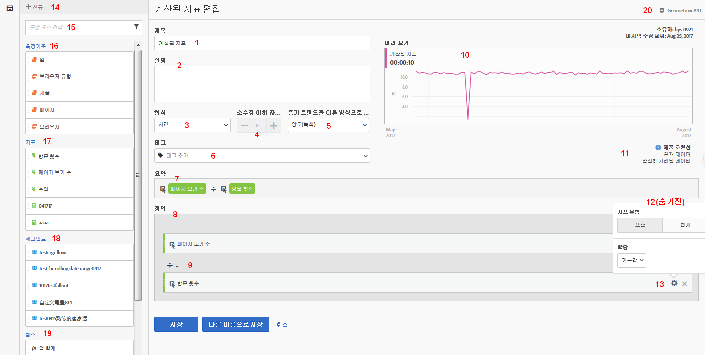
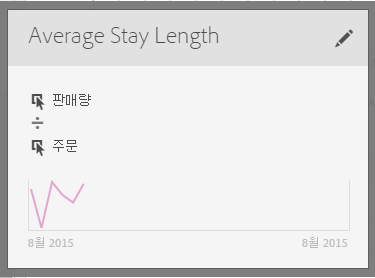

# 지표 작성

계산된 지표 빌더는 차원, 지표, 세그먼트 및 함수를 드래그하여 놓음으로써 컨테이너 계층 논리, 규칙 및 연산자를 기준으로 사용자 지정 지표를 만들 수 있는 캔버스를 제공합니다. 이러한 통합 개발 도구를 사용하여 간단한 계산된 지표나 복잡한 고급 계산된 지표를 빌드하고 저장할 수 있습니다.

다음 몇 가지 방법으로 계산된 지표 빌더에 액세스할 수 있습니다.

* In Analysis Workspace, open a project and click  **[!UICONTROL + New]** &gt; **[!UICONTROL Create Metric]** .
* In [!DNL Analytics], go to **[!UICONTROL Components]** &gt; **[!UICONTROL Calculated Metrics]**.

* Click **[!UICONTROL + Add]** at the top of the [Calculated Metric Manager](../../../../../components/c-calcmetrics/c-workflow/cm-workflow/cm-manager.md#concept_BA6815CB06D842D5825766396B691653), or

* **[!UICONTROL Analytics]** &gt; **[!UICONTROL 보고서로]**&#x200B;이동하고 보고서를 열고 지표 아이콘을  클릭하여 지표 레일을 표시한 다음 **[!UICONTROL 추가를 클릭합니다]**.

## UI 구성 요소 {#section_9382AEEBA4244DD6A9F6C1DD3F6D076B}

<table id="table_60A82936321047D1A335331BF83B0972"> 
 <thead> 
  <tr> 
   <th colname="col2" class="entry"> 필드 </th> 
   <th colname="col3" class="entry"> 설명 </th> 
  </tr> 
 </thead>
 <tbody> 
  <tr> 
   <td colname="col2">  직함  </td> 
   <td colname="col3"> 
지표에 이름을 지정하는 것은 필수입니다. 이름을 지정하지 않으면 지표를 저장할 수 없습니다. 
 </td> 
  </tr> 
  <tr> 
   <td colname="col2">  설명  </td> 
   <td colname="col3"> 
사용자에게 친근한 설명을 지정하여 용도를 알고 유사한 지표들과 구별할 수 있도록 하십시오. 
 
이 설명은 보고서 내에도 나타납니다. 설명에 공식을 넣지 않는 것이 좋습니다. 대신 이 지표를 어디에 사용하고 어디에 사용하지 말아야 하는지 설명하십시오. (공식은 지표를 만들면 요약 머리글 아래에 생성됩니다. 따라서 공식을 설명에 추가할 필요가 없습니다.) 
 </td> 
  </tr> 
  <tr> 
   <td colname="col2">  형식  </td> 
   <td colname="col3"> 
선택 사항에는 소수, 시간, 비율 및 통화가 포함됩니다. 
 </td> 
  </tr> 
  <tr> 
   <td colname="col2">  소수점  </td> 
   <td colname="col3"> 
보고서에 소수점 이하 몇 자리가 표시될 것인지 보여줍니다. 지정할 수 있는 소수점 이하 최대 자릿수는 10자리입니다. 
 </td> 
  </tr> 
  <tr> 
   <td colname="col2">  증가 트렌드를 다른 방식으로 표시...  </td> 
   <td colname="col3"> 
이 지표 극성 설정은 [! DNL Analytics] 는 지표에서 증가 트렌드를 좋은 (녹색) 또는 불량 (빨간색) 로 간주해야 합니다. 그 결과, 보고서의 그래프는 증가할 때 녹색 또는 빨간색으로 표시됩니다. 
 </td> 
  </tr> 
  <tr> 
   <td colname="col2">  태그  </td> 
   <td colname="col3"> 
태깅은 지표를 구성하는 좋은 방법입니다. 모든 사용자는 태그를 만든 후 지표에 하나 이상의 태그를 적용할 수 있습니다. 그렇지만 본인이 소유하거나 본인과 공유된 세그먼트에 대한 태그만 볼 수 있습니다. 어떤 종류의 태그를 만들어야 합니까? 다음은 제안되는 유용한 태그입니다. 
     <ul id="ul_9A6CE5F179424687A39F2D5C1A953258"> 
      <li id="li_A8815F2D8D284874AD701A7B103D82A3"><b>팀 이름</b>을 기반으로 하는 태그(예: 소셜 마케팅, 모바일 마케팅) </li> 
      <li id="li_A51A4515A541488E9D90296A955E9F4F"><b>프로젝트</b> 태그(분석 태그)(예: 시작 페이지 분석) </li> 
      <li id="li_B4605470A7094026AC168420B64BBCC3"><b>카테고리</b> 태그: 남성용, 지역 </li> 
      <li id="li_B6EAB0F2A96C41209C4EC97B9E64390B"><b>워크플로우</b> 태그: 승인용, 처리됨(특정 비즈니스 단위) </li> 
     </ul> 
 </td> 
  </tr> 
  <tr> 
   <td colname="col2">  요약  </td> 
   <td colname="col3"> 
요약 공식은 지표 정의를 변경할 때마다 업데이트됩니다. 이 공식은 마우스로 지표를 가리키고  아이콘을 클릭하면 왼쪽의 지표 레일에 표시됩니다. 
 </td> 
  </tr> 
  <tr> 
   <td colname="col2">  정의  </td> 
   <td colname="col3"> 
이곳은 계산된 지표를 빌드하기 위해 지표/계산된 지표, 세그먼트 및/또는 함수를 드래그하여 놓는 곳입니다. 
 
 
     <ul id="ul_B13401A266354DC594C6176025DB61CB"> 
      <li id="li_01776C32C7C5440AA1F847096CBED92B">계산된 지표에서 드래그하면 그 지표 정의를 자동으로 확장합니다. </li> 
      <li id="li_A483D352522E4572AB43042473053359">정의를 컨테이너와 중첩시킬 수 있습니다. 하지만, 세그먼트 컨테이너와 달리, 컨테이너는 수학 표현식처럼 작동하고 작업 순서를 결정합니다. </li> 
     </ul> 
 </td> 
  </tr> 
  <tr> 
   <td colname="col2">  연산자  </td> 
   <td colname="col3"> 
나누기(  )는 기본 연산자이고 이외에도 +, -, x 연산자가 있습니다. 
 </td> 
  </tr> 
  <tr> 
   <td colname="col2">  미리 보기  </td> 
   <td colname="col3"> 
모든 가능한 오류 시 빨리 읽을 수 있도록 해줍니다. 이 미리 보기는 마지막 90일에 적용됩니다. 해당 지표에 대해 올바른 구성 요소를 선택했는지를 초기에 판단하는 방법입니다. 예상치 않은 결과는 지표 정의 시 두 번 확인해야 함을 의미합니다. 
 </td> 
  </tr> 
  <tr> 
   <td colname="col2">  제품 호환성  </td> 
   <td colname="col3"> 
제품 호환성은 지표가 <a href="https://marketing.adobe.com/resources/help/en_US/reference/data_latency.html" format="https" scope="external">현재 데이터</a>와 호환되는지, 완전히 처리된 데이터와 호환되는지 또는 마케팅 채널 보고서와 호환되는지를 보여줍니다(첫 번째 터치 할당). 
참고: 현재 데이터는 일부 데이터를 지원하지 않습니다. 세그먼트나 함수가 들어 있는 지표는 현재 데이터와 호환하지 않습니다. <a href="../../../../../components/c-calcmetrics/cm-compatibility.md#concept_906480DEBEEC4D279BBBBD4CE7DFE70C" format="dita" scope="local"> 자세히... </a> 
 
 </td> 
  </tr> 
  <tr> 
   <td colname="col2">  추가  </td> 
   <td colname="col3"> 
모든 유형의 계산된 지표의 경우, 컨테이너 및 정적 수를 정의에 추가할 수 있습니다. 고급 계산된 지표의 경우 세그먼트 및 함수를 추가할 수도 있습니다. 
 
 
     <ul id="ul_607C1B303F334062BC620317667DE490"> 
      <li id="li_53462789B8AF4F1AA9B45565D37CF22B">컨테이너는 수학 표현식처럼 작동하고 작업 순서를 결정합니다. 그러므로 컨테이너에 있는 모든 것은 다음 작업 전에 처리됩니다. </li> 
      <li id="li_401A9E0D8B3B468990289DBF66A06F63">세그먼트를 컨테이너에 드래그하면 해당 컨테이너에 있는 모든 내용이 세그먼트화됩니다. (고급 계산된 지표만) </li> 
      <li id="li_F191B200D7A944F9ADC0573A9A82A6DA">한 컨테이너에서 여러 세그먼트를 스택할 수 있습니다. </li> 
     </ul> 
 </td> 
  </tr> 
  <tr> 
   <td colname="col2"> 톱니바퀴 아이콘(지표 유형,  속성 ) </td> 
   <td colname="col3"> 
Selecting the gear icon next to a metric lets you specify the <a href="../../../../../components/c-calcmetrics/c-workflow/cm-workflow/c-build-metrics/m-metric-type-alloc.md#concept_B7A1FCFEFA9D4C4883208ACE8C9C8E5E" format="dita" scope="local"> metric type and attribution models </a>. 
 </td> 
  </tr> 
  <tr> 
   <td colname="col2">  + 신규  </td> 
   <td colname="col3"> 
새로운 세그먼트(<a href="https://marketing.adobe.com/resources/help/en_US/analytics/segment/seg_build_ui.html" format="https" scope="external">세그먼트 빌더</a>로 이동)와 같은 새 구성 요소를 만듭니다. 
 </td> 
  </tr> 
  <tr> 
   <td colname="col2"> 
구성 요소 검색 
 </td> 
   <td colname="col3"> 
이 검색 창을 사용하여 차원, 지표, 세그먼트(고급 계산된 지표만) 및 함수(고급 계산된 지표만)를 검색할 수 있습니다. 
 </td> 
  </tr> 
  <tr> 
   <td colname="col2"> 
차원 목록 
 </td> 
   <td colname="col3"> 
세그먼트 빌더에서 "Page = Homepage"와 같은 간단한 세그먼트를 작성하기 위해 계산된 지표 빌더를 종료하지 않고, 페이지에서 끌어서 홈 페이지를 계산된 지표 빌더에서 직접 선택할 수 있습니다. 
 
그 결과 세그먼트화된 계산된 지표를 생성할 훨씬 능률적인 워크플로우가 만들어집니다. 
 </td> 
  </tr> 
  <tr> 
   <td colname="col2"> 
지표 목록 
 </td> 
   <td colname="col3"> 
지표는 3가지 카테고리로 분류됩니다. 
 
    <ul id="ul_7BF50F4964EF45858FBA1634FBFA45CF"> 
     <li id="li_90F2312927A6499CA1CE04F8FFC912CF">표준 지표 ( ) </li> 
     <li id="li_A3F59083E79B4AC780D6F8CEDFFD20C9">계산된 지표 ( ) </li> 
     <li id="li_8735E76637ED4C3F983731A66E04C93E">지표 템플릿() - 목록의 맨 아래. </li> 
    </ul> 
마우스로 지표를 가리키면 그 오른쪽에 정보 아이콘이 표시됩니다. 이 아이콘을 클릭하면 다음 정보가 표시됩니다. 
 
    <ul id="ul_DF35DDB9FBFA40C8A93FA0F2286A0BBE"> 
     <li id="li_4215AA9BF93F4C8B941002A7A4D2F50B">계산되는 방식에 대한 공식. </li> 
     <li id="li_6A8E39EB6DCE4377B0B594B6D4FC0294">지표의 미리 보기 트렌드. </li> 
     <li id="li_44C1595E4BE64ED69D1DB3BB6655ED55">이 계산된 지표를 편집할 수 있는 계산된 지표 빌더를 표시하는 오른쪽 상단의 편집(연필) 아이콘. </li> 
    </ul> 
 
 </td> 
  </tr> 
  <tr> 
   <td colname="col2"> 
세그먼트 목록 
 </td> 
   <td colname="col3"> 
(고급 계산된 지표만 해당) 관리로서, 이 목록은 로그인 회사에서 만든 모든 세그먼트를 보여줍니다. 사용자가 관리 사용자가 아닐 경우, 이 목록에는 사용자가 소유한 세그먼트와 사용자와 공유된 세그먼트가 표시됩니다. <a href="https://marketing.adobe.com/resources/help/en_US/analytics/segment/seg_rights.html" format="https" scope="external"> 자세히... </a> 
 </td> 
  </tr> 
  <tr> 
   <td colname="col2"> 
함수 목록 
 </td> 
   <td colname="col3"> 
(고급 계산된 지표만) 함수는 두 개의 목록으로 나뉩니다. <a href="../../../../../components/c-calcmetrics/cm-reference/cm-functions.md#concept_E3022D5EEEE145B69A23438BAF7016B2" format="dita" scope="local"> 기본 </a> (가장 자주 사용됨) 및 <a href="../../../../../components/c-calcmetrics/cm-reference/cm-adv-functions.md#concept_A5FB9127D70F4E1AA02D1ACBF4F54174" format="dita" scope="local"> 고급 </a>. 
 </td> 
  </tr> 
  <tr> 
   <td colname="col2"> 
보고서 세트 선택기 
 </td> 
   <td colname="col3"> 
다른 보고서 세트로 전환할 수 있도록 해줍니다. 
 </td> 
  </tr> 
 </tbody> 
</table>

