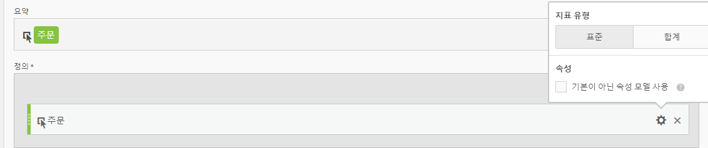
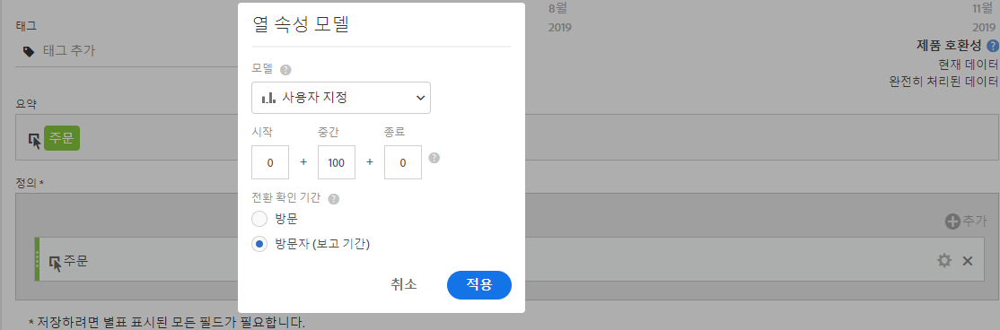
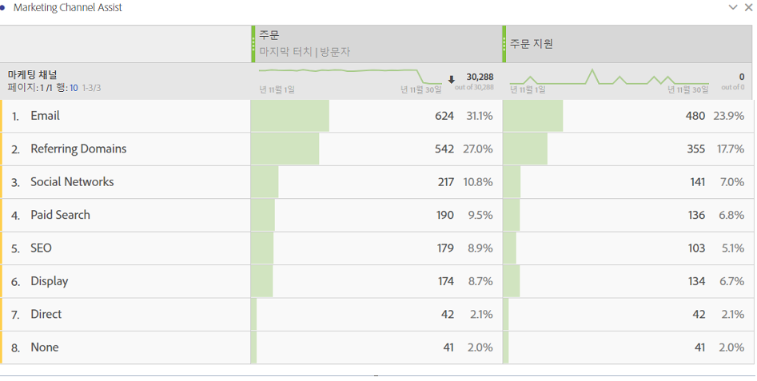

# 지원 지표 주문

주문을 지원하는 마케팅 채널을 보여 주는 지표를 작성하는 방법에 대해 설명합니다. 이는 원하는 모든 차원 또는 성공 이벤트에 적용할 수 있습니다.

1. 계산된 지표 빌더에서 지표에 "지원된 주문"이라는 이름을 지정합니다.
1. 정의 캔버스에서 주문 지표를 드래그합니다. 그런 다음 **[!UICONTROL 기본이 아닌 속성 모델]확인란을 선택하여 설정 기어를 통해 속성 모델을 조정합니다.**

   

1. **[!UICONTROL 사용자 지정]을 속성 모델로 선택합니다.** 가중치를 0(시작), 100(중간), 0(종료)으로 변경합니다.

   

1. 지표를 저장합니다.
1. Analysis Workspace에서 마케팅 채널 차원, 주문 및 새 지원 주문 지표로 자유 형식 테이블을 생성합니다.

   

이는 마케팅 채널에서 주문을 지원하는 방법을 쉽게 구분하는 방법입니다. 또는 자유 형식 테이블에서 임의의 지표를 마우스 오른쪽 단추로 클릭하고 테이블에서 직접 속성 모델을 조정할 수 있습니다.
