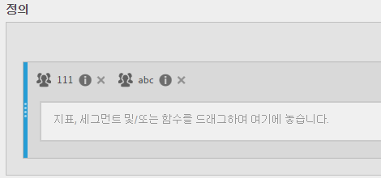
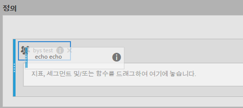

# 세그먼트 스택 및 바꾸기

계산된 지표 빌더 내에서 세그먼트를 스택하고 바꾸는 방법을 보여줍니다.

## 세그먼트 스택 {#section_3FC1118FEE2B40B7BB90F29C8521AF53}

[정의] 캔버스에서 새 세그먼트를 기존 세그먼트의 옆에 놓습니다.

## 한 세그먼트를 다른 세그먼트로 바꾸기 {#section_3DA899DF522A44D7A583C5DC8C0A033E}

[정의] 캔버스에서 새 세그먼트를 기존 세그먼트의 맨 위에 놓습니다.

