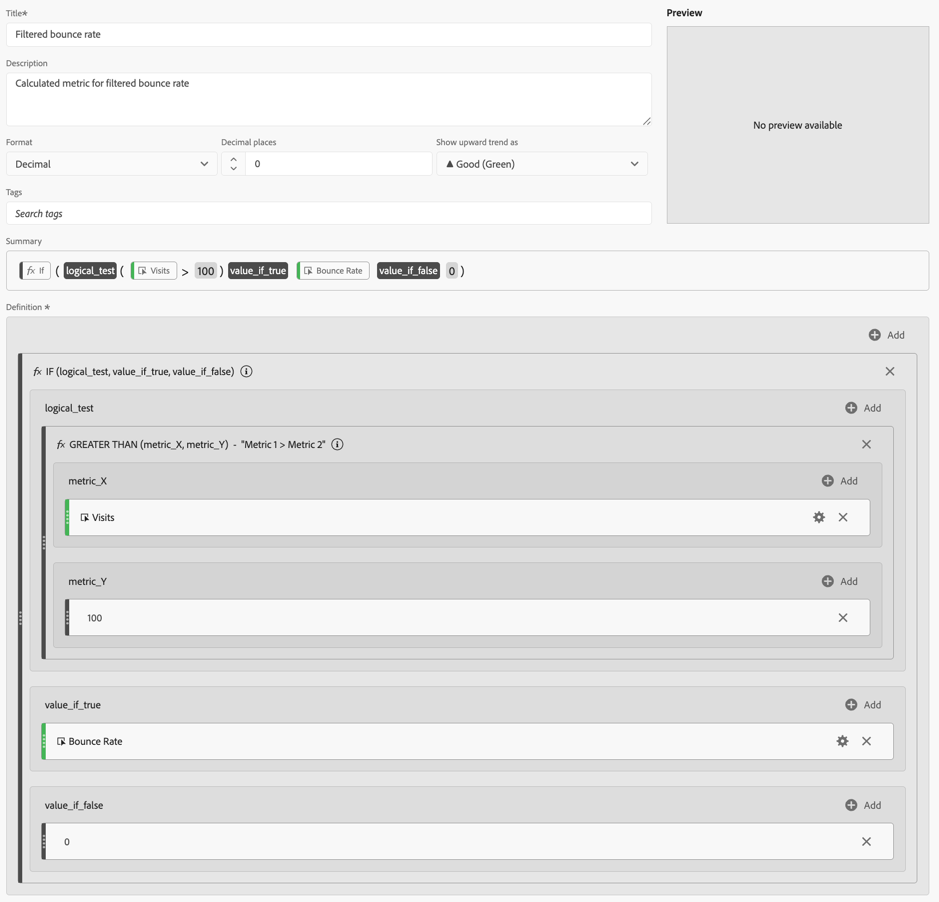

# 필터 및 가중치가 적용된 지표

이 문서에서는 필터 및 가중치가 적용된 지표의 예를 보여줍니다.

## 필터링된 바운스 비율

이 간단한 필터링된 지표는 방문이 100개가 넘는 페이지에 대해서만 바운스 비율을 표시합니다.

{zoomable="yes"}

이 공식은 일관된 시간 범위에 따라 달라진다는 것을 잊지 마십시오. 하루에 대해 보고서를 실행하는 경우 방문이 20개가 넘는 모든 페이지는 확인할 가치가 있습니다. 한 달에 대해 실행하는 경우에는 더 많은 방문을 포함하도록 필터링해야 할 수도 있습니다.

## 백분위수로 필터링된 바운스 비율

이 필터는 방문 횟수로 정렬할 때 페이지의 상위 30%에 대한 바운스 비율을 표시합니다.

{zoomable="yes"}

## 가중치가 적용된 바운스 비율

일반적으로 바운스 비율로 정렬하려 하지만 방문 수가 많은 페이지가 목록의 상단에 있어야 합니다. 다음과 같은 모습의 가중치가 적용된 바운스 비율을 만들 수 있습니다.

