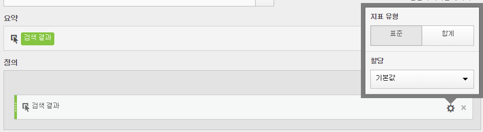

# 지표 유형 및 속성

지표 옆에 있는 톱니바퀴 아이콘을 선택하여 지표 유형 및 속성 모델을 지정할 수 있습니다.

* [지표 유형](../../../../../components/c-calcmetrics/c-workflow/cm-workflow/c-build-metrics/m-metric-type-alloc.md#section_34A86FB402F94E988724232283BF18B7)
* [열 속성 모델](../../../../../components/c-calcmetrics/c-workflow/cm-workflow/c-build-metrics/m-metric-type-alloc.md#section_F9690FD1943B403AB28E2FAC54EFE032)
* [선형 할당 작동 방식(2018년 7월 19일 자)](../../../../../components/c-calcmetrics/c-workflow/cm-workflow/c-build-metrics/m-metric-type-alloc.md#section_EDBB2E14A6C248C5A79C0913C02D7CA1)

## 지표 유형 {#section_34A86FB402F94E988724232283BF18B7}

| 지표 유형 | 정의 |
|---|---|
| 표준 | These metrics are the same metrics used in standard [!DNL Analytics] reporting. 공식이 하나의 표준 지표로 구성된 경우 계산되지 않은 지표에 해당하는 대응값과 동일한 데이터가 표시됩니다. 표준 지표는 각 개별 라인 항목별로 계산된 지표를 만드는 데 유용합니다. For example, [Orders] / [Visits] takes orders for that specific line item and divides it by the number of visits for that specific line item. |
| 합계 | 각 라인 항목에 있는 보고 기간에 대한 합계를 사용하십시오. 공식이 하나의 합계 지표로 구성된 경우 각 라인 항목에서 동일한 합계 숫자가 표시됩니다. 합계 지표는 사이트 합계 데이터를 기준으로 비교하는 계산된 지표를 만드는 데 유용합니다. For example, [Orders] / [Total Visits] shows the proportion of orders against ALL visits to your site, not just the visits to the specific line item. |

## 열 속성 모델 {#section_F9690FD1943B403AB28E2FAC54EFE032}

>[!IMPORTANT]
>
>In July 2018, [!DNL Analytics] introduced [Attribution IQ](https://marketing.adobe.com/resources/help/en_US/analytics/analysis-workspace/attribution.html), which revised the way allocation models in calculated metrics are evaluated. 이 변경의 일부로, 기본이 아닌 할당 모델을 사용하는 계산된 지표는 개선된 새로운 속성 모델로 마이그레이션되었습니다.
>
>* 기본이 아닌 속성 모델 및 전환 확인 창의 전체 목록에 대해서는 [속성 IQ](https://marketing.adobe.com/resources/help/en_US/analytics/analysis-workspace/attribution.html) 설명서를 참조하십시오.
>* "마케팅 채널 마지막 터치" 및 "마케팅 채널 첫 번째 터치" 할당 모델은 새 "마지막 터치" 및 "첫 번째 터치" 속성 모델로 마이그레이션됩니다. 참고: "마케팅 채널"은 더 이상 사용되지 않으며, 계산된 지표에 나타나는 두 개의 할당 모델만 사용됩니다.
>* 또한 선형 할당이 계산되는 방법을 수정할 예정입니다. 고객이 선형 할당 모델에 계산된 지표를 사용하는 경우 수정된 새로운 속성 모델을 반영하도록 보고서가 약간 변경될 수 있습니다. This change to calculated metrics will be reflected in Analysis Workspace, [!UICONTROL Reports &amp; Analytics], the Reporting API, Report Builder, and Ad Hoc Analysis. 자세한 내용은 [선형 할당 작동 방식(2018년 7월 19일 자)](../../../../../components/c-calcmetrics/c-workflow/cm-workflow/c-build-metrics/m-metric-type-alloc.md#section_EDBB2E14A6C248C5A79C0913C02D7CA1)을 참조하십시오.
>

## 선형 할당 작동 방식(2018년 7월 19일 자) {#section_EDBB2E14A6C248C5A79C0913C02D7CA1}

2018 년 7 월, Adobe는 계산된 지표에 대해 선형 할당이 보고되는 방식을 변경했습니다. This change impacts Analysis Workspace, Ad Hoc Analysis, [!UICONTROL Reports &amp; Analytics], Report Builder, Activity Map, and the Reporting APIs. 변경 사항은 주로 지속성이 있는 eVars 및 기타 차원에 영향을 줍니다. Note that these changes will only apply to calculated metrics and will not impact other reports using linear allocation (such as the Pages report in [!UICONTROL Reports &amp; Analytics]). 선형 할당을 사용하는 다른 보고서는 계속해서 기존의 선형 할당 방법을 사용합니다.

다음 예제는 선형 할당을 사용하여 계산된 지표가 보고에서 변경되는 방식을 보여줍니다.

<table id="table_E66D066A3E7B4232BBC220775F8B985A"> 
 <thead> 
  <tr> 
   <th colname="col1" class="entry"> </th> 
   <th colname="col2" class="entry"> 히트 1 </th> 
   <th colname="col3" class="entry"> 히트 2 </th> 
   <th colname="col4" class="entry"> 히트 3 </th> 
   <th colname="col5" class="entry"> 히트 4 </th> 
   <th colname="col6" class="entry"> 히트 5 </th> 
   <th colname="col7" class="entry"> 히트 6 </th> 
   <th colname="col8" class="entry"> 히트 7 </th> 
  </tr>
 </thead>
 <tbody> 
  <tr> 
   <td colname="col1"> 
데이터가 전송됨 
 </td> 
   <td colname="col2"> PROMO A </td> 
   <td colname="col3"> - </td> 
   <td colname="col4"> PROMO A </td> 
   <td colname="col5"> PROMO B </td> 
   <td colname="col6"> - </td> 
   <td colname="col7"> PROMO C </td> 
   <td colname="col8"> $10 </td> 
  </tr> 
  <tr> 
   <td colname="col1"> 
마지막 터치 eVar 
 </td> 
   <td colname="col2"> PROMO A </td> 
   <td colname="col3"> PROMO A </td> 
   <td colname="col4"> PROMO A </td> 
   <td colname="col5"> PROMO B </td> 
   <td colname="col6"> PROMO B </td> 
   <td colname="col7"> PROMO C </td> 
   <td colname="col8"> $10 </td> 
  </tr> 
  <tr> 
   <td colname="col1"> 
첫 번째 터치 eVar 
 </td> 
   <td colname="col2"> PROMO A </td> 
   <td colname="col3"> PROMO A </td> 
   <td colname="col4"> PROMO A </td> 
   <td colname="col5"> PROMO A </td> 
   <td colname="col6"> PROMO A </td> 
   <td colname="col7"> PROMO A </td> 
   <td colname="col8"> $10 </td> 
  </tr> 
  <tr> 
   <td colname="col1"> 
예제 prop 
 </td> 
   <td colname="col2"> PROMO A </td> 
   <td colname="col3"> - </td> 
   <td colname="col4"> PROMO A </td> 
   <td colname="col5"> PROMO B </td> 
   <td colname="col6"> - </td> 
   <td colname="col7"> PROMO C </td> 
   <td colname="col8"> $10 </td> 
  </tr> 
 </tbody> 
</table>

이 예에서, 값 A, B, C는 히트 7에서 $10를 구매하기 전에 히트 1, 3, 4, 6에 있는 변수로 전송되었습니다. 두 번째 행에서 그러한 값은 마지막 터치 방문을 기준으로 하여 히트에서 유지됩니다. 세 번째 행은 첫 번째 터치 방문 지속성을 보여 줍니다. 마지막으로, 마지막 행은 지속성이 없는 prop에 대해 데이터가 기록되는 방식을 보여줍니다.

**2018 7월 이전의 선형 할당 작동 방식에 대한 요약**

2018년 7월 19일 이전에 선형 속성은 첫 번째 터치 또는 마지막 터치 지속이 발생한 후에 계산됩니다. 즉, 위의 마지막 터치 eVar의 경우 $10는 다음과 같이 분산됩니다. A = 10 * (3/6) = $5, B = 10 * (2/6) = $3.33, C = 10 * (1/6) = $1.67.

위의 첫 번째 터치 eVar의 경우 $10 전체가 A에 제공됩니다. prop의 경우 다음과 같습니다. A = 10 * (2/4) = $5, B = 10 * (1/4) = $2.50, and C = 10 * (1/4) = $2.5. 이전에 작업한 대로 선형 할당을 요약하려면 다음을 수행하십시오.

| 값 | 현재 마지막 터치 eVar | 현재 첫 번째 터치 eVar | 현재 Prop |
|---|---|---|---|
| PROMO A | $5.00 | $10.00 | $5.00 |
| PROMO B | $3.33 | $0 | $2.50 |
| PROMO C | $1.67 | $0 | $2.50 |
| 합계 | $10.00 | $10.00 | $10.00 |

**2018년 7월 19일부터 선형 할당이 작동하는 방식 요약**

7월 19일 이후에 계산된 지표에서 이 동작을 수정했습니다. [!DNL Analytics] 이제 마지막 터치 또는 첫 번째 터치를 기준으로 지속되는 값을 사용하는 대신 전달된 값만 사용합니다 (맨 위 표의 첫 번째 행). 따라서 차원 할당 설정은 더 이상 선형 할당이 계산되는 방식에 영향을 주지 않으며(즉, props 및 eVars가 같은 방식으로 처리됨), 결과는 지속되었을 수 있는 첫 번째 또는 마지막 터치 값이 아닌 처음에 전달된 것을 반영합니다. 따라서 세 가지 경우 모두 A = 10 * (2/4) = $5, B = 10 * (1/4) = $2.50, C = 10 * (1/4) = $2.50입니다.

| 값 | 새로운 마지막 터치 eVar | 새로운 첫 번째 터치 eVar | 새 Prop |
|---|---|---|---|
| PROMO A | $5.00 | $5.00 | $5.00 |
| PROMO B | $2.50 | $2.50 | $2.50 |
| PROMO C | $2.50 | $2.50 | $2.50 |
| 합계 | $10.00 | $10.00 | $10.00 |

<!-- 

Additionally, as part of this change, [!DNL Analytics] is <b>changing how multiple sequential successes</b> are treated. In the following example, 7 hits occurred in the same visit with two orders, one $10 order on hit 4, and one $5 order on hit 7: 
 
<table id="table_4647AA466D1447F6961DDC10468FCCE1"> 
 <tgroup cols="8">
  <colspec colnum="1" colname="col1" colwidth="1.00*" />
  <colspec colnum="2" colname="col2" colwidth="1.04*" />
  <colspec colnum="3" colname="col3" colwidth="1.02*" />
  <colspec colnum="4" colname="col4" colwidth="1.02*" />
  <colspec colnum="5" colname="col5" colwidth="1.03*" />
  <colspec colnum="6" colname="col6" colwidth="1.02*" />
  <colspec colnum="7" colname="col7" colwidth="1.02*" />
  <colspec colnum="8" colname="col8" colwidth="1.03*" />
  <thead> 
   <tr> 
    <th colname="col1" class="entry"> </th> 
    <th colname="col2" class="entry"> Hit 1 </th> 
    <th colname="col3" class="entry"> Hit 2 </th> 
    <th colname="col4" class="entry"> Hit 3 </th> 
    <th colname="col5" class="entry"> Hit 4 </th> 
    <th colname="col6" class="entry"> Hit 5 </th> 
    <th colname="col7" class="entry"> Hit 6 </th> 
    <th colname="col8" class="entry"> Hit 7 </th> 
   </tr>
  </thead> 
  <tbody> 
   <tr> 
    <td colname="col1"> 
Data Sent In 
 </td> 
    <td colname="col2"> PROMO A </td> 
    <td colname="col3"> - </td> 
    <td colname="col4"> PROMO B </td> 
    <td colname="col5"> $10 </td> 
    <td colname="col6"> - </td> 
    <td colname="col7"> PROMO C </td> 
    <td colname="col8"> $5 </td> 
   </tr> 
   <tr> 
    <td colname="col1"> 
Last Touch eVar 
 </td> 
    <td colname="col2"> PROMO A </td> 
    <td colname="col3"> PROMO A </td> 
    <td colname="col4"> PROMO B </td> 
    <td colname="col5"> $10 </td> 
    <td colname="col6"> PROMO B </td> 
    <td colname="col7"> PROMO C </td> 
    <td colname="col8"> $5 </td> 
   </tr> 
   <tr> 
    <td colname="col1"> 
First Touch eVar 
 </td> 
    <td colname="col2"> PROMO A </td> 
    <td colname="col3"> PROMO A </td> 
    <td colname="col4"> PROMO A </td> 
    <td colname="col5"> $10 </td> 
    <td colname="col6"> PROMO A </td> 
    <td colname="col7"> PROMO A </td> 
    <td colname="col8"> $5 </td> 
   </tr> 
   <tr> 
    <td colname="col1"> 
Example prop 
 </td> 
    <td colname="col2"> PROMO A </td> 
    <td colname="col3"> - </td> 
    <td colname="col4"> PROMO A </td> 
    <td colname="col5"> $10 </td> 
    <td colname="col6"> - </td> 
    <td colname="col7"> PROMO C </td> 
    <td colname="col8"> $5 </td> 
   </tr> 
  </tbody> 
 </tgroup> 
</table> 

 
 

Currently (<b>prior to July 19, 2018</b>), linear attribution would carry forward past the initial conversion and persist into the second conversion 
 
<ul id="ul_FD09813B59F04FF2A96A70BBE0A8F349"> 
 <li id="li_2EC965DDAE334C1795530F7C6F1674C5">In our first-touch eVar example, the total revenue for each promotion would be calculated using the promos prior to conversion on hit 4 for revenue on hit 4, but all promos for the conversion on hit 7. </li> 
 <li id="li_687C03C4B0A941AA800084F324A95FD6">In our last-touch eVar example, this would be: A = (2/3) * 10 + (2/5) * 5 = $8.66, B = (1/3) * 10 + (2/5) * 5 = $5.33, C = (1/5) * 5 = $1.00. In our FT eVar example: A = (3/3) * 10 + (5/5) * 5 = $15.00, and for the prop: A = (1/2) * 10 + (1/3) * 5 = $6.66, B = (1/2) * 10 + (1/3) * 5 = $6.66, and C = (1/3) * 5 = $1.66. </li> 
</ul> 

Resulting in a distribution as follows: 
 
<table id="table_6A066E602BF641B0BD4B175EE9753C6E"> 
 <tgroup cols="4">
  <colspec colnum="1" colname="col1" colwidth="*" />
  <colspec colnum="2" colname="col2" colwidth="*" />
  <colspec colnum="3" colname="col3" colwidth="*" />
  <colspec colnum="4" colname="col4" colwidth="*" />
  <thead> 
   <tr> 
    <th colname="col1" class="entry"> Values </th> 
    <th colname="col2" class="entry"> Current Last Touch eVar </th> 
    <th colname="col3" class="entry"> Current First Touch eVar </th> 
    <th colname="col4" class="entry"> Current Prop </th> 
   </tr>
  </thead> 
  <tbody> 
   <tr> 
    <td colname="col1"> PROMO A </td> 
    <td colname="col2"> $8.66 </td> 
    <td colname="col3"> $15.00 </td> 
    <td colname="col4"> $6.66 </td> 
   </tr> 
   <tr> 
    <td colname="col1"> PROMO B </td> 
    <td colname="col2"> $5.33 </td> 
    <td colname="col3"> $0.00 </td> 
    <td colname="col4"> $6.66 </td> 
   </tr> 
   <tr> 
    <td colname="col1"> PROMO C </td> 
    <td colname="col2"> $1.00 </td> 
    <td colname="col3"> $0.00 </td> 
    <td colname="col4"> $1.66 </td> 
   </tr> 
   <tr> 
    <td colname="col1"> Total </td> 
    <td colname="col2"> $15.00 </td> 
    <td colname="col3"> $15.00 </td> 
    <td colname="col4"> $15.00 </td> 
   </tr> 
  </tbody> 
 </tgroup> 
</table> 

 
 

<b>After July 19, 2018</b>, [!DNL Analytics] will treat each sequence of conversions independently, meaning linear attribution will no longer carry forward from one conversion to another. In the previous example, attribution will always be treated the same way (regardless of the eVar allocation settings as stated above) and will be calculated as follows: A = (1/2) * 10 = $5, B = (1/2) * 10 = $5, and C = (1/1) * 5 = $5. To summarize: 
 
<table id="table_2D39CCD158BF488EA404324DF50B9579"> 
 <tgroup cols="4">
  <colspec colnum="1" colname="col1" colwidth="*" />
  <colspec colnum="2" colname="col2" colwidth="*" />
  <colspec colnum="3" colname="col3" colwidth="*" />
  <colspec colnum="4" colname="col4" colwidth="*" />
  <thead> 
   <tr> 
    <th colname="col1" class="entry"> Values </th> 
    <th colname="col2" class="entry"> New Last Touch eVar </th> 
    <th colname="col3" class="entry"> New First Touch eVar </th> 
    <th colname="col4" class="entry"> New Prop </th> 
   </tr>
  </thead> 
  <tbody> 
   <tr> 
    <td colname="col1"> PROMO A </td> 
    <td colname="col2"> $5.00 </td> 
    <td colname="col3"> $5.00 </td> 
    <td colname="col4"> $5.00 </td> 
   </tr> 
   <tr> 
    <td colname="col1"> PROMO B </td> 
    <td colname="col2"> $5.00 </td> 
    <td colname="col3"> $5.00 </td> 
    <td colname="col4"> $5.00 </td> 
   </tr> 
   <tr> 
    <td colname="col1"> PROMO C </td> 
    <td colname="col2"> $5.00 </td> 
    <td colname="col3"> $5.00 </td> 
    <td colname="col4"> $5.00 </td> 
   </tr> 
   <tr> 
    <td colname="col1"> Total </td> 
    <td colname="col2"> $15.00 </td> 
    <td colname="col3"> $15.00 </td> 
    <td colname="col4"> $15.00 </td> 
   </tr> 
  </tbody> 
 </tgroup> 
</table>

 -->

