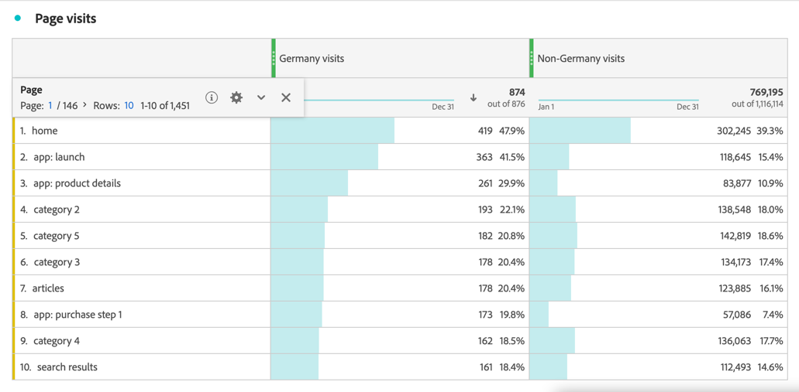

# 세그먼트화된 지표

[계산된 지표 빌더](cm-build-metrics.md#definition-builder)에서 지표 정의 내에 세그먼트를 적용할 수 있습니다. 분석에서 데이터 하위 집합에 대한 지표를 사용하려는 경우 세그먼트를 적용하는 것이 유용합니다.

>[!NOTE]
>
>세그먼트 정의는 [세그먼트 빌더](/help/components/segmentation/segmentation-workflow/seg-build.md)를 통해 업데이트됩니다. 세그먼트를 변경하면 세그먼트는 사용된 모든 곳에서 자동으로 업데이트됩니다(세그먼트가 계산된 지표 정의의 일부인 경우 포함).
>

내 브랜드와 상호 작용하는 독일인 사용자와 독일 외부 사용자에 대한 지표를 비교하려고 합니다. 따라서 다음과 같은 질문에 답변할 수 있습니다.

1. 가장 [인기 있는 페이지](#popular-pages)를 방문하는 독일인과 외국인의 수를 표시합니다.
1. 이번 달에 총 [총](#totals)명의 독일 사용자와 해외 사용자의 브랜드와 온라인으로 상호 작용한 사용자 수입니다.
1. 인기 있는 페이지를 방문한 독일인과 해외 사용자의 [백분율](#percentages)은 무엇입니까?

세그먼트화된 지표를 통해 이러한 질문에 답변할 수 있는 방법을 알려면 아래 섹션을 참조하십시오. 필요한 경우 보다 자세한 설명서를 참조합니다.

## 방문 빈도가 높은 페이지

1. [(이)라는 Workspace 프로젝트에서 ](../cm-workflow.md)계산된 지표를 만듭니다`Germany`.
1. [계산된 지표 빌더](cm-build-metrics.md)에서 국가 필드를 사용하는 [세그먼트 만들기](/help/components/segmentation/segmentation-workflow/seg-build.md)(`Germany`).

   >[!TIP]
   >
   >계산된 지표 빌더에서는 구성 요소 패널을 사용하여 직접 세그먼트를 만들 수 있습니다.
   >   

   세그먼트는 다음과 같습니다.

   

1. 계산된 지표 빌더로 돌아가 세그먼트를 사용하여 계산된 지표를 업데이트합니다.

   

계산된 지표의 국제 버전에 대해 위의 단계를 반복합니다.

1. 제목이 `Non Germany visits`인 Workspace 프로젝트에서 계산된 지표를 만듭니다.
1. 계산된 지표 빌더 내에서 CRM 데이터의 CRM 국가 필드를 사용하는 `Not Germany`이라는 세그먼트를 만들어 개인의 출처를 결정합니다.

   세그먼트는 다음과 같아야 합니다.

   

1. 계산된 지표 빌더로 돌아가 세그먼트를 사용하여 계산된 지표를 업데이트합니다.

   

1. Analysis Workspace에서 독일 방문자와 비독일 방문자가 방문한 페이지를 살펴보는 프로젝트를 만듭니다.

   

## 총계

1. 총계를 기반으로 두 개의 새 계산된 지표를 만듭니다. 이전에 만든 각 세그먼트를 열고, 세그먼트 이름을 바꾸고, **[!UICONTROL 사람]**&#x200B;에 대한 **[!UICONTROL 지표 유형]**&#x200B;을(를) **[!UICONTROL 총계]**(으)로 설정하고 **[!UICONTROL 다른 이름으로 저장]**&#x200B;을(를) 사용하여 새 이름으로 세그먼트를 저장합니다. 예:

   

1. Workspace 프로젝트에 올해의 총 페이지를 보여주는 새 자유 형식 테이블 시각화를 추가합니다.

   

## 백분율

1. 이전에 만든 계산된 지표에서 비율을 계산하는 계산된 지표 두 개를 새로 만듭니다.

   

1. Workspace 프로젝트를 업데이트합니다.

   

