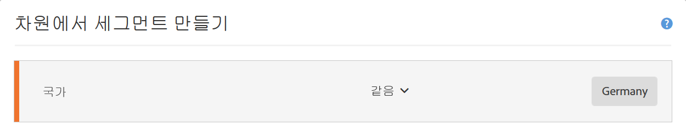
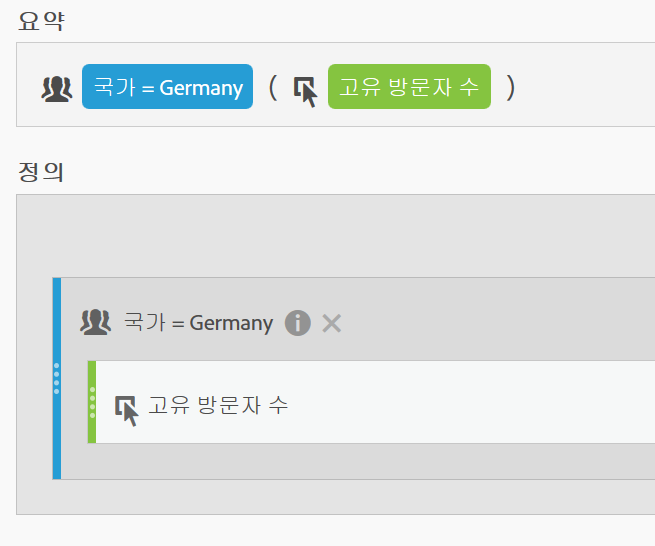
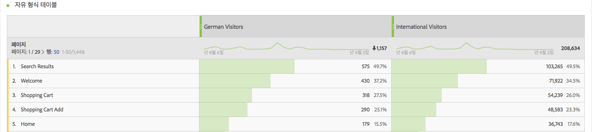
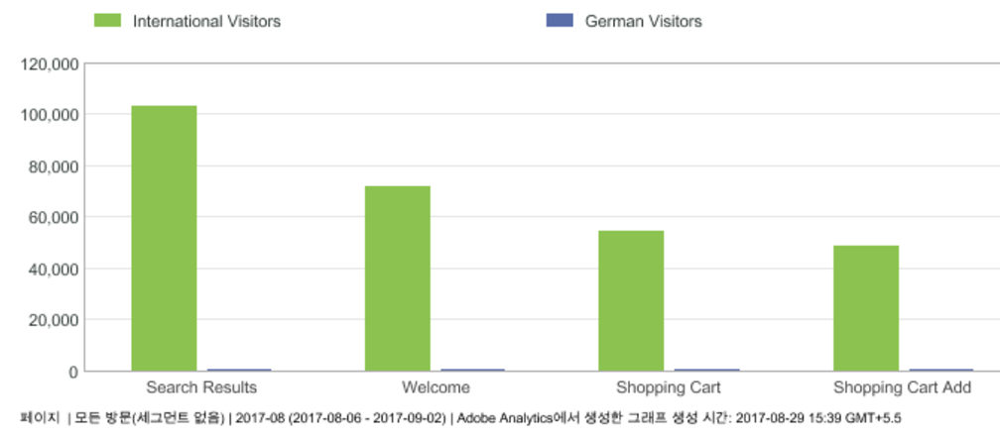
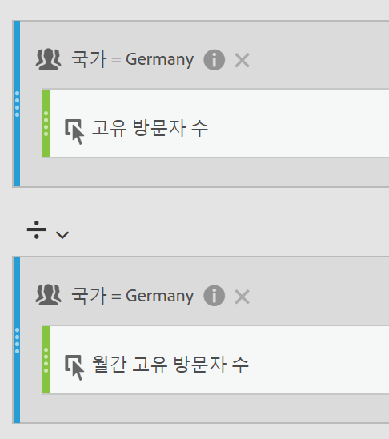
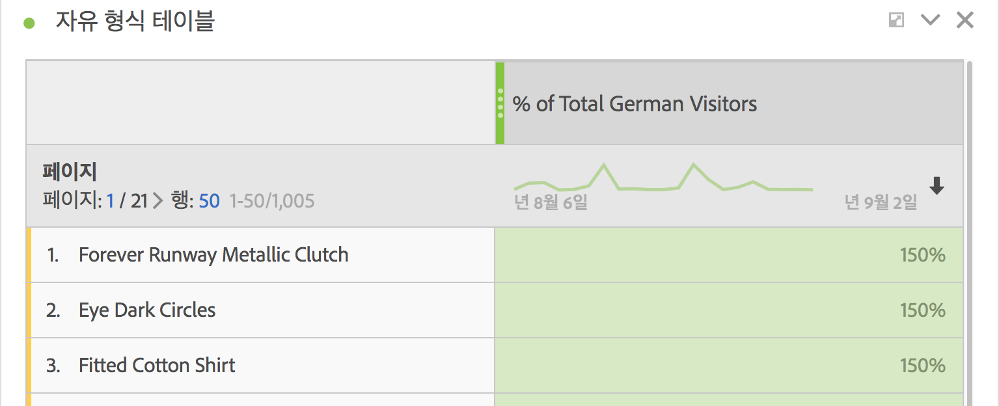
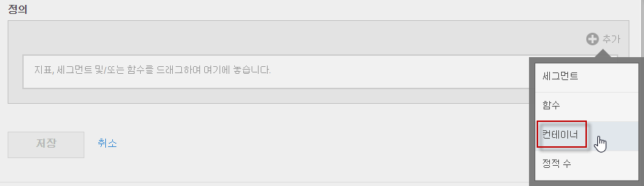
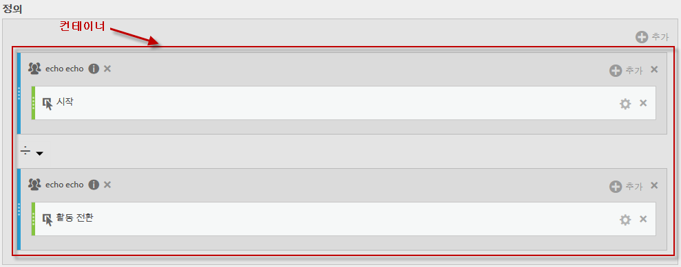
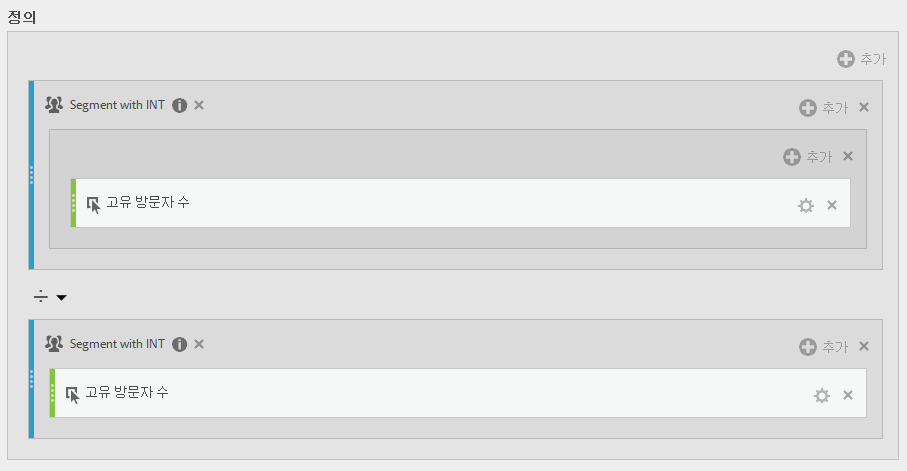

# 세그먼트화된 지표

개별 지표에 대한 세그먼트화는 동일한 보고서 내에서 지표 비교를 수행할 수 있도록 해줍니다. (파생 지표만 해당)

## 세그먼트 비교 {#section_29A6E0070F084BFDB6228FA9CE106F48}

"미국 방문자" 세그먼트의 다양한 측면을 "해외 방문자" 세그먼트의 다양한 측면과 비교하려는 경우, 다음과 같이 통찰력을 제공하는 지표를 만들 수 있습니다.

* 두 그룹 간 컨텐츠 탐색 행동은 어떻게 비교합니까? (다른 예: 두 세그먼트 간 전환 비율은 어떻게 비교합니까?)
* 총 방문자의 백분율로서 특정 페이지를 탐색한 미국 방문자 수와 해외 방문자 수는 어떻게 비교합니까?
* 이렇게 다른 세그먼트에서 액세스한 컨텐츠의 측면에서 볼 때 차가 가장 큰 곳은 어디입니까?

첫 번째 질문인 "두 그룹 간 컨텐츠 탐색 행동은 어떻게 비교합니까?"를 살펴보겠습니다.

1. 비교 가능한 세그먼트가 없는 경우 계산된 지표 빌더에서 "국가"가 "독일"인 "독일 방문자"라는 내부 세그먼트를 만듭니다. 국가 차원을 정의 캔버스로 드래그하고 독일을 값으로 선택하면 됩니다.

   

   >[!NOTE]
   >
   >[세그먼트 빌더에서도](https://marketing.adobe.com/resources/help/en_US/analytics/segment/seg_build.html)수행할 수 있지만 계산된 지표 빌더에서 차원을 사용할 수 있게 함으로써 워크플로우를 간소화했습니다.

   >[!NOTE]
   >
   >"Internal" means that the segment is not visible in the **[!UICONTROL Segments]** list in the left rail. 그러나 그 옆에 있는 "i" 아이콘 위에 마우스를 올려놓고 **[!UICONTROL 공개로 설정을 클릭하여 공개할 수 있습니다]**.

1. 비교 가능한 세그먼트가 없을 경우에는 "해외 방문자"라는 세그먼트를 만드십시오. 여기서 "국가"는 "독일"과 같지 않습니다.
1. 독일 방문자 세그먼트를 [정의] 캔버스로 드래그하고 고유 방문자 수 지표를 그 안에 드래그하여 "미국 방문자"라는 지표를 만들고 저장하십시오.

   

1. 해외 방문자 세그먼트와 고유 방문자 수 지표를 사용하여 3단계를 반복하여 해외 방문자 지표를 만듭니다.
1. Analysis Workspace에서 **[!UICONTROL Page]차원을 자유형 테이블로 드래그하고 서로 옆에 있는 계산된 두 개의 지표를 위쪽으로 끕니다.**

   

1. Or, in [!UICONTROL Reports &amp; Analytics], open the [!UICONTROL Pages] report and click **[!UICONTROL Show Metrics]**, then apply the new US Visitors and International Visitors segmented metrics to see how their content browsing behavior compares.

   

## 합계의 백분율 비교 {#section_846CB89725F04388AE0352DB20189EE8}

표준화된 백분율로 방문자의 탐색 행동을 비교함으로써 다른 수준의 조사를 도입할 수 있습니다. 이렇게 하려면 두 가지의 새로운 지표 "총 독일 방문자의 %"와 "해외 방문자의 %"를 만드십시오.

1. 독일(또는 해외) 방문자 세그먼트를 캔버스에 넣으십시오.
1. 아래에 다른 독일(또는 해외) 방문자 세그먼트를 넣으십시오. 하지만, 이때, 그 구성(톱니바퀴) 아이콘을 클릭하여 지표 유형 "합계"를 선택합니다. 형식은 "퍼센트"여야 합니다. 연산자는 "나누기"여야 합니다. 다음 지표 정의로 종료합니다.

   

1. 이 지표를 프로젝트에 적용합니다.

   

## 백분율로 차이 비교(컨테이너 사용) {#section_13D6353259B74C09B37BA6378A501938}

미국 방문자의 탐색 행동과 해외 방문자의 탐색 행동 간의 가장 큰 차이를 한눈에 보려는 경우, 서로 백분율을 빼는 다른 지표를 만들 수 있습니다. 그렇게 하려면, 두 지표 세트를 둘러싸는 괄호로서 효과적으로 동작하는 컨테이너 기능을 사용할 수 있습니다.

1. [!UICONTROL 정의] 캔버스에서 **[!UICONTROL 추가]** &gt; **[!UICONTROL 컨테이너를 클릭합니다]**.

   

1. 이전에 만든 "총 미국 방문자의 %" 지표를 첫 번째 컨테이너에 넣으십시오. 이것은 전체 정의로 확장됩니다.

   

1. 아래에서 다른 컨테이너를 만들고 "총 해외 방문자의 %" 지표를 거기에 넣으십시오.
1. 2개 컨테이너 간의 연산자를 빼기(-)로 변경합니다.

   

1. 지표를 저장합니다(이름을 "미국과 해외 간의 차이 %"와 같은 것으로 지정하십시오.).
1. 보고서에 적용되면, 어디에서 백분율 차가 가장 큰지 쉽게 알고 그에 따라 보고서를 정렬할 수 있습니다.

   

