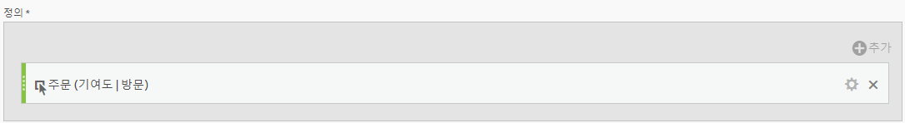
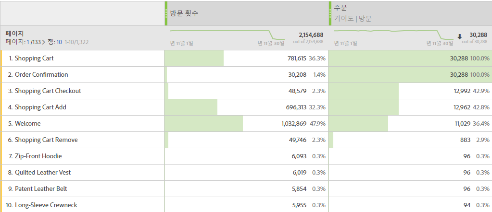

# 기여도 지표

다음은 간단한 사용 사례입니다. 컨텐츠 소유자이며 주문이 들어 있는 방문에 기여한 (즉, 참여) 페이지가 기여한 페이지를 확인하려고 합니다. 방법은 다음과 같습니다.

>[!NOTE]
>
>관리 도구를 통해 이렇게 해야 했습니다. 관리 도구에서 기여도 지표를 여전히 활성화할 수 있지만, 사용자 지정 이벤트 1 - 100에 대해서만 가능합니다.

다음은 간단한 사용 사례입니다. 컨텐츠 소유자는 이메일 로그인이 포함된 방문에 기여한(참여한) 페이지를 확인할 수 있습니다. 방법은 다음과 같습니다.

1. 계산된 지표 빌더에서 새 지표를 만듭니다.
1. 성공 이벤트 "Orders" 를 정의 캔버스로 드래그합니다.
1. 해당 이벤트의 [기여도 모델을](../../../../../components/c-calcmetrics/c-workflow/cm-workflow/c-build-metrics/m-metric-type-alloc.md#concept_B7A1FCFEFA9D4C4883208ACE8C9C8E5E) 설정 톱니바퀴 **[!UICONTROL 아래의 기여도로]** **[!UICONTROL 변경합니다]** . **[!UICONTROL 방문]** 룩백을 선택합니다. 정의 모양은 다음과 같아야 합니다.

   

1. 지표를 저장합니다.
1. **[!UICONTROL 페이지]** 보고서에서 계산된 지표를 사용합니다.

   

1. (선택 사항) 지표를 조직의 다른 사용자와 공유합니다.

