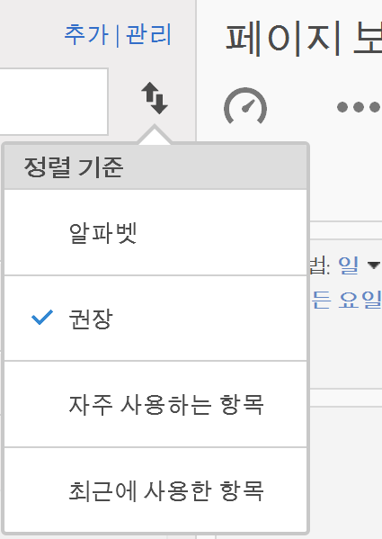
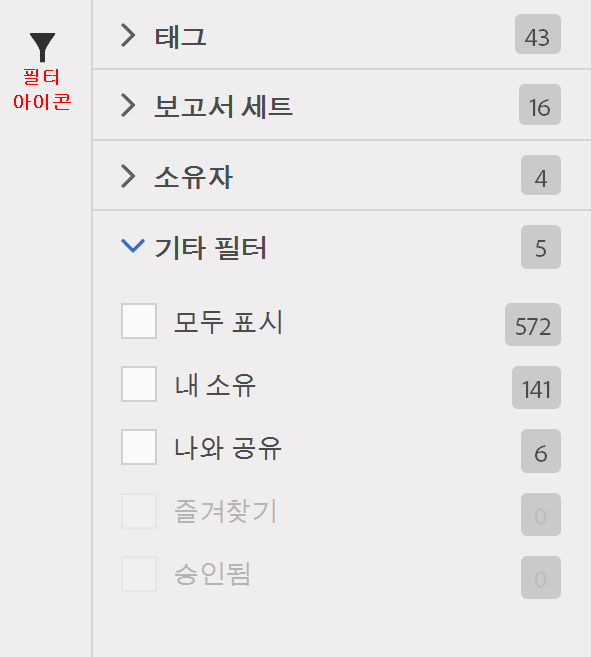

# 지표 찾기

지표를 찾는 두 가지 주요 방법, 즉 정렬과 필터링에 대해 설명합니다.

## 정렬 {#section_89F9C4D515084F5796F2A54D468BF6C8}

보고서를 열고 보고서 왼쪽에 있는 지표 아이콘 을 클릭하여 지표 레일을 표시하면 지표 선택기에서 **정렬 기준]드롭다운 목록에 네 개의 정렬 옵션이 표시됩니다.[!UICONTROL **

| 옵션 | 사용하는 경우 |
|---|---|
| 알파벳 | 이름을 알면 유용합니다. |
| 권장 | 사람들이 보고서에서 사용하는 일반적인 지표 - 사용자가 일반적으로 이 보고서와 사용하는 지표에서 백엔드로 수집됩니다. |
| 자주 사용하는 항목 | 초보 사용자이고 보고서에서 일반적으로 사용되는 내용을 보려는 경우 유용합니다. |
| 최근에 사용한 항목 | 프로젝트에서 작업하면서 동일한 지표 세트를 반복하여 사용하는 경우 유용합니다. |

## 필터링 - 고급 선택 {#section_33818CC048C04F098703AC229693F8CA}

보고서를 열고 지표 아이콘을 클릭한 다음 **[!UICONTROL 관리를 클릭합니다]**. 이제 필터 아이콘을 클릭합니다. 여러 방법으로 필터링할 수 있습니다.

<table id="table_269081BC9DF54FFDA4E949FFC7488F42"> 
 <thead> 
  <tr> 
   <th colname="col1" class="entry"> 다음을 원하는 경우 </th> 
   <th colname="col2" class="entry"> 정렬에 사용할 방법 </th> 
  </tr>
 </thead>
 <tbody> 
  <tr> 
   <td colname="col1"> 이 보고서 세트에 모든 지표를 표시합니다. </td> 
   <td colname="col2"> 기타 필터 &gt; 모두 표시 </td> 
  </tr> 
  <tr> 
   <td colname="col1"> 보유한 지표만 표시합니다. </td> 
   <td colname="col2"> 기타 필터 &gt; 내 소유 </td> 
  </tr> 
  <tr> 
   <td colname="col1"> 다른 사람이 나와 공유한 지표를 표시합니다. </td> 
   <td colname="col2">소유자 또는 
 기타 필터 &gt; 나와 공유 
 </td> 
  </tr> 
  <tr> 
   <td colname="col1"> 회사가 승인한 지표만 표시합니다. </td> 
   <td colname="col2"> 승인됨 </td> 
  </tr> 
  <tr> 
   <td colname="col1"> 작업 중인 프로젝트의 지표를 필터링합니다. </td> 
   <td colname="col2">태그 중 하나. </td> 
  </tr> 
 </tbody> 
</table>

