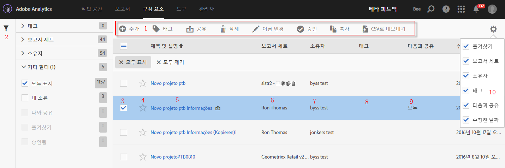

# 계산된 지표 관리자

계산된 지표 관리자는 공유, 필터링, 태깅, 승인, 복사, 삭제 및 즐겨찾기로 표시 등 다양한 지표 처리 작업 방식을 제공합니다.

계산된 지표 관리자는 사용자가 보유하는 모든 세그먼트 및 사용자와 공유되는 모든 세그먼트를 표시합니다. 관리자 수준의 사용자는 조직의 모든 사용자 지정 지표를 볼 수 있습니다. 이 개요에서는 계산된 지표 관리자의 사용자 인터페이스와 기능을 설명합니다. 다음 방법으로 액세스해 보십시오.

* Going to **[!UICONTROL Analytics]** &gt; **[!UICONTROL Components]** in the left navigation. 그런 다음 **[!UICONTROL 계산된 지표를 클릭합니다]**.

| UI 기능 | 설명 |
|---|---|
| 계산된 지표 관리 도구 모음 | 지표를 선택하면 이 도구 모음이 나타납니다. 대부분의 관리 작업은 이 도구 모음에서 완료할 수 있습니다. |
| 필터 표시/숨기기 | 필터 표시를 클릭하면 필터 메뉴가 표시됩니다. 태그, 보고서 세트, 소유자, 모두 표시(관리자만), 나와 공유, 내 세그먼트, 즐겨찾기 및 승인됨을 기준으로 필터링할 수 있습니다. |
| 확인란 | 사용자 지정 지표를 관리하려면 선택합니다. |
| 즐겨찾기 | 지표 옆에 있는 별 모양을 클릭하면 별이 노란색으로 바뀌고 지표가 즐겨찾기로 표시됩니다. |
| 세그먼트 제목 및 설명 | 계산된 지표 빌더에서 제공됩니다. 제목 및 설명을 편집하려면 제목 링크를 클릭합니다. 이렇게 하면 계산된 지표 빌더로 돌아갑니다. |
| 보고서 세트 | 이 열은 지표를 마지막으로 저장한 보고서 세트를 표시합니다. |
| 소유자 | 사용자 지정 지표를 소유하는 사람을 나타냅니다. 관리자가 아닌 경우 사용자가 소유하거나 사용자와 공유된 지표만 표시할 수 있습니다. |
| 태그 | 사용자 또는 사용자와 세그먼트를 공유한 다른 사람이 지표에 적용한 태그를 표시합니다. |
| 다음 사용자와 공유 | 세그먼트를 공유한 개인 또는 그룹(관리자만) 또는 모든 사용자(관리자만)를 표시합니다. |
| 열 선택기 | 보기를 사용자 지정할 수 있도록 계산된 지표 관리자에서 열을 선택하거나 선택 취소할 수 있게 해줍니다. |
| 공유 아이콘 (표시되지 않음) | 이 사용자 지정 지표를 사용자가 공유했거나 이 지표가 사용자와 공유되고 있음을 가리킵니다. |
| 승인됨 아이콘 (표시되지 않음) | 관리자가 이 사용자 지정 지표를 승인했음을 가리킵니다. |