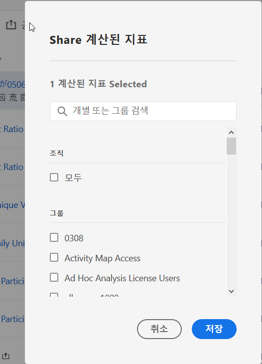

# 계산된 지표 공유

사용 권한에 따라, 전체 조직, 그룹 또는 개별 사용자와 지표를 공유할 수 있습니다.

| 역할 | 권한 |
|---|---|
| 관리자 | 모든 사람, 그룹 및 사용자와 지표를 공유할 수 있습니다. 그룹은 관리 콘솔에서 권한 그룹으로 설정되어 있습니다. |
| 비관리자 | 개별 사용자와만 지표를 공유할 수 있습니다. |

지표를 언제 전체 회사와 공유하는 것이 좋고, 언제 사용자 그룹이나 개인과 공유해야 좋을까요? 다음은 따라야 할 몇 가지 모범 사례입니다.

* 관리자는 해당 지표가 전체 회사에 유용하고 모든 사람이 편리하게 사용할 수 있는 경우 **[!UICONTROL 모든 사람]과 공유합니다.** 이 경우 지표를 승인된 지표로 만드는 것도 고려해야 합니다.
* 관리자는 지표가 팀에게 유용한 비즈니스 가치를 제공하는 경우 특정 **[!UICONTROL 그룹]과 지표를 공유하십시오.**
* 관리자 또는 개인 사용자는 다른 사용자와 지표를 공유하여 지표를 수정하고 유효성을 검증합니다. 유용하지 않다고 확인되면 삭제할 수 있습니다. 이 유형의 지표는 공식적으로 승인하지 마십시오.

1. 계산된 지표 관리자에서 공유할 지표 옆의 확인란을 선택합니다. 작업 표시줄이 표시됩니다.

   

1. **[!UICONTROL 공유]아이콘을 클릭합니다.**

   

   관리자는 **[!UICONTROL 모두]**&#x200B;를 선택하거나 조직의 **[!UICONTROL 그룹]및 (아래로 스크롤하여)**&#x200B;사용자]에서 선택할 수 있습니다. **[!UICONTROL ** 관리자가 아닌 사용자는 개별 사용자만 볼 수 있습니다. **[!UICONTROL 검색]필드를 사용하여 그룹 또는 사용자를 검색합니다**

1. **[!UICONTROL 공유를 클릭합니다]**.

   지표 옆에 공유 아이콘이 표시됩니다.

1. **[!UICONTROL 필터]** &gt; **[!UICONTROL 기타 필터]** &gt; 나와 **[!UICONTROL 공유로 이동하여 사용자와 공유된 지표를 필터링할]**&#x200B;수 있습니다.

