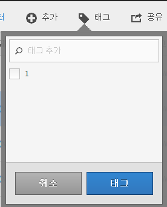

# 계산된 지표 태그 지정

계산된 지표 관리자에서 세그먼트에 태깅하여 세그먼트를 정리할 수 있습니다.

모든 사용자는 계산된 지표에 대해 태그를 만든 후 지표에 하나 이상의 태그를 적용할 수 있습니다. 그렇지만 본인이 소유하거나 본인과 공유된 계산된 지표에 대한 태그만 볼 수 있습니다. 어떤 종류의 태그를 만들어야 합니까? 다음은 제안되는 유용한 태그입니다.

* **팀 이름**&#x200B;을 기반으로 하는 태그(예: 소셜 마케팅, 모바일 마케팅)
* **프로젝트** 태그(분석 태그)(예: 시작 페이지 분석)
* **카테고리** 태그: 남성용, 지역
* **워크플로우** 태그: 승인용, 처리됨(특정 비즈니스 단위)

1. 계산된 지표 관리자에서 태깅할 지표 옆의 확인란을 선택합니다. 관리 도구 모음이 표시됩니다. 
1. **[!UICONTROL 태그]를 클릭하고**

   * 기존 태그에서 선택하거나
   * add a new tag name in the Add Tags/Search dialog box and press **[!UICONTROL Enter]**.

      

1. **[!UICONTROL 태그]를 다시 클릭하여 지표에 태깅합니다.**

이제 태그가 태그 열에 나타납니다. (열을 관리하려면 오른쪽 위에 있는 톱니바퀴 아이콘 클릭)

You can also filter on tags by going to **[!UICONTROL Show Filters]** &gt; **[!UICONTROL Tags]**.
