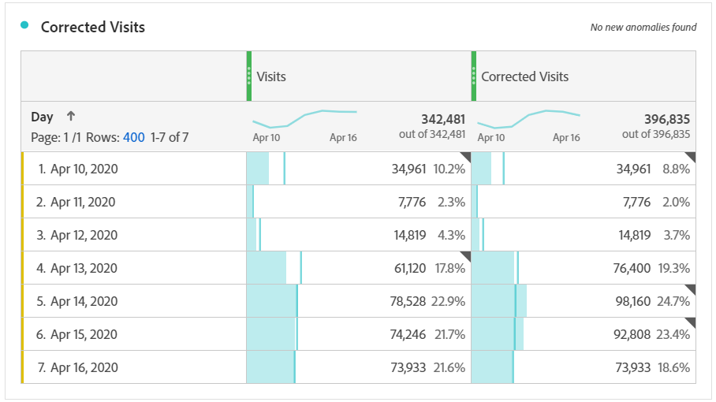

# 이벤트의 영향을 받는 데이터 추출

이벤트의 영향을 받은 데이터가 있는 경우 계산된 지표를 사용하여 이벤트 기간 동안 트렌드 값을 파생시킬 수 있습니다. 예를 들어 데이터가 25% 감소하는 이벤트가 있는 경우 계산된 지표에서 승수로 사용할 수 있습니다.

>[!NOTE] 이러한 단계는 세그멘테이션 및 날짜 비교 관점에서 이벤트의 영향을 이해할 때 가장 잘 작동합니다. 이벤트에 의해 영향을 받은 날짜를 [이전 범위로](/help/analyze/analysis-workspace/components/calendar-date-ranges/compare-event.md) 비교하고 이 페이지 뒤에 [오기 전에 분석에서](../c-segmentation/use-cases/exclude-date-range.md) 특정 날짜 제외를 따르십시오.

1. 분석에서 특정 날짜 제외에 설명된 대로 &#39;영향을 받는 일 수&#39;와 &#39;영향을 받는 일 제외&#39;에 대해 두 개의 세그먼트를 만듭니다.
2. > **[!UICONTROL Components]** 으로 **[!UICONTROL Calculated metrics]**&#x200B;이동합니다.
3. 클릭 **[!UICONTROL Add]**.
4. 위의 두 세그먼트를 모두 정의 캔버스로 드래그합니다. 두 항목 사이의 연산자를 조합하여 `+` 하나로 변경합니다.
5. 두 세그먼트 내에 원하는 지표를 추가합니다. 예를 들어 &#39;방문 횟수&#39; 지표를 사용할 수 있습니다.

   

6. &#39;영향을 받는 일 수&#39; 컨테이너의 오른쪽 **[!UICONTROL Add]** 상단에서 을 클릭한 다음 을 클릭합니다 **[!UICONTROL Static number]**. 이벤트의 영향을 받은 날짜를 이전 범위로 비교에서 설명한 대로 정적 숫자를 데이터 오프셋할 비율로 설정합니다. 이 예에서는 오프셋이 25% 또는 1.25입니다.

   

7. 트렌드 자유 형식 테이블에서 &quot;수정된&quot; 지표를 나란히 적용합니다. 이벤트 외부의 모든 날은 정상적인 지표 카운트를 반영하지만 영향을 받는 모든 일은 승수 오프셋을 사용합니다.

   

8. 라인 시각화로 데이터를 보고 수정된 지표의 효과를 확인합니다.

   
