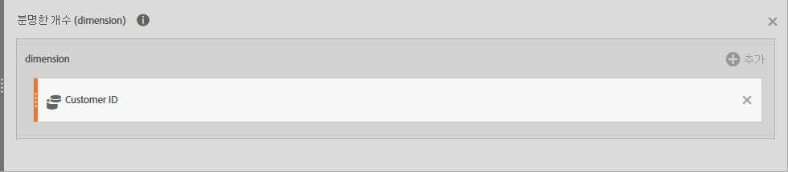

# 참조: 고급 함수

<!-- 

cm_adv_functions.xml

 -->

Access these functions by checking **[!UICONTROL Show Advanced]** in the **[!UICONTROL Functions]** drop-down list.

## 테이블 함수 대 행 함수 {#section_8977BE40A47E4ED79EB543A9703A4905}

테이블 함수는 출력이 모든 테이블 행에 대해 동일한 함수입니다. 행 함수는 출력이 모든 테이블 행에 대해 다른 함수입니다.

## Include-Zeros 매개 변수의 의미는 무엇입니까? {#section_C7A2B05929584C65B308FD372CB8E8E3}

계산에 0을 포함할지 여부를 알려 줍니다. 때로 영은 "아무것도 없다"는 뜻이지만, 경우에 따라서는 중요합니다.

예를 들어, 매출 지표가 있고, 그다음에 페이지 보기 지표를 보고서에 추가하는 경우, 모두 0인 매출 행이 갑자기 더 많아집니다. 이 경우 매출 열에 대해 수행하는 MEAN, MIN, QUARTILE 등의 계산에 영향을 주지 않으려면 include-zeros 매개 변수를 확인해야 합니다.

반면에 필요한 지표가 2개인 경우, 일부 행이 0이므로 반드시 더 높은 평균이나 최소값이 있다고 볼 수 있는 것은 아니며, 따라서 0을 포함하는 매개 변수를 확인하지 않게 됩니다.

## 및 {#concept_E14513FE464F4491AD0D4130D4EE621C}

인수의 값을 반환합니다. NOT을 사용하여 값이 하나의 특정 값과 동일하지 않도록 하십시오.

>[!NOTE]
>
>0 (영) 는 false를 의미하며 다른 값은 true 입니다.

```
AND(logical_test1,[logical_test2],...)
```

| 인수 | 설명 |
|---|---|
| *logical_test1* | 필수. TRUE 또는 FALSE로 평가할 수 있는 임의 값 또는 표현식. |
| *logical_test2* | 선택 사항입니다. TRUE 또는 FALSE로 평가할 추가 조건 |

## 근사 고유 개수(차원) {#concept_000776E4FA66461EBA79910B7558D5D7}

선택한 차원에 대한 차원 항목의 근사 고유 개수를 반환합니다. 이 함수는 뚜렷한 수를 근사화하는 HyperLogLog(HLL) 메서드를 사용합니다.  값이 실제 값의 95%의 5% 내에 있음을 보장하도록 구성됩니다.

```
Approximate Count Distinct (dimension)
```

| 인수 |  |
|---|---|
| *차원과 함께 표시됩니다* | 근사 고유 항목 개수를 위한 차원입니다. |

## 사용 사례 예제 {#section_424E3FC5092948F0A9D655F6CCBA0312}

근사 고유 개수(고객 ID eVar)는 이 기능의 일반적인 사용 사례입니다.

새로운 '예상 고객' 계산된 지표에 대한 정의:



다음과 같은 방식으로 "예상 고객" 지표 측정 항목을 보고에 사용할 수 있습니다.


## 고유 수 초과됨 {#section_9C583858A9F94FF7BA054D1043194BAA}

Count() 및 RowCount()와 마찬가지로 근사 고유 개수()는 ["고유 수 초과" 한도](https://marketing.adobe.com/resources/help/en_US/reference/metrics_uniques_high_numbers.html)에 속합니다. 특정 차원의 특정 월에 "고유 수 초과" 한도에 도달하면 이 값은 1개의 차원 항목으로 집계됩니다.

## 계수 함수 비교 {#section_440FB8FB44374459B2C6AE2DA504FC0B}

근사 고유 개수()는 생성된 지표를 어떤 차원 보고서에서나 사용하여 개별 차원에 대한 대략적인 항목 수를 렌더링하므로 Count() 및 RowCount() 함수보다 향상되었습니다. 예를 들어 모바일 장치 유형 보고서에 사용된 고객 ID의 수입니다.

Count() 및 RowCount()가 정확한 수인 반면 이 함수는 HLL 메서드를 사용하므로 Count() 및 RowCount()보다 정확성이 다소 떨어집니다.

## 아크코사인(행) {#concept_1DA3404F3DDE4C6BAF3DBDD655D79C7B}

지표의 아크코사인 또는 코사인의 역함수를 반환합니다. 아크코사인은 코사인이 숫자인 각도입니다. 반환된 각도는 0(영)~pi 범위의 라디안으로 주어집니다. 라디안 결과를 도 단위로 변환하려면 결과에 180/PI( )를 곱하십시오.

```
ACOS(metric)
```

| 인수 |  |
|---|---|
| *지표* | 원하는 각도의 코사인(-1 ~ 1 범위). |

## 아크사인(행) {#concept_90F00DEC46BA47F8A21493647D9668CD}

숫자의 아크사인 또는 사인의 역함수를 반환합니다. 아크사인은 사인이 숫자인 각도입니다. 반환된 각도는 -pi/2~pi/2 범위의 라디안으로 주어집니다. 아크사인을 도 단위로 표현하려면 결과에 180/PI( )를 곱하십시오.

```
ASIN(metric) 
```

| 인수 |  |
|---|---|
| *지표* | 원하는 각도의 코사인(-1 ~ 1 범위). |

## 아크탄젠트(행) {#concept_3408520673774A10998E9BD8B909E90C}

숫자의 아크탄젠트 또는 탄젠트의 역함수를 반환합니다. 아크탄젠트는 탄젠트가 숫자인 각도입니다. 반환된 각도는 -pi/2~pi/2 범위의 라디안으로 주어집니다. 아크탄젠트를 도 단위로 표현하려면 결과에 180/PI( )를 곱하십시오.

```
ATAN(metric)
```

| 인수 |  |
|---|---|
| *지표* | 원하는 각도의 코사인(-1 ~ 1 범위). |

## 지수 회귀: 예측된 Y(행) {#concept_25615693312B4A7AB09A2921083502AD}

)를 기반으로 가장 잘 맞는 라인을 계산하기 위해 "최소 제곱법"을 사용하여 알려진 x-값(metric_X)이 주어지면 예측된 y-값(metric_Y)을 계산합니다.

```
ESTIMATE.EXP(metric_X, metric_Y)
```

| 인수 | 설명 |
|---|---|
| *metric_X* | 종속 데이터로 지정할 지표. |
| *metric_Y* | 독립 데이터로 지정할 지표. |

## Cdf-T {#concept_4E2F2673532A48B5AF786521DE428A66}

자유도가 n인 student-t 분포에서 x보다 적은 z-점수가 있는 값들의 비율을 반환합니다.

```
cdf_t( -∞, n ) = 0 
cdf_t(  ∞, n ) = 1 
cdf_t( 3, 5 ) ? 0.99865 
cdf_t( -2, 7 ) ? 0.0227501 
cdf_t( x, ∞ ) ? cdf_z( x )
```

## Cdf-Z {#concept_99C97ACC40A94FADBCF7393A17BC2D12}

정규 분포에서 x보다 적은 z-점수가 있는 값들의 비율을 반환합니다.

```
cdf_z( -∞ ) = 0 
cdf_z( ∞ ) = 1 
cdf_z( 0 ) = 0.5 
cdf_z( 2 ) ? 0.97725 
cdf_z( -3 ) ? 0.0013499 
 
```

## 천정(행) {#concept_A14CDB1E419B4AA18D335E5BA2548346}

주어진 값보다 작지 않은 가장 작은 정수를 반환합니다. 예를 들어, 매출에 대해 소수 통화를 보고하지 않으려 하고, 제품에 $569.34가 있을 경우, 공식 CEILING(*매출*)을 사용하여 매출을 가장 근접한 달러 또는 $570으로 올림하십시오.

```
CEILING(metric)
```

| 인수 | 설명 |
|---|---|
| *지표* | 반올림할 지표. |

## 코사인(행) {#concept_DD07AA1FB08145DC89B69D704545FD0A}

주어진 각도의 코사인을 반환합니다. 이 각도가 도 단위인 경우에는 각도에 PI( )/180을 곱하십시오.

```
COS(metric)
```

| 인수 | 설명 |
|---|---|
| *지표* | 코사인이 필요한 라디안 단위 각도. |

## 세제곱근 {#concept_BD93EFA45DF7447A8F839E1CA5B5F795}

숫자의 양의 세제곱근을 반환합니다. 숫자의 세제곱근은 해당 숫자의 1/3 거듭제곱 값입니다.

```
CBRT(metric)
```

| 인수 | 설명 |
|---|---|
| *지표* | 세제곱근이 필요한 지표. |

## 누적 {#concept_3D3347797B6344CE88B394C3E39318ED}

마지막 N개 행(문자열 기반 필드의 해시 값을 사용하여 차원으로 순서가 정해진 대로)에 대한 x의 합을 반환합니다.

N &lt;= 0이면 이전의 모든 행을 사용합니다. 차원으로 순서가 지정되므로 날짜나 경로 길이와 같은 자연상의 순서가 있는 차원에만 유용합니다.

```
| Date | Rev  | cumul(0,Rev) | cumul(2,Rev) | 
|------+------+--------------+--------------| 
| May  | $500 | $500         | $500         | 
| June | $200 | $700         | $700         | 
| July | $400 | $1100        | $600         | 
 
```

## 누적 평균 {#concept_ABB650962DC64FD58A79C305282D3E61}

마지막 N개 행의 평균을 반환합니다.

N &lt;= 0이면 이전의 모든 행을 사용합니다. 차원으로 순서가 지정되므로 날짜나 경로 길이와 같은 자연상의 순서가 있는 차원에만 유용합니다.

>[!NOTE]
>
>매출액/방문자처럼 비율 지표로 예상할 수 있는 것은 아닙니다. 마지막 N에 대한 매출을 합하고 마지막 N에 대해 방문자를 집계한 다음 나눕니다. 대신, 다음 공식을 사용하십시오.

```
cumul(revenue)/cumul(visitor)
```

## Equal {#concept_A3B97152B5F74E04A97018B35734BEEB}

숫자나 문자열 값에 대해 정확히 일치하는 항목을 반환합니다.

## 지수 회귀_ 상관 계수(테이블) {#concept_C18BBFA43C1A499293290DF49566D8D8}

Returns the correlation coefficient, *r*, between two metric columns ( *metric_A* and *metric_B*) for the regression equation .

```
CORREL.EXP(metric_X, metric_Y)
```

| 인수 | 설명 |
|---|---|
| *metric_X* | *metric_Y*&#x200B;와 관련지을 지표. |
| *metric_Y* | *metric_X*&#x200B;와 관련지을 지표. |

## 지수 회귀: 절편(테이블) {#concept_0047206C827841AD936A3BE58EEE1514}

Returns the intercept, *b*, between two metric columns ( *metric_X* and *metric_Y*) for

```
INTERCEPT.EXP(metric_X, metric_Y)
```

| 인수 | 설명 |
|---|---|
| *metric_X* | 종속 데이터로 지정할 지표. |
| *metric_Y* | 독립 데이터로 지정할 지표. |

## 지수 회귀: 기울기(테이블) {#concept_230991B0371E44308C52853EFA656F04}

Returns the slope, *a*, between two metric columns ( *metric_X* and *metric_Y*) for .

```
SLOPE.EXP(metric_X, metric_Y)
```

| 인수 | 설명 |
|---|---|
| *metric_X* | 종속 데이터로 지정할 지표. |
| *metric_Y* | 독립 데이터로 지정할 지표. |

## 내림(행) {#concept_D368150EC3684077B284EE471463FC31}

주어진 값보다 크지 않은 가장 큰 정수를 반환합니다. 예를 들어, 매출에 대해 소수 통화를 보고하지 않으려 하고, 제품에 $569.34가 있을 경우, 공식 FLOOR(*매출*)을 사용하여 매출을 가장 근접한 달러 또는 $569로 내림하십시오.

```
FLOOR(metric)
```

| 인수 | 설명 |
|---|---|
| *지표* | 반올림할 지표. |

## 보다 큼 {#concept_A83734A0C0C14646B76D2CC5E677C644}

숫자 값이 입력한 값보다 큰 항목을 반환합니다.

## 크거나 같음 {#concept_8CA6DF1F84784D50849BF1C566AE1D37}

숫자 값이 입력한 값보다 크거나 같은 항목을 반환합니다.

## 쌍곡코사인(행) {#concept_79DD5681CE9640BDBA3C3F527343CA98}

숫자의 쌍곡코사인을 반환합니다.

```
COSH(metric)
```

| 인수 | 설명 |
|---|---|
| *지표* | 쌍곡코사인을 찾을 라디안 단위 각도. |

## 쌍곡사인(행) {#concept_96230731600C45E3A4E823FE155ABA85}

숫자의 쌍곡사인을 반환합니다.

```
SINH(metric)
```

| 인수 | 설명 |
|---|---|
| *지표* | 쌍곡사인을 찾을 라디안 단위 각도. |

## 쌍곡탄젠트(행) {#concept_BD249013732F462B9863629D142BCA6A}

숫자의 쌍곡탄젠트를 반환합니다.

```
TANH(metric)
```

| 인수 | 설명 |
|---|---|
| *지표* | 쌍곡탄젠트를 찾을 라디안 단위 각도. |

## IF(행) {#concept_6BF0F3EAF3EF42C288AEC9A79806C48E}

IF 함수는 지정하는 조건이 TRUE로 평가할 경우 값 하나를 반환하고, 해당 조건이 FALSE로 평가할 경우 다른 값을 반환합니다.

```
IF(logical_test, [value_if_true], [value_if_false])
```

| 인수 | 설명 |
|---|---|
| *logical_test* | 필수. TRUE 또는 FALSE로 평가할 수 있는 임의 값 또는 표현식. |
| *[value_if_true]* | *logical_test* 인수가 TRUE로 평가되는 경우 반환할 값. (이 인수는 포함되지 않을 경우 기본값이 0으로 지정됩니다.) |
| *[value_if_false]* | *logical_test* 인수가 FALSE로 평가되는 경우 반환할 값. (이 인수는 포함되지 않을 경우 기본값이 0으로 지정됩니다.) |

## 보다 작음 {#concept_A4A85C0FDF944AACAD4B8B55699D1B11}

숫자 값이 입력한 값보다 작은 항목을 반환합니다.

## 작거나 같음 {#concept_99D12154DE4848B1B0A6327C4322D288}

숫자 값이 입력한 값보다 작거나 같은 항목을 반환합니다.

## 선형 회귀_ 상관 계수 {#concept_132AC6B3A55248AA9C002C1FBEB55C60}

Y = a X + b. 상관 계수를 반환합니다.

## 선형 회귀_ 절편 {#concept_E44A8D78B802442DB855A07609FC7E99}

Y = a X + b. b를 반환합니다.

## 선형 회귀_ 예측된 Y {#concept_9612B9BF106D4D278648D2DF92E98EFC}

Y = a X + b. Y를 반환합니다.

## 선형 회귀_ 기울기 {#concept_12352982082A4DDF824366B073B4C213}

Y = a X + b. a를 반환합니다.

## 로그 밑 10(행) {#concept_4C65DF9659164261BE52AA5A95FD6BC1}

숫자의 밑이 10인 로그를 반환합니다.

```
LOG10(metric)
```

| 인수 | 설명 |
|---|---|
| *지표* | 밑이 10인 로그가 필요한 양의 실수. |

## 로그 회귀: 상관 계수(테이블) {#concept_F3EB35016B754E74BE41766E46FDC246}

Returns the correlation coefficient, *r*, between two metric columns (*metric_X* and *metric_Y*) for the regression equation [!DNL Y = a ln(X) + b]. 이것은 CORREL 방정식을 사용하여 계산됩니다.

```
CORREL.LOG(metric_X,metric_Y)
```

| 인수 | 설명 |
|---|---|
| *metric_X* | *metric_Y*&#x200B;와 관련지을 지표. |
| *metric_Y* | *metric_X*&#x200B;와 관련지을 지표. |

## 로그 회귀: 절편(테이블) {#concept_75A3282EDF54417897063DC26D4FA363}

회귀방정식 *에 대한 두 지표 열(* metric_X *와* metric_Y *) 간의 최소 제곱 회귀로서* b[!DNL Y = a ln(X) + b]를 반환합니다. 이것은 INTERCEPT 방정식을 사용하여 계산됩니다.

```
INTERCEPT.LOG(metric_X, metric_Y)
```

| 인수 | 설명 |
|---|---|
| *metric_X* | 종속 데이터로 지정할 지표. |
| *metric_Y* | 독립 데이터로 지정할 지표. |

## 로그 회귀: 예측된 Y(행) {#concept_5F3A9263BBB84E6098160A4DFB9E3607}

Calculates the predicted [!DNL y] values (metric_Y), given the known [!DNL x] values (metric_X) using the "least squares" method for calculating the line of best fit based on [!DNL Y = a ln(X) + b]. 이것은 ESTIMATE 방정식을 사용하여 계산됩니다.

In regression analysis, this function calculates the predicted [!DNL y] values (*metric_Y*), given the known [!DNL x] values (*metric_X*) using the logarithm for calculating the line of best fit for the regression equation [!DNL Y = a ln(X) + b]. [!DNL a] 값은 각 x 값에 해당하고 [!DNL b]는 상수 값입니다.

```
ESTIMATE.LOG(metric_X, metric_Y)
```

| 인수 | 설명 |
|---|---|
| *metric_X* | 종속 데이터로 지정할 지표. |
| *metric_Y* | 독립 데이터로 지정할 지표. |

## 로그 회귀: 기울기(테이블) {#concept_B291EFBE121446A6B3B07B262BBD4EF2}

Returns the slope, *a*, between two metric columns (*metric_X* and *metric_Y*) for the regression equation [!DNL Y = a ln(X) + b]. 이것은 SLOPE 방정식을 사용하여 계산됩니다.

```
SLOPE.LOG(metric_A, metric_B)
```

| 인수 | 설명 |
|---|---|
| *metric_A* | 종속 데이터로 지정할 지표. |
| *metric_B* | 독립 데이터로 지정할 지표. |

## 자연 로그 {#concept_D3BE148A9B84412F8CA61734EB35FF9E}

숫자의 자연 로그를 반환합니다. 자연 로그의 밑은 상수 *e*(2.71828182845904)입니다. LN은 EXP 함수의 역함수입니다.

```
LN(metric)
```

| 인수 | 설명 |
|---|---|
| *지표* | 자연 로그가 필요한 양의 실수. |

## NOT {#concept_BD954C455A8148A3904A301EC4DC821E}

숫자가 0이면 1을 반환하고 다른 숫자이면 0을 반환합니다.

```
NOT(logical)
```

| 인수 | 설명 |
|---|---|
| *논리적* | 필수. TRUE 또는 FALSE로 평가할 수 있는 값 또는 표현식. |

NOT을 사용하기 위해서는 표현식(&lt;, &gt;, =, &lt;&gt; 등)이 0이나 1 값을 반환할지 여부를 알아야 합니다.

## 같지 않음 {#concept_EC010B7A9D2049099114A382D662FC16}

입력한 값의 정확한 일치를 포함하지 않는 모든 항목을 반환합니다.

## Or(행) {#concept_AF81A33A376C4849A4C14F3A380639D2}

인수가 TRUE이면 TRUE를 반환하고, 인수가 FALSE이면 FALSE를 반환합니다.

>[!NOTE]
>
>0 (영) 는 false를 의미하며 다른 값은 true 입니다.

```
OR(logical_test1,[logical_test2],...)
```

| 인수 | 설명 |
|---|---|
| *logical_test1* | 필수. TRUE 또는 FALSE로 평가할 수 있는 임의 값 또는 표현식. |
| *logical_test2* | 선택 사항입니다. TRUE 또는 FALSE로 평가할 추가 조건 |

## Pi {#concept_41258789660D4A33B5FB86228F12ED9C}

상수 PI를 정확히 15자릿수 3.14159265358979로 반환합니다.

```
PI()
```

[!DNL PI] 함수에는 인수가 없습니다.

## 거듭제곱 회귀: 상관 계수(테이블) {#concept_91EC2CFB5433494F9E0F4FDD66C63766}

Returns the correlation coefficient, *r*, between two metric columns (*metric_X* and *metric_Y*) for [!DNL Y = b*X].

```
CORREL.POWER(metric_X, metric_Y)
```

| 인수 | 설명 |
|---|---|
| *metric_X* | *metric_Y*&#x200B;와 관련지을 지표. |
| *metric_Y* | *metric_X*&#x200B;와 관련지을 지표. |

## 거듭제곱 회귀: 절편(테이블) {#concept_7781C85597D64D578E19B212BDD1764F}

Returns the intercept, *b*, between two metric columns (*metric_X* and *metric_Y*) for [!DNL Y = b*X].

```
 INTERCEPT.POWER(metric_X, metric_Y)
```

| 인수 | 설명 |
|---|---|
| *metric_X* | 종속 데이터로 지정할 지표. |
| *metric_Y* | 독립 데이터로 지정할 지표. |

## 거듭제곱 회귀: 예측된 Y(행) {#concept_CD652C0A921D4EFBA8F180CB8E486B18}

Calculates the predicted [!DNL y] values ( [!DNL metric_Y]), given the known [!DNL x] values ( [!DNL metric_X]) using the "least squares" method for calculating the line of best fit for [!DNL Y = b*X].

```
 ESTIMATE.POWER(metric_X, metric_Y)
```

| 인수 | 설명 |
|---|---|
| *metric_X* | 종속 데이터로 지정할 지표. |
| *metric_Y* | 독립 데이터로 지정할 지표. |

## 거듭제곱 회귀: 기울기(테이블) {#concept_5B9E71B989234694BEB5EEF29148766C}

Returns the slope, *a*, between two metric columns (*metric_X* and *metric_Y*) for [!DNL Y = b*X].

```
SLOPE.POWER(metric_X, metric_Y)
```

| 인수 | 설명 |
|---|---|
| *metric_X* | 종속 데이터로 지정할 지표. |
| *metric_Y* | 독립 데이터로 지정할 지표. |

## 이차 회귀: 상관 계수(테이블) {#concept_9C9101A456B541E69BA29FCEAC8CD917}

Returns the correlation coefficient, *r*, between two metric columns (*metric_X* and *metric_Y*) for [!DNL Y=(a*X+b)]****.

```
CORREL.QUADRATIC(metric_X, metric_Y)
```

| 인수 | 설명 |
|---|---|
| *metric_X* | *metric_Y*&#x200B;와 관련지을 지표. |
| *metric_Y* | *metric_X*&#x200B;와 관련지을 지표. |

## 이차 회귀: 절편(테이블) {#concept_69DC0FD6D38C40E9876F1FD08EC0E4DE}

Returns the intercept, *b*, between two metric columns (*metric_X* and *metric_Y*) for [!DNL Y=(a*X+b)]****.

```
INTERCEPT.POWER(metric_X, metric_Y)
```

| 인수 | 설명 |
|---|---|
| *metric_X* | 종속 데이터로 지정할 지표. |
| *metric_Y* | 독립 데이터로 지정할 지표. |

## 이차 회귀: 예측된 Y(행) {#concept_2F1ED70B1BDE4664A61CC09D30C39CBB}

Calculates the predicted [!DNL y] values (metric_Y), given the known [!DNL x] values (metric_X) using the least squares method for calculating the line of best fit using [!DNL Y=(a*X+b)]**** .

```
ESTIMATE.QUADRATIC(metric_A, metric_B)
```

| 인수 | 설명 |
|---|---|
| *metric_A* | 종속 데이터로 지정할 지표. |
| *metric_B* | 종속 데이터로 지정할 지표. |

## 이차 회귀: 기울기(테이블) {#concept_0023321DA8E84E6D9BCB06883CA41645}

Returns the slope, *a*, between two metric columns (*metric_X* and metric_Y) for [!DNL Y=(a*X+b)]****.

```
SLOPE.QUADRATIC(metric_X, metric_Y)
```

| 인수 | 설명 |
|---|---|
| *metric_X* | 종속 데이터로 지정할 지표. |
| *metric_Y* | 독립 데이터로 지정할 지표. |

## 역수 회귀: 상관 계수(테이블) {#concept_EBEC509A19164B8AB2DBDED62F4BA2A5}

*에 대한 두 지표 열(* metric_X)*와* metric_Y *) 간의 상관 계수* r[!DNL Y = a/X+b]을 반환합니다.

```
CORREL.RECIPROCAL(metric_X, metric_Y)
```

| 인수 | 설명 |
|---|---|
| *metric_X* | *metric_Y*&#x200B;와 관련지을 지표. |
| *metric_Y* | *metric_X*&#x200B;와 관련지을 지표. |

## 역수 회귀: 절편(테이블) {#concept_2DA45B5C69F140EC987649D2C88F19B3}

Returns the intercept, *b*, between two metric columns (*metric_X* and *metric_Y*) for [!DNL Y = a/X+b].

```
INTERCEPT.RECIPROCAL(metric_A, metric_B)
```

| 인수 | 설명 |
|---|---|
| *metric_X* | 종속 데이터로 지정할 지표. |
| *metric_Y* | 독립 데이터로 지정할 지표. |

## 역수 회귀: 예측된 Y(행) {#concept_2CF4B8F417A84FE98050FE488E227DF8}

Calculates the predicted [!DNL y] values (metric_Y), given the known [!DNL x] values (metric_X) using the least squares method for calculating the line of best fit using [!DNL Y = a/X+b].

```
ESTIMATE.RECIPROCAL(metric_X, metric_Y)
```

| 인수 | 설명 |
|---|---|
| *metric_X* | 종속 데이터로 지정할 지표. |
| *metric_Y* | 독립 데이터로 지정할 지표. |

## 역수 회귀: 기울기(테이블) {#concept_8A8B68C9728E42A6BFDC6BD5CBDCCEC5}

Returns the slope, *a*, between two metric columns (*metric_X* and *metric_Y*) for [!DNL Y = a/X+b].

```
SLOPE.RECIPROCAL(metric_X, metric_Y)
```

| 인수 | 설명 |
|---|---|
| *metric_X* | 종속 데이터로 지정할 지표. |
| *metric_Y* | 독립 데이터로 지정할 지표. |

## 사인(행) {#concept_21C8C3AA835947A28B53A4E756A7451E}

주어진 각도의 사인을 반환합니다. 이 각도가 도 단위인 경우에는 각도에 PI( )/180을 곱하십시오.

```
SIN(metric)
```

| 인수 | 설명 |
|---|---|
| *지표* | 사인이 필요한 라디안 단위 각도. |

## T 스코어 {#concept_80D2B4CED3D0426896B2412B4FC73BF7}

T 스코어에 대한 별칭, 즉, 표준 편차로 나눈 평균과의 편차

## T-테스트 {#concept_A1F78F4A765348E38DBCAD2E8F638EB5}

t 점수가 col이고 자유도가 n인 m측 검증 t 테스트를 수행합니다.

`t_test( x, n, m )`서명은 입니다. Underneath, it simply calls `m*cdf_t(-abs(x),n)`. (This is similar to the z-test function which runs `m*cdf_z(-abs(x))`.

여기서 `m`은 꼬리(tail) 수이고 `n`은 자유 정도입니다. 둘 모두 숫자여야 합니다(전체 보고서에서 상수, 즉, 행 단위로 변경되지 않음).

`X`는 t-test 통계로 종종 지표를 기반으로 하는 공식(예: zscore)으로 표시되며 모든 행에서 평가됩니다.

반환 값은 자유도 및 꼬리 수를 감안할 때 테스트 통계 x의 지각 확률입니다.

**예:**

1. 범위 밖 아웃라이어를 찾을 때 사용:

   ```
   t_test( zscore(bouncerate), row-count-1, 2)
   ```

1. Combine it with `if` to ignore very high or low bounce rates, and count visits on everything else:

   ```
   if ( t_test( z-score(bouncerate), row-count, 2) < 0.01, 0, visits )
   ```

## 탄젠트 {#concept_C25E00CB17054263AB0460D9EF94A700}

주어진 각도의 탄젠트를 반환합니다. 이 각도가 도 단위인 경우에는 각도에 PI( )/180을 곱하십시오.

```
TAN (metric)
```

| 인수 | 설명 |
|---|---|
| *지표* | 탄젠트가 필요한 라디안 단위 각도. |

## Z 스코어(행) {#concept_96BEAC79476C49B899DB7E193A5E7ADD}

정규 분포를 기반으로 Z 스코어 또는 정규 점수를 반환합니다. Z 스코어는 평균에서 관찰값까지의 표준 편차의 수입니다. Z 스코어가 0(영)이면 스코어가 평균과 같음을 의미합니다. Z 스코어는 양수 또는 음수일 수 있으며, 이것은 평균보다 큰지 또는 작은지를 표준 편차의 수로 나타냅니다.

Z 스코어에 대한 방정식은 다음과 같습니다.


여기서 [!DNL x]는 원시 스코어이고, [!DNL μ]는 인구의 평균이고 [!DNL σ]는 인구의 표준 편차입니다.

>[!NOTE]
>
>[!DNL μ] (mu) 및[!DNL σ] (sigma) 는 지표에서 자동으로 계산됩니다.

Z 점수 (지표)

<table id="table_AEA3622A58F54EA495468A9402651E1B"> 
 <thead> 
  <tr> 
   <th colname="col1" class="entry"> 인수 </th> 
   <th colname="col2" class="entry"> 설명 </th> 
  </tr> 
 </thead>
 <tbody> 
  <tr> 
   <td colname="col1"> <i>지표</i> </td> 
   <td colname="col2"> <p> 0이 아닌 첫 번째 인수의 값을 반환합니다. </p> </td> 
  </tr> 
 </tbody> 
</table>

## Z-테스트 {#concept_2A4ADD6B3AEB4A2E8465F527FAFC4C23}

Z 스코어가 A인 n측 검증 Z 테스트를 수행합니다.

현재 행이 열에서 우연히 보일 수 있는 확률을 반환합니다.

>[!NOTE]
>
>값이 정상적으로 배포된다고 가정합니다.

