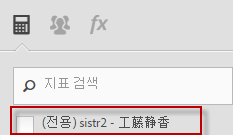

# FAQ

These changes to the way calculated metrics work in [!DNL Analytics] may impact you.

[계산된 지표 빌더에 액세스하려면 어떻게 합니까?](../../components/c-calcmetrics/cm-transition.md#section_D9AE9A0ACF824BACB5D05F0C2F7E9CA1)

[계산된 지표 관리자에 액세스하려면 어떻게 합니까?](../../components/c-calcmetrics/cm-transition.md#section_DD0BD13E9EC940268EBE8BC88241A152)

[같은 이름의 계산된 지표가 왜 이렇게 많이 표시됩니까?](../../components/c-calcmetrics/cm-transition.md#section_E15C5B6CCC58498CAEC3FBDA8988F0A1)

[내 전역 계산된 지표가 어떻게 되었습니까?](../../components/c-calcmetrics/cm-transition.md#section_7351D4C7361F4ABAA1B43F8E89AAD211)

[로그인 회사 간에 공유된 전역 계산된 지표가 어떻게 되었습니까?](../../components/c-calcmetrics/cm-transition.md#section_59E5CD948ED643AE9AD3D2E4277647F8)

[Numeric 또는 Numeric2 분류의 계산된 지표가 어떻게 되었습니까?](../../components/c-calcmetrics/cm-transition.md#section_71AFE6C4A7CD4AA19AB3A9D3C41D115B)

[라이프타임 지표가 어떻게 되었습니까?](../../components/c-calcmetrics/cm-transition.md#section_AEDB02EF24584DAD8731BED9DDCE4F48)

[일별/주별/월별/분기별/연간 고유 방문자 지표를 기반으로 한 계산된 지표에 대해 무엇을 알아야 합니까?](../../components/c-calcmetrics/cm-transition.md#section_E9A77EBB41CE4881B196CC1C282B2DF3)

[이전 보고서 세트 API 메서드로 만들어지거나 관리된 계산된 지표는 어떻게 됩니까?](../../components/c-calcmetrics/cm-transition.md#section_13ED1BAD02634674BDAEB479B060A4B6)

[현재 데이터는 모든 유형의 계산된 지표를 지원합니까?](../../components/c-calcmetrics/cm-transition.md#section_1DAA718BB8DB4413BAF8AD4B4FAAFFA2)

[마이그레이션된 계산된 지표와 함께 "제공된 이름 없음"은 무슨 의미입니까?](../../components/c-calcmetrics/cm-transition.md#section_C90CBB72A67644F38D583301981F8D03)

[사용자가 삭제될 경우 해당 사용자의 계산된 지표는 어떻게 됩니까?](../../components/c-calcmetrics/cm-transition.md#section_42ED4C15830540879C4A161423690E5A)

[다른 보고서 세트에 만들어서 이 세트에 적용할 수 있음에도 불구하고 해당 보고서 세트에 '유효'하지 않은 "알 수 없는" 계산된 지표는 왜 표시됩니까?](../../components/c-calcmetrics/cm-transition.md#section_6772818EFDED46E9B7095D64C3B77211)

[기존의 계산된 지표에 수행된 변경 사항이 왜 저장되지 않았습니까?](../../components/c-calcmetrics/cm-transition.md#section_81CDEFCA1FD542579AF183DA1494EAF0)

[왜 마케팅 채널 보고서에 내 계산된 지표가 표시되지 않습니까?](../../components/c-calcmetrics/cm-transition.md#section_FC350359A775433AB5F43C7CAB304D62)

[왜 일부 계산된 지표는 내가 추가한 괄호가 없는 채로 공식을 표시합니까?](../../components/c-calcmetrics/cm-transition.md#section_AC0D1E9714AD487F9A1C73359F518B5E)

[(Ad Hoc Analysis만 해당) 포함된 세그먼트 정의나 인라인 세그먼트 정의가 있는 계산된 지표가 여전히 지원됩니까?](../../components/c-calcmetrics/cm-transition.md#section_B25C924A282F49388AB604E3D826F44C)

[(Report Builder만 해당) 왜 계산된 지표가 내 요청에서 사라졌습니까?](../../components/c-calcmetrics/cm-transition.md#section_DA4792FE5D7945218CD5E6328DE08E82)

[계산된 지표 합계는 어떻게 작동합니까?](../../components/c-calcmetrics/cm-transition.md#section_57BA3A299C7948ABB82B0392A9B0F33E)

## 계산된 지표 빌더에 액세스하려면 어떻게 합니까? {#section_D9AE9A0ACF824BACB5D05F0C2F7E9CA1}

* 계산된 지표 관리자의 상단에서 **[!UICONTROL + 추가]를 클릭하거나**
* In any Analytics report, click the Metrics icon   to the left of a report to bring up the Metrics rail, then click **[!UICONTROL Add]**.

## 계산된 지표 관리자에 액세스하려면 어떻게 합니까? {#section_DD0BD13E9EC940268EBE8BC88241A152}

* Go to  **[!UICONTROL Analytics]** &gt; **[!UICONTROL Components]** in the left navigation. 그런 다음 **[!UICONTROL 계산된 지표를 클릭합니다]**.

* [!DNL Analytics] 보고서에서 보고서 왼쪽에 있는 지표 아이콘을  클릭하여 지표 레일을 표시한 다음 **[!UICONTROL 관리를 클릭합니다]**.

## 같은 이름의 계산된 지표가 왜 이렇게 많이 표시됩니까? {#section_E15C5B6CCC58498CAEC3FBDA8988F0A1}

(이전에는, 전역 계산된 지표가 특정 관리 사용자에 의해 소유되지 않았고 해당 보고서 세트의 모든 사용자가 볼 수 있었습니다. 이 지표들은 보고서 세트에 의해 구분되었습니다. 한 보고서 세트에 있는 한 지표의 이름이 다른 보고서 세트에 있는 지표의 이름과 같은 경우 사용자가 보고서 세트를 전환하면 이 지표는 사용자에게 동일한 지표로 표시됩니다.)

이제, 지표는 더 이상 보고서 세트로 구별되지 않습니다. 한 보고서 세트에 있는 한 지표의 이름이 다른 보고서 세트에 있는 지표의 이름과 같을 경우 이 지표는 지표 선택기뿐만 아니라 계산된 지표 빌더에도 표시되며, 지표들의 정의가 동일하지 않더라도 중복 지표로 표시될 수 있습니다.

You would see a number of calculated metrics with the same name (but created in different report suites) only if you unchecked the (Only `<report suite>`) checkbox as shown here:

**해야 할 작업**

이름과 정의가 유사한 계산된 지표들의 통합을 고려해 보십시오. 단 통합할 때에는 주의하십시오. 계산된 지표 관리자에서 보고서 세트에 계산된 지표가 있는지 확인하여 원본 보고서 세트를 확인할 수 있습니다. 잠재적인 중복 항목들을 제거할 때 지표 정의도 확인하여 지표들을 올바로 통합하고 있는지 확인해야 합니다.

> [!NOTE] 계산된 지표가 더 이상 특정 보고서 세트에 바인딩되지 않고 로그인 회사에서 볼 수 있는 모든 보고서 세트에서 사용할 수 있지만 계산된 지표를 만들었거나 마지막으로 저장한 보고서 세트는 여전히 계산된 지표 관리자에서 볼 수 있습니다.

> [!NOTE] 계산된 지표가 삭제되더라도 해당 지표를 참조하는 책갈피나 대시보드 보고서는 여전히 작동합니다.

## 내 전역 계산된 지표가 어떻게 되었습니까?{#section_7351D4C7361F4ABAA1B43F8E89AAD211}

(이전에는 관리자가 관리 도구를 통해 보고서 세트에서 계산된 지표("전역 계산된 지표" 또는 "보고서 세트 계산된 지표"로 알려짐)를 만들 수도 있었습니다.

전역 계산된 지표는 이제 로그인 회사의 관리자 사용자 목록의 첫 번째 관리자 사용자가 소유합니다. 이러한 지표는 기본적으로 "모든 사람"과 공유됩니다. 이 패턴은 세그먼트와 동일한 공유 모델 및 마이그레이션 계획들을 따릅니다.

**해야 할 작업**

없습니다. 하지만, 새 관리 소유자는 이러한 계산된 지표를 수정하거나 삭제할 때 주의해야 합니다. 이 지표들은 많은 책갈피 보고서 및 대시보드에서 사용될 수 있습니다.

> [!NOTE] 계산된 지표가 삭제되더라도 해당 지표를 참조하는 책갈피나 대시보드 보고서는 여전히 작동합니다.

## 로그인 회사 간에 공유된 전역 계산된 지표가 어떻게 되었습니까? {#section_59E5CD948ED643AE9AD3D2E4277647F8}

(이전에는 관리자가 관리 도구를 통해 보고서 세트에서 계산된 지표("전역 계산된 지표" 또는 "보고서 세트 계산된 지표"로 알려짐)를 만들 수도 있었습니다. 그런 다음 이 지표들은 보고서 세트를 다중 로그인 회사에 추가하여 로그인 회사 간에 "공유"할 수도 있습니다.)

더 이상 로그인 회사 간에는 전역 계산된 지표를 공유할 수 없습니다. 이 지표들은 더 이상 특정 보고서 세트에 제한되거나 연결되어 있지 않으며, 대신 특정 로그인 회사에 연결되어 있습니다. 로그인 회사 간에 공유된 계산된 지표는

* 가 해당 보고서 세트에 대한 액세스 권한이 있는 모든 로그인 회사로 마이그레이션되었습니다.
* 기본값은 "모든 사람과 공유됨" 입니다.
* 모든 다른 로그인 회사로부터 독립적인 복사본이 됩니다.

>[!NOTE]
>
>계산된 지표가 책갈피, 대시보드, 경고 또는 예약된 보고서에서 사용된 경우 새 사본을 편집해도 이전의 지속적인 계산된 지표에는 영향을 주지 않습니다.

## Numeric 또는 Numeric2 분류의 계산된 지표가 어떻게 되었습니까?{#section_71AFE6C4A7CD4AA19AB3A9D3C41D115B}

(Previously, calculated metrics with a Numeric or Numeric2 classification were only visible in [!UICONTROL Reports &amp; Analytics], [!UICONTROL Report Builder], and the APIs.)

Now, calculated metrics with a Numeric or Numeric2 classification will continue to be visible in [!UICONTROL Reports &amp; Analytics], [!UICONTROL Report Builder], and the APIs. 하지만, 세그먼트가 적용된 모든 보고서에서 지원되지 않습니다.

In addition, calculated metrics with a Numeric or Numeric2 classification will not be supported in the following components: [!UICONTROL Ad Hoc Analysis], [!UICONTROL Analysis Workspace], [!UICONTROL Real-Time] reports, [!UICONTROL Anomaly Detection], and [!UICONTROL Contribution Analysis]. Numeric 또는 Numeric2 분류를 사용하는 계산된 지표를 만들거나 편집할 때에는 계산된 지표가 특정 제품 영역과 호환하지 않는다는 호환성 경고가 표시됩니다.

**해야 할 작업**

지표가 세그먼트나 호환하지 않는 구성 요소에 사용할 목적이었다면 Numeric1 또는 Numeric2 분류를 사용하는 계산된 지표를 만드는 것을 피하십시오.

## 라이프타임 지표가 어떻게 되었습니까?{#section_AEDB02EF24584DAD8731BED9DDCE4F48}

Life-Time metrics (a.k.a. all-time metrics) are no longer supported and no longer visible in the [!UICONTROL Reports &amp; Analytics] UI or any other UI. 이 지표는 보고서 API로 쿼리할 수 없습니다.

전체 기간 지표가 들어 있었던 책갈피, 대시보드, 예약된 보고서 또는 경고는 적어도 하나의 다른 올바른 지표가 보고서에도 있는 한 해당 지표 없이도 계속 실행됩니다. 책갈피, 대시보드, 예약된 보고서 또는 경고에 있던 유일한 지표가 전체 기간 지표일 경우 보고서는 더 이상 실행되지 않습니다.

## 일별/주별/월별/분기별/연간 고유 방문자 지표를 기반으로 한 계산된 지표에 대해 무엇을 알아야 합니까?{#section_E9A77EBB41CE4881B196CC1C282B2DF3}

Calculated metrics based on Unique Visitor metrics will be visible in the following [!DNL Analytics] components: [!UICONTROL Reports &amp; Analytics], [!UICONTROL Report Builder], and Reporting API.

However, these metrics will not be supported in the following components: [!UICONTROL Segments], [!UICONTROL Analysis Workspace], [!UICONTROL Real-Time] reports, [!UICONTROL Anomaly Detection], and [!UICONTROL Contribution Analysis]. 고유 방문자 수 지표를 기반으로 하는 계산된 지표를 만들거나 편집할 때 이 지표가 특정 제품 영역과 호환하지 않는다는 호환성 경고가 표시됩니다.

세그먼트가 있는 보고서에서는 기본 고유 방문자 수 지표를 사용합니다. 고유 방문자 수 지표를 기반으로 하는 계산된 지표를 만들 수는 있지만, 이러한 계산된 지표는 세그먼트가 있는 보고서에 적용할 수 없거나 해당 계산된 지표에 세그먼트를 포함할 수 없습니다.

## 이전 보고서 세트 API 메서드로 만들어지거나 관리된 계산된 지표는 어떻게 됩니까? {#section_13ED1BAD02634674BDAEB479B060A4B6}

이전에는, (1.3 또는 1.4) API 메서드 ReportSuite.SaveCalculatedMetrics로 계산된 지표를 저장하는 것은 관리 콘솔에서 계산된 지표를 만들거나 업데이트하는 것과 같았습니다. ReportSuite.DeleteCalculatedMetrics도 마찬가지였습니다. 또한, 관리 콘솔에 표시되었거나 ReportSuite.GetCalculatedMetrics를 호출할 때의 계산된 지표 목록은 같았습니다.

이제 Reportsuite calculatedmetrics API 메서드 (1.3 또는 1.4) 는 이전 스토어를 사용하여 계산된 지표를 저장, 삭제 및 검색합니다. 기존의 계산된 지표는 새로운 계산된 지표 빌더를 통해 마이그레이션되며 이 빌더에서 볼 수 있게 됩니다. **API 메서드에서 만들어진 새 계산된 지표는 API에서만 볼 수 있게 됩니다. 이 지표는 여전히 보고 API에서 사용할 수 있습니다.**

**해야 할 작업**

API와 계산된 지표 빌더를 모두 사용해야 할 경우에는 ReportSuite CalculatedMetrics API 메서드의 사용을 중단하고 대신 새로운 CalculatedMetrics API 메서드(Get, Save, Delete 및 GetFunctions)를 사용해야 합니다.

## 현재 데이터는 모든 유형의 계산된 지표를 지원합니까? {#section_1DAA718BB8DB4413BAF8AD4B4FAAFFA2}

현재 데이터는 세그먼트나 통계 함수가 들어 있는 계산된 지표를 지원하지 않습니다. 지원되는 함수들은 덧셈, 뺄셈, 곱셈, 나눗셈 및 부정(-x)과 같은 기본 수학 함수뿐입니다.

## 마이그레이션된 계산된 지표와 함께 "제공된 이름 없음"은 무슨 의미입니까? {#section_C90CBB72A67644F38D583301981F8D03}

"제공된 이름 없음"은 이 마이그레이션된 지표와 연결된 지표 이름이 없음을 의미합니다(수사적 이름이 없는 공식).

## 사용자가 삭제될 경우 해당 사용자의 계산된 지표는 어떻게 됩니까? {#section_42ED4C15830540879C4A161423690E5A}

사용자가 만든 모든 계산된 지표도 삭제됩니다. 하지만, 삭제된 계산된 지표는 여전히 저장된 책갈피, 대시보드 또는 예약된 보고서의 일부로서 작동하게 됩니다.

## 다른 보고서 세트에 만들어서 이 세트에 적용할 수 있음에도 불구하고 해당 보고서 세트에 '유효'하지 않은 "알 수 없는" 계산된 지표는 왜 표시됩니까? {#section_6772818EFDED46E9B7095D64C3B77211}

계산된 지표에 선택한 보고서 세트에 대해 존재하지 않는 기본 지표나 차원이 들어 있는 경우 사용자 인터페이스에 "알 수 없음"이 표시됩니다.

## 기존의 계산된 지표에 수행된 변경 사항이 왜 저장되지 않았습니까? {#section_81CDEFCA1FD542579AF183DA1494EAF0}

이것은 2015년 6월 15일과 18일 사이에 수행되는 새 계산된 지표 데이터베이스로의 마이그레이션 타이밍 때문일 수 있습니다.

**해야 할 작업**

기존 지표에 수행한 변경 사항을 다시 수행해야 할 것입니다.

## 왜 마케팅 채널 보고서에 내 계산된 지표가 표시되지 않습니까? {#section_FC350359A775433AB5F43C7CAB304D62}

(이전에는, 모든 계산된 지표가 첫 번째 터치 및 마지막 터치 옵션이 있는 마케팅 채널 보고서의 지표 선택기에 나열되었습니다.)

이제는, 계산된 지표 빌더에서 첫 번째 터치 또는 마지막 터치로 특별히 설정된 할당 유형이 있는 이러한 계산된 지표만 마케팅 채널 보고서의 지표 선택기에서 사용할 수 있게 됩니다. 이미 마케팅 채널 보고서에 적용된 모든 계산된 지표는 전과 같이 계속 적용되고 작동합니다. 마케팅 채널을 위한 계산된 지표를 만들려면, 지표 빌더에서 구성 아이콘을 클릭하고 할당 유형으로서 첫 번째 터치나 마지막 터치를 선택하십시오. 이렇게 하면 마케팅 채널 보고서와만 호환하는 계산된 지표가 만들어지고 다른 보고서에서는 이 지표를 사용할 수 없다는 것을 잊지 마십시오.

## 왜 일부 계산된 지표는 내가 추가한 괄호가 없는 채로 공식을 표시합니까? {#section_AC0D1E9714AD487F9A1C73359F518B5E}

마이그레이션 동안 Adobe에서는 일부 공식의 불필요한 괄호들을 제거했습니다. 지표가 계산되는 방식에 영향을 주지 않는 괄호들만 제거했습니다. 이렇게 해도 데이터는 변경되지 않고, 공식만 간단해집니다.

## (Ad Hoc Analysis만 해당) 포함된 세그먼트 정의나 인라인 세그먼트 정의가 있는 계산된 지표가 여전히 지원됩니까? {#section_B25C924A282F49388AB604E3D826F44C}

Ad Hoc Analysis에서 만든 계산된 지표는 이전부터 인라인 세그먼트 정의를 포함할 수 있었습니다. 이것은 더 이상 불가능합니다.

**해야 할 작업**

세그먼트를 명시적으로 저장해야 합니다. 인라인 세그먼트 정의가 있는 기존의 계산된 지표는 계속하여 올바른 실행되며 Ad Hoc Analysis에서 볼 수 있지만, 세그먼트를 명시적으로 저장하지 않고는 저장할 수 없습니다.

## (Report Builder만 해당) 왜 계산된 지표가 내 요청에서 사라졌습니까? {#section_DA4792FE5D7945218CD5E6328DE08E82}

요청이 v 5.2에서 만들어졌고 계산된 지표가 들어 있는 경우 해당 지표가 v 5.1 (또는 이전 버전) 에 표시되지 않습니다. 이제 계산된 지표에서는 전역 ID(보고서 세트별 ID가 아님)를 사용하기 때문입니다.

**해야 할 작업**

이러한 지표들을 볼 수 있으려면 v5.2로 업그레이드해야 합니다.

## 계산된 지표 합계는 어떻게 작동합니까? {#section_57BA3A299C7948ABB82B0392A9B0F33E}

[!UICONTROL 보고 및 분석에서] 보고 및 분석에서 계산된 지표를 합계하면 공식이 합계에 적용됩니다. 예를 들어 계산된 지표 주문/방문 횟수에 대한 합계는 총 주문 수를 가져와서 총 방문 횟수로 나눕니다. 하지만 계산된 지표 합계가 라인 항목의 합계가 아니라 사이트의 합계인 경우도 있습니다.

예 1: 검색어에 대한 방문자 수: 같은 방문자가 여러 용어를 검색했을 수 있으므로 이 경우 총 방문자 수는 라인 항목의 합계와 같지 않습니다.

예 2: 제품 페이지 보기 횟수: 장바구니에는 여러 개의 제품이 있을 수 있으며, 따라서 장바구니에 대한 페이지 보기는 여러 개가 있습니다. 라인 항목 합계와 보고서 합계 비교에 대한 자세한 내용은 [이 기술 자료 문서](https://helpx.adobe.com/analytics/kb/sum-line-items-different-from-total.html)를 참조하십시오.
