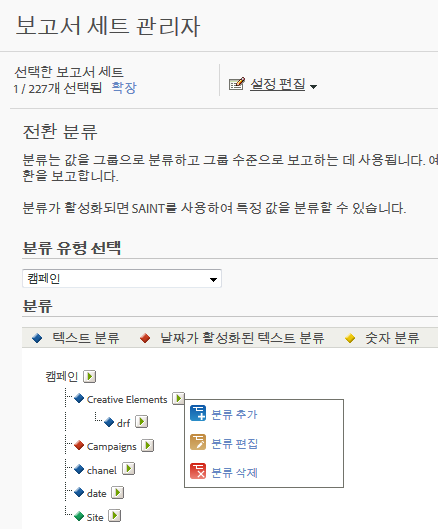

# 분류 정보

분류는 Analytics 변수 데이터를 분류한 다음 보고서를 생성할 때 다른 방법으로 데이터를 표시하는 방법입니다.

[분석 분류](https://video.tv.adobe.com/v/16853/?captions=kor)의 비디오 개요

**[!UICONTROL 관리]** &gt; **[!UICONTROL 보고서 세트]** &gt; **[!UICONTROL 설정 편집]** &gt; *`<Traffic or Conversion>`*

분류 시 변수 및 해당 변수와 관련된 메타데이터 간의 관계를 설정하려고 합니다. 분류는 캠페인에서 가장 흔하게 사용됩니다. 변수(eVars, prop 및 이벤트) 정보를 사용하여 수집된 데이터는 변수에서 수집된 값에 메타데이터를 적용하여 롤업할 수 있습니다.

한 번 분류하면, 키 변수를 사용하여 생성할 수 있는 모든 보고서를 연관된 특성을 사용하여 생성할 수 있습니다. 예를 들어 제품 이름, 색상, 크기, 설명 및 SKU와 같은 추가 제품 특성을 사용하여 [!UICONTROL 제품 ID]를 분류할 수 있습니다. 추가 특성을 사용하여 Reports &amp; Analytics 데이터를 늘리면 보다 심도 있고 복잡한 보고 기회를 제공할 수 있습니다.

>[!IMPORTANT]
>
>숫자 2와 활성화된 날짜 분류를 가져오는 기능이 코드 베이스에서 제거되었습니다. 이 변경 사항은 2019년 6월 유지 관리 릴리스에 적용됩니다. 가져온 파일에 숫자 또는 활성화된 날짜 열이 있는 경우 해당 셀은 자동으로 무시되며, 해당 파일의 다른 모든 데이터는 정상적으로 가져와집니다. 기존 분류는 여전히 표준 분류 워크플로우를 통해 내보낼 수 있으며, 보고에서 계속 사용할 수 있습니다.

>[!NOTE]
>
>2018 년 5 월 10 일 Analytics 유지 관리 릴리스에서는 Adobe가 날짜 지원 및 숫자 분류의 기능을 제한하기 시작했습니다. 이러한 분류 유형은 관리 및 분류 가져오기 인터페이스에서 제거되었습니다. 날짜 사용 및 숫자 분류를 새로 추가할 수 없습니다. 기존 분류는 여전히 표준 분류 워크플로우를 통해 관리(업로드, 삭제)할 수 있으며 보고에서 계속 사용할 수 있습니다.

분류를 만든 후 Adobe Analytics 전체에서 새 데이터 특성을 활용할 수 있습니다.

**추적 코드 예제**

단지 추적 코드별로 캠페인을 보는 것이 아니라 검색 엔진, 키워드, 캠페인 채널별로 캠페인 결과를 보기를 원한다고 가정해 보겠습니다. 각각에 대한 전환 변수에 집중하는 것이 아니라 3가지 캠페인 변수 분류를 만들어 검색 엔진, 키워드, 캠페인 채널을 나타낼 수 있습니다. 이 전략을 사용하면 추가 태그를 지정하지 않아도 4가지 모든 변수를 기준으로 사이트 성공 이벤트를 볼 수 있습니다.

Reports &amp; Analytics에는 추적 코드 변수를 위해 사전 정의된 분류가 포함되어 있으며, 크리에이티브 요소 및 캠페인이라고 하는 분류 기반 보고서를 제공합니다. 다른 모든 전환 및 트래픽 변수에 대한 분류를 수동으로 구성해야 합니다.

[트래픽 분류](/help/admin/admin/c-traffic-variables/traffic-classifications.md) 및 [전환 분류](https://marketing.adobe.com/resources/help/en_US/reference/index.html?f=conversion_classifications)를 참조하십시오.

다음 표는 사용 가능한 분류의 다양한 유형과 각 분류를 지원하는 변수 유형을 나타냅니다. 데이터 파일을 업로드하기 전에 [일반 파일 구조를](../../components/c-classifications2/c-classifications-importer/c-saint-data-files.md#concept_9EFF968DF5D244A887DE94075431C1BE) 참조하십시오.

<table id="table_279728C28D9C40EE832ACC9F211B5F17"> 
 <thead> 
  <tr> 
   <th colname="col1" class="entry"> 
유형 
 </th> 
   <th colname="col2" class="entry"> 
가용성 
 </th> 
   <th colname="col3" class="entry"> 
설명 
 </th> 
  </tr> 
 </thead>
 <tbody> 
  <tr> 
   <td colname="col1"> 
  텍스트 
 </td> 
   <td colname="col2"> 
전환 및 트래픽 변수 
 </td> 
   <td colname="col3"> 
텍스트 분류는 범주를 정의하여 보고를 위한 변수 데이터를 그룹화합니다. 
 
예를 들어 셔츠를 판매할 경우 셔츠 판매를 색상, 크기 및 스타일별로 분류하면, 해당 범주별로 구성된 셔츠 판매를 확인할 수 있는 보고서를 생성할 수 있습니다. 
 </td> 
  </tr> 
  <tr> 
   <td colname="col1"> 
  활성화된 날짜 텍스트 
 
참고: 2018 년 5 월 10 일 Analytics 유지 관리 릴리스에서는 Adobe가 날짜 지원 분류의 기능을 제한하기 시작했습니다. 이러한 분류 유형은 관리 및 분류 가져오기 인터페이스에서 제거되었습니다. 새 날짜 지원 분류를 추가할 수 없습니다. 기존 분류는 여전히 표준 분류 워크플로우를 통해 관리(업로드, 삭제)할 수 있으며 보고에서 계속 사용할 수 있습니다. 
 </td> 
   <td colname="col2"> 
전환 변수 
 </td> 
   <td colname="col3"> 
활성화된 날짜 텍스트 분류를 사용하면 날짜 범위를 텍스트 분류에 할당할 수 있습니다. 이것은 일반적으로 캠페인 분류에 사용되기 때문에 캠페인 보고서에서 간트 차트 보기를 이용할 수 있습니다. 
 
분류 데이터를 채우는 데이터 파일의 실제 캠페인 날짜를 포함할 수 있습니다. 
 
보고 및 분석은 캠페인 종료 날짜가 이미 경과한 경우에도 캠페인 추적 코드를 수집하지만 캠페인의 종료 날짜 이후에 수집된 캠페인 데이터는 캠페인과 관련이 없습니다. 
 </td> 
  </tr> 
  <tr> 
   <td colname="col1"> 
  숫자 
참고: 2018 년 5 월 10 일 Analytics 유지 관리 릴리스에서는 Adobe가 숫자 분류의 기능을 제한하기 시작했습니다. 이러한 분류 유형은 관리 및 분류 가져오기 인터페이스에서 제거되었습니다. 새 숫자 분류를 추가할 수 없습니다. 기존 분류는 여전히 표준 분류 워크플로우를 통해 관리(업로드, 삭제)할 수 있으며 보고에서 계속 사용할 수 있습니다. 
 
 </td> 
   <td colname="col2"> 
전환 변수 
 </td> 
   <td colname="col3"> 
숫자 분류를 사용하면 고정된 숫자 값을 전환 보고서에 적용할 수 있습니다. 이러한 분류는 보고서에 지표로 나타납니다. 
 
숫자 분류를 추가할지 여부를 결정하는 경우 숫자 값이 고정되어 있고 시간이 지나도 변경되지 않아야 합니다. 
 </td> 
  </tr> 
 </tbody> 
</table>

