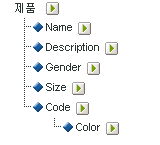

# 하위 분류 정보

Adobe Analytics는 단일 수준 및 다중 수준 분류 모델을 모두 지원합니다. 분류 계층을 사용하면 분류에 분류를 적용할 수 있습니다.

>[!NOTE]
>
>하위 분류는 분류의 분류를 만드는 기능을 나타냅니다. 하지만 [!UICONTROL 계층] 보고서를 만들 때 사용하는 [!UICONTROL 분류 계층]과 같지는 않습니다. For more information about Classification hierarchies, see [Classification Hierarchies](classification-hierarchies.md).

<!-- 

Removed sub-classifications in rule builder. Preserve subclass files in project for future reference. 

 -->

<!-- 

c_single-level_classifications.xml

 -->

예:

이 모델의 각 분류는 독립적이며 선택된 보고 변수에 대한 새로운 하위 보고서에 해당합니다. 또한 각 분류는 데이터 파일에서 분류 이름이 열 제목인 하나의 데이터 열을 구성합니다. 예:

| 키 | 속성 1 | 속성 2 |
|---|---|---|
| 123 | ABC | A12B |
| 456 | DEF | C3D4 |

 데이터 파일에 대한 자세한 내용은 [분류 데이터 파일](../../components/c-classifications2/c-classifications-importer/c-saint-data-files.md#concept_EBA7669C546040BE8162ADACA3548735).

<!-- 

c_multiple-level_classifications.xml

 -->

복수 수준 분류는 상위 및 하위 분류로 구성되어 있습니다. 예:

**상위 분류:**&#x200B;상위 분류는 하위 분류와 연관된 모든 분류입니다. 분류는 상위 및 하위 분류 모두가 될 수 있습니다. 최상위 수준의 상위 분류는 단일 수준 분류에 해당합니다 [단일 수준 분류](../../components/c-classifications2/c-sub-classifications.md#concept_6B909B54221F4A9BAEA8E30594F06C49)).

**하위 분류:**&#x200B;하위 분류는 변수 대신 상위로 다른 분류를 가지는 모든 분류입니다. 하위 분류는 상위 분류에 대한 추가 정보를 제공합니다. 예를 들어 [!UICONTROL 캠페인] 분류는 캠페인 소유자 하위 분류를 가질 수 있습니다. 또한 [!UICONTROL 숫자] 분류는 분류 보고서에서 지표로 기능합니다.

상위 또는 하위의 각 분류는 데이터 파일에서 하나의 데이터 열을 구성합니다. 하위 분류의 열 제목은 다음 명명 규칙을 사용합니다.

`<parent_name>^<child_name>`

For more information about the data file format, see [Classification Data Files](../../components/c-classifications2/c-classifications-importer/c-saint-data-files.md#concept_EBA7669C546040BE8162ADACA3548735).

예:

| 키 | 속성 1 | 속성 1 &amp; amp; hat; 속성 1-1 | 속성 1 &amp; amp; hat; 속성 1-2 | 속성 2 |
|---|---|---|---|---|
| 123 | ABC | 녹색 | 작음 | A12B |
| 456 | DEF | 빨간색 | 큼 | C3D4 |

복수 수준 분류의 파일 템플릿이 보다 복잡하지만 복수 수준 분류는 개별 수준을 개별 파일로 업로드할 수 있다는 장점이 있습니다. 이 방법을 사용하면 시간이 지남에 따라 변경되는 분류 수준과 변경되지 않는 분류 수준으로 데이터를 그룹화함으로써 주기적으로(일일, 주별 등) 업로드해야 하는 데이터의 양을 최대한 줄일 수 있습니다.

>[!NOTE]
>
>If the [!UICONTROL Key] column in a data file is blank, Adobe automatically generates unique keys for each data row.  데이터 파일을 두 번째 수준 또는 두 번째 수준 이상의 분류 파일로 업로드할 때 파일이 손상되지 않게 하려면 [!UICONTROL 키] 열의 각 행을 별표(*)로 채웁니다.

문제 해결 도움말은 [일반적인 분류 업로드 문제](https://marketing.adobe.com/resources/help/en_US/home/index.html#kb-common-saint-upload-issues)를 참조하십시오.

<!-- 

c_classifications_example.xml

 -->

>[!NOTE]
제품 분류 데이터는 제품과 직접적으로 관련된 데이터 특성으로 제한됩니다. 이 데이터는 웹 사이트에서 제품이 분류되거나 판매되는 방식의 제한을 받지 않습니다. 판매 카테고리, 사이트 검색 노드 또는 판매 항목과 같은 데이터 요소는 제품 분류 데이터가 아닙니다. 그 대신, 이러한 요소는 보고서 전환 변수로 캡처됩니다.

이 제품 분류에 대한 데이터 파일을 업로드할 때 분류 데이터를 단일 또는 여러 파일로 업로드할 수 있습니다(아래 참조). 파일 1의 색상 코드와 파일 2의 색상 이름을 구분함으로써 새로운 색상 코드가 만들어질 때 색상 이름 데이터(몇 개의 행만일 수 있음)만 업데이트하면 됩니다. 이렇게 하면 색상 이름 (코드 및 amp,hat; 색상) 필드를 자주 업데이트하면 파일 1 이 생성되고 데이터 파일을 생성할 때 파일 크기와 복잡도가 줄어듭니다.

## 제품 분류 - 단일 파일 {#section_E8C5E031869C449F9B636F5EB3BFEC17}

| 키 | 제품 이름 | 제품 세부 사항 | 성별 | 크기 | 코드 | 코드 및 amp; hat; color |
|---|---|---|---|---|---|---|
| 410390013 | 폴로-SS | 남성용 폴로 셔츠, 반팔(M,01) | M | M | 01 | 스톤색 |
| 410390014 | 폴로-SS | 남성용 폴로 셔츠, 반팔(L,03) | M | L | 03 | 자주색 |
| 410390015 | 폴로-LS | 여성용 폴로 셔츠, 긴팔(S,23) | F | S | 23 | 아쿠아색 |

## 제품 분류 - 다중 파일(파일 1) {#section_A99F7D0F145540069BA4EEC0597FF13F}

| 키 | 제품 이름 | 제품 세부 사항 | 성별 | 크기 | 코드 |
|---|---|---|---|---|---|
| 410390013 | 폴로-SS | 남성용 폴로 셔츠, 반팔(M,01) | M | M | 01 |
| 410390014 | 폴로-SS | 남성용 폴로 셔츠, 반팔(L,03) | M | L | 03 |
| 410390015 | 폴로-LS | 여성용 폴로 셔츠, 긴팔(S,23) | F | S | 23 |

## 제품 분류 - 다중 파일(파일 2) {#section_19ED95C33B174A9687E81714568D56A3}

| 키 | 코드 | 코드 및 amp; hat; color |
|---|---|---|
| * | 01 | 스톤색 |
| * | 03 | 자주색 |
| * | 23 | 아쿠아색 |
