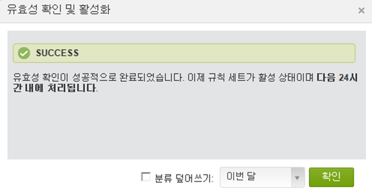
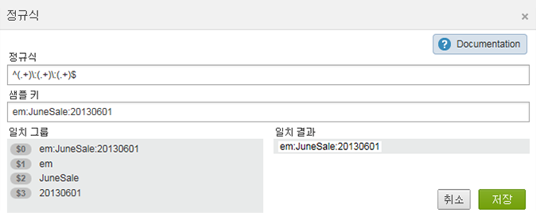
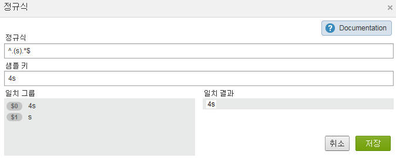
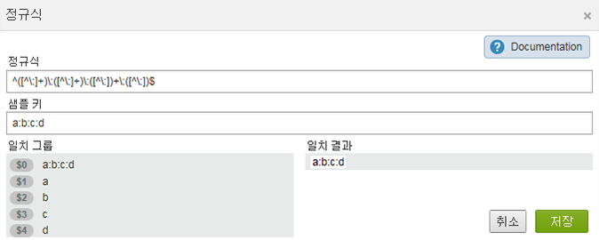
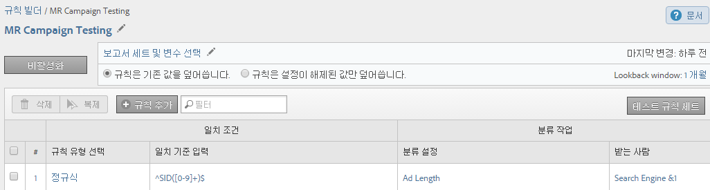
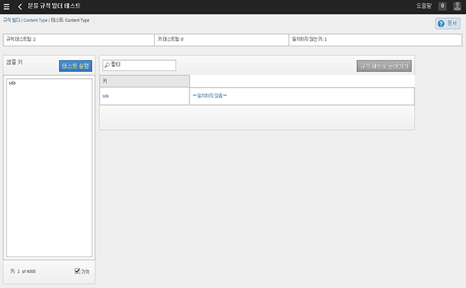

# 분류 규칙

분류 규칙은 분류되지 않은 용어를 정기적으로 찾습니다. 규칙 일치가 발견되면 이 규칙이 해당 용어를 분류 데이터 표에 자동으로 추가합니다. 분류 규칙을 사용하여 기존의 키를 덮어쓸 수도 있습니다.

## 분류 규칙 {#concept_CF2F64BD96454FBFAA84638FC7DEA263}

분류 규칙은 분류되지 않은 용어를 정기적으로 찾습니다. 규칙 일치가 발견되면 이 규칙이 해당 용어를 분류 데이터 표에 자동으로 추가합니다. 분류 규칙을 사용하여 기존의 키를 덮어쓸 수도 있습니다.

**[!UICONTROL Analytics]** &gt; **[!UICONTROL 관리]** &gt; **[!UICONTROL 분류 규칙 빌더]**

규칙 빌더를 사용하면 목록 *`classification rule set`*&#x200B;목록을 만들 수 *`classification rules`*&#x200B;있습니다. 규칙이 지정한 기준에 일치시킨 다음 작업을 수행합니다.

분류 규칙은 다음과 같은 경우에 편리합니다.

* **이메일** 및 **디스플레이 광고**: 이메일 캠페인과 비교하여 디스플레이 캠페인의 실적을 확인할 수 있도록 분류 규칙을 만들어 개별 디스플레이 광고 캠페인을 그룹화합니다.

* **추적 코드**: 분류 규칙을 만들어 추적 코드의 문자열에서 파생된 키 값을 카테고리별로 분류하고 정의한 특정 기준에 일치시킵니다.
* **검색어**:  [정규 표현식](../../../components/c-classifications2/crb/classification-quickstart-rules.md#concept_8A63F9BCF9484963962E14E6286D312D) 및 와일드카드를 사용하여 검색어 분류를 단순화합니다. 예를 들어 검색어에 *`baseball`*&#x200B;분류가 포함된 경우 *`Sports League`* 분류를 로 설정할 수 *`MLB`*&#x200B;있습니다.

예를 들어 이메일 캠페인 ID에 대한 추적 코드가 다음과 같다고 가정해봅시다.

`em:Summer:2013:Sale`를 참조하십시오.

1개 규칙 세트에 문자열의 각 부분을 식별하는 3개의 규칙을 설정한 후 값을 분류할 수 있습니다.

| 규칙 유형 선택 | 일치 기준 입력 | 분류 설정 | 대상 |
|---|---|---|---|
| 다음으로 시작 | em: | 채널 | 이메일 |
| 종료 문자 | 판매 | 유형 | 판매 |
| 포함 | 2013 | 년 | 2013 |

## 규칙 처리 방법{#concept_A67A23F523844D37898583C632DB9D25}의 정보를 숙지하십시오 

분류 규칙 처리 방법에 관한 중요 정보입니다.

<!-- 

about_classification_rules.xml

 -->

* [규칙에 관한 중요한 정보](/help/components/c-classifications2/crb/classification-rule-builder.md)
* [규칙이 키를 분류하지 않는 경우](/help/components/c-classifications2/crb/classification-rule-builder.md)
* [규칙 우선 순위 정보](../../../components/c-classifications2/crb/classification-quickstart-rules.md#concept_93527FEB3C9B48FB96FB7DF857E5F980)

>[!NOTE]
>
>The [!UICONTROL Rule Builder] does not support Numeric 2 classifications.

## 규칙에 관한 중요한 정보 {#section_0BD46702FBEC4D98A4DD2EA0BD428046}

* Specify [group permissions](https://marketing.adobe.com/resources/help/en_US/reference/groups.html) for classifications in [!UICONTROL Admin Tools].

* **정규 표현식**:도움말은 분류 규칙의 [정규 표현식에서 사용할 수 있습니다](../../../components/c-classifications2/crb/classification-quickstart-rules.md#concept_8A63F9BCF9484963962E14E6286D312D).

* **보고서 세트**: 최소 1개의 보고서 세트를 선택할 때까지 분류를 선택할 수 없습니다. 규칙 세트를 만들고 변수를 할당할 때까지 보고서 세트를 적용할 수 없습니다.

   규칙 세트를 테스트할 때 보고서의 키(분류되는 변수)를 사용하여 이러한 보고서 키가 규칙 세트에 의해 어떤 영향을 받는지 확인하십시오. (The [키](../../../components/c-classifications2/c-classifications-importer/c-saint-data-files.md#concept_0B77B3079B5C414F9956058688990443)는 분류되는 변수이거나 분류 업로드 테이블에 있는 첫 번째 열입니다.

* **규칙 우선 순위**: 어떤 하나의 키가 ([!UICONTROL 분류 설정]에서) 동일한 분류를 설정하는 여러 규칙과 일치하는 경우 해당 분류와 일치하는 마지막 규칙이 사용됩니다. See [규칙 우선 순위 정보](../../../components/c-classifications2/crb/classification-quickstart-rules.md#concept_93527FEB3C9B48FB96FB7DF857E5F980).

* **규칙 수의 제한**: 만들 수 있는 규칙 수에 대한 제한 설정은 없습니다. 그러나 규칙 수가 너무 많으면 브라우저의 성능에 영향을 줄 수 있습니다.
* **처리**: 규칙은 분류 관련 트래픽 볼륨에 따라 빈번하게 처리됩니다.

   활성 규칙은 4시간마다 처리되며, 일반적으로 한 달 이전의 분류 데이터를 조사합니다. 이 규칙은 자동으로 새로운 값을 확인하고 가져오기를 사용하여 분류를 업로드합니다.

* **기존 분류 덮어쓰기**: [규칙이 키를 분류하지 않는 경우를 참조하십시오.](../../../components/c-classifications2/crb/classification-quickstart-rules.md#section_4481E88CA28246B6B19EA16E2D83A3A8) 필요한 경우 가져오기를 사용하여 기존 분류를 삭제하거나 제거할 수 있습니다.

## 규칙이 키를 분류하지 않는 경우{#section_4481E88CA28246B6B19EA16E2D83A3A8}

규칙을 활성화하면 기존 분류를 덮어쓸 수 있습니다. 다음과 같은 경우에는 분류 규칙이 [키](../../../components/c-classifications2/c-classifications-importer/c-saint-data-files.md#concept_0B77B3079B5C414F9956058688990443)(변수)를 분류하지 않습니다.

* 키가 이미 분류되었고 [분류 덮어쓰기](../../../components/c-classifications2/crb/classification-rule-definitions.md#overwrite_classifications)를 선택하지 않습니다.

   분류 덮어쓰기 [](../../../components/c-classifications2/crb/classification-quickstart-rules.md#task_86F216DFD2534FA181E64ABDF306782B)규칙을 추가 및 활성화할 때, 그리고 Data Connectors 통합을 활성화할 때 분류를 덮어쓸 수 있습니다. (Data Connectors에 대한 규칙은 개발 센터에서 파트너에 의해 만들어져서 [!UICONTROL 분류 규칙 빌더]에 표시됩니다.)

* [분류 덮어쓰기](../../../components/c-classifications2/crb/classification-rule-definitions.md#overwrite_classifications)를 활성화한 후에도 키를 덮어쓸 때 지정된 기간 이후 데이터에는 분류된 키가 표시되지 않았습니다.
* 약 한 달 전에 시작된 기간 이후에는 키가 분류되지 않고 [!DNL Adobe Analytics]로 절대 전달되지 않습니다.

   >[!NOTE]
   >
   >보고서에서 분류는 키가 있을 때마다 지정된 모든 시간대에 적용됩니다. 보고서 날짜 범위는 보고에 영향을 주지 않습니다.



## 분류 규칙의 정규 표현식{#concept_8A63F9BCF9484963962E14E6286D312D}에서 볼 수 있습니다 

정규 표현식을 사용하여 일관된 서식의 문자열 값과 분류를 일치시킵니다. 예를 들면 추적 코드의 특정 문자로부터 분류를 만들 수 있습니다. 특정 문자, 단어 또는 문자 패턴을 일치시킬 수 있습니다.

<!-- 

regex_classification_rules.xml

 -->

* [정규 표현식 - 추적 코드 예](../../../components/c-classifications2/crb/classification-quickstart-rules.md#section_2EF7951398EB4C2F8E52CEFAB4032669)
* [정규 표현식 - 특정 문자 분류](../../../components/c-classifications2/crb/classification-quickstart-rules.md#section_5D300C03FA484BADACBFCA983E738ACF)
* [정규 표현식 - 다양한 길이의 추적 코드 일치](../../../components/c-classifications2/crb/classification-quickstart-rules.md#section_E86F5BF5C2F44ABC8FFCE3EA67EE3BB2)
* [정규 표현식 - "포함되지 않음" 예](../../../components/c-classifications2/crb/classification-quickstart-rules.md#section_FCA88A612A4E4B099458E3EF7B60B59C)
* [정규 표현식 - 참조 테이블](../../../components/c-classifications2/crb/classification-quickstart-rules.md#section_0211DCB1760042099CCD3ED7A665D716)

>[!NOTE]
>
>우수 사례로, 정규 표현식은 구분 기호를 사용하는 추적 코드에 가장 적합합니다.

## 정규 표현식 - 추적 코드 예 {#section_2EF7951398EB4C2F8E52CEFAB4032669}

>[!NOTE]
>
>If the tracking code is URL encoded, it will **not** be classified by the Rules Builder.

이 예에서 다음 캠페인 ID를 분류하려고 한다고 가정해봅시다.

[!UICONTROL Sample Key]: `em:JuneSale:20130601`

분류할 추적 코드의 각 부분은 다음과 같습니다.

* `em` = email
* `JuneSale` = 캠페인 이름
* `20130601` = 날짜

[!UICONTROL Regular Expression]: `^(.+)\:(.+)\:(.+)$`

정규 표현식과 캠페인 ID의 상관 관계:


[!UICONTROL 일치 그룹]: 캠페인 ID에서 위치를 분류할 수 있도록 정규 표현식이 캠페인 ID 문자에 대응하는 방식을 표시합니다.



This example tells the rule that the campaign date `20140601` is at the third group `(.+)`, identified by `$3`.

**[!UICONTROL 규칙 빌더]**

[!UICONTROL 규칙 빌더]에서 규칙을 다음과 같이 구성하십시오.

| 규칙 유형 선택 | 일치 기준 입력 | 분류 설정 | 종료 |
|---|---|---|---|
| 정규 표현식 | &amp;Hat;(.+)\:(.+)\:(.+)$ | 캠페인 날짜 | $3 |

**구문**

| 정규 표현식 | 문자열 또는 일치 결과 | 해당 일치 그룹 |
|--- |--- |--- |
| `^(.+)\:(.+)\:(.+)$` | em:JuneSale:20130601 | `$0`:em:JuneSale:20130601 `$1`:em `$2`:6월 판매 `$3`:20130601년 |
| 구문 작성 중 | `^` = 행() = 그룹 문자를 시작하고 괄호 안의 일치하는 문자를 추출할 수 있습니다.  `(.+)` = captures one ( . ) 문자 및 ( + ) 더 이상 \ = 문자열의 시작.  `$` = 이전 문자(또는 문자 그룹)가 라인의 마지막 부분임을 의미합니다. |

정규 표현식의 문자가 무엇을 의미하는지에 대한 자세한 내용은 [정규 표현식 - 참조 테이블](../../../components/c-classifications2/crb/classification-quickstart-rules.md#section_0211DCB1760042099CCD3ED7A665D716)을 참조하십시오.

## 정규 표현식 - 특정 문자 분류 {#section_5D300C03FA484BADACBFCA983E738ACF}

정규 표현식을 사용하는 한 가지 방법은 문자열에서 특정 문자를 분류하는 것입니다. 예를 들어 다음 추적 코드에는 두 가지 중요한 문자가 포함되어 있다고 가정해봅시다.

[!UICONTROL Sample Key]: `4s3234`

* `4` = 브랜드 이름
* `s` = Google과 같은 검색 엔진 식별



**[!UICONTROL 규칙 빌더]**

[!UICONTROL 규칙 빌더]에서 규칙을 다음과 같이 구성하십시오.

| 규칙 유형 선택 | 일치 기준 입력 | 분류 설정 | 종료 |
|--- |--- |--- |--- |
| 정규 표현식 | `^.(s).*$` | 브랜드 및 엔진 | `$0` (브랜드 이름과 검색 엔진의 처음 두 문자를 캡처합니다.) |
| 정규 표현식 | `^.(s).*$` | 검색 엔진 | `$1` (Google의 두 번째 문자를 캡처합니다.) |

## 정규 표현식 - 다양한 길이의 추적 코드 일치 {#section_E86F5BF5C2F44ABC8FFCE3EA67EE3BB2}

이 예는 다양한 길이의 추적 코드가 있을 때 콜론 구분 기호 간에 특정 문자를 식별하는 방법을 보여줍니다. 각 추적 코드에 대해 하나의 정규 표현식을 사용하는 것이 좋습니다.

샘플 키:

* `a:b`
* `a:b:c`
* `a:b:c:d`

**구문**




**[!UICONTROL 규칙 빌더]**

[!UICONTROL 규칙 빌더]에서 규칙을 다음과 같이 구성하십시오.

| 규칙 유형 선택 | 일치 기준 입력 | 분류 설정 | 대상 |
|--- |--- |--- |--- |
| 정규 표현식 일치 문자열 a:b | `^([^\:]+)\:([^\:]+)$` | a | `$1` |
| 정규 표현식 일치 문자열 a:b | `^([^\:]+)\:([^\:]+)$` | b | `$2` |
| 정규 표현식 일치 문자열 a:b:c | `^([^\:]+)\:([^\:]+)\:([^\:]+)$` | a | `$1` |
| 정규 표현식 일치 문자열 a:b:c | `^([^\:]+)\:([^\:]+)\:([^\:]+)$` | b | `$2` |
| 정규 표현식 일치 문자열 a:b:c | `^([^\:]+)\:([^\:]+)\:([^\:]+)$` | c | `$3` |
| 정규 표현식 일치 문자열 a:b:c:d | `^([^\:]+)\:([^\:]+)\:([^\:]+)\:([^\:])$` | d | `$4` |

## 정규 표현식 - "포함되지 않음" 예 {#section_FCA88A612A4E4B099458E3EF7B60B59C}

이 예는 이 사례 `13`에서 특정 문자가 포함되지 않은 모든 문자열에 일치하는 정규 표현식을 제공합니다.

정규 표현식:

`^(?!.*13.*).*$`

테스트 문자열:

```
a:b:
a:b:1313
c:d:xoxo
c:d:yoyo
```

일치 결과:

```
a:b:
c:d:xoxo
c:d:yoyo
```

In this result, `a:b:1313` does not indicate a match.

## 정규 표현식 - 참조 테이블 {#section_0211DCB1760042099CCD3ED7A665D716}

| 표현식 | 설명 |
|---|---|
| `(?ms)` | 전체 정규 표현식을 여러 줄 입력과 일치시켜서, 와일드 카드(.)가 모든 새 줄 문자와 일치하게 합니다. |
| (`?i`) | 전체 정규 표현식에서 대/소문자를 구분하지 않게 합니다. |
| [`abc`] | 단일 문자 a, b 또는 c |
| [`^abc`] | a, b 또는 c를 제외한 모든 단일 문자 |
| [`a-z`] | a-z 범위의 모든 단일 문자 |
| [`a-zA-Z`] | a-z 또는 A-Z 범위의 모든 단일 문자 |
| `^` | 라인 시작(라인 시작과 일치) |
| `$` | 라인 끝과 일치(또는 끝 부분의 새 라인 앞) |
| `\A` | 문자열 시작 |
| `\z` | 문자열 끝 |
| `.` | 모든 문자와 일치(새 라인 제외) |
| `\s` | 모든 공백 문자 |
| `\S` | 모든 비공백 문자 |
| `\d` | 모든 숫자 |
| `\D` | 모든 비숫자 |
| `\w` | 모든 단어 문자(문자, 숫자, 밑줄) |
| `\W` | 모든 비단어 문자 |
| `\b` | 모든 단어 경계 |
| `(...)` | 둘러싸인 모든 항목 캡처 |
| `(a|b)` | a 또는 b |
| `a?` | 0 또는 1개 |
| `a*` | 0개 이상 |
| `a+` | 1개 이상 |
| `a{3}` | 정확히 3개 |
| `a{3,}` | 3개 이상 |
| `a{3,6}` | 3과 6 사이 |

정규 표현식 유효성 테스트를 위한 유용한 리소스는 https://rubular.com/입니다.

## 규칙 우선 순위 정보 {#concept_93527FEB3C9B48FB96FB7DF857E5F980}

키가 여러 규칙과 일치하고 [!UICONTROL 분류 설정] 열에 표시된 동일한 분류 열을 설정하는 경우 마지막 규칙이 사용됩니다. 이와 같이 규칙 세트에서 가장 중요한 마지막 규칙의 등급을 지정하려고 할 수 있습니다.

<!-- 

rule_priority.xml

 -->

동일한 분류를 공유하지 않는 규칙을 여러 개 만든 경우 처리 순서는 문제가 되지 않습니다.

운동 선수에 대한 검색 유형을 분류하는 검색어 규칙을 따르는 예

| 규칙 번호 | 규칙 유형 | 일치 | 분류 설정 | 대상 |
|---|---|---|---|---|
| 1 | 포함 | Cowboys | 검색 유형 | Team |
| 2 | 포함 | Fantasy | 검색 유형 | Fantasy |
| 3 | 포함 | Romo | 검색 유형 | Player |

사용자가 *`Cowboys fantasy Tony Romo`*, the term *`Player`* is classified, because it matches the last given classification shown in the Set Classification column.

마찬가지로, 다음 검색어에 대해 한 세트에 두 개의 규칙을 설정한다고 가정합니다.

| 규칙 번호 | 규칙 유형 | 일치 | 분류 설정 | 대상 |
|---|---|---|---|---|
| 1 | 포함 | Cowboys | 도시 | Dallas |
| 2 | 포함 | Broncos | 도시 | Denver |

사용자는 *`Cowboys vs. Broncos`*. 규칙 빌더가 규칙 일치에서 충돌을 발견할 경우 두 번째 규칙(Denver)에 대한 분류가 이 검색에 적용됩니다.

## 규칙 세트에 분류 규칙 추가 {#task_86F216DFD2534FA181E64ABDF306782B}

<!-- 

t_classification_rule.xml

 -->

분류 규칙을 추가하거나 편집하는 방법을 설명하는 단계입니다.

조건을 분류와 일치시키고 작업을 지정하여 규칙을 추가하십시오.

>[!NOTE]
>
>이 절차에서는 규칙을 하나 이상의 보고서 세트에 적용해야 합니다. 규칙 세트의 규칙 수는 제한은 없지만 500~1000개 사이가 좋습니다. 규칙이 100개를 초과하는 경우 [하위 분류](../../../components/c-classifications2/c-sub-classifications.md#concept_19EE5513A7DC43C38CC396E96F306CFE)를 사용하여 규칙 세트를 단순화하는 것을 고려하십시오.

1. [분류 규칙 세트를 만듭니다](../../../components/c-classifications2/crb/classification-rule-set.md#task_86F216DFD2534FA181E64ABDF306782B) .
1. On the rule set page, click **[!UICONTROL Add Rule]**.

   

1. Next to **[!UICONTROL Report Suites]**, click **[!UICONTROL Add Suites]** to specify one or more report suites to assign to this rule set.

   **[!UICONTROL 보고서 세트 선택]페이지가 표시됩니다.**

   >[!NOTE]
   보고서 세트는 다음 조건이 충족될 *`only`* 때 이 페이지에 표시됩니다.       &gt;

   * [!UICONTROL 관리 도구]에 있는 해당 변수에 대해 하나 이상의 분류가 보고서 세트에 정의되어 있습니다.
   (이 전제 조건에 대한 자세한 내용은 분류 *`Variable`* 규칙 [](../../../components/c-classifications2/crb/classification-rule-set.md#concept_CD3D510F5070486584F3BB535AE41524) 세트에서 이 전제 조건에 대한 설명을 참조하십시오.)

   * 사용 가능한 보고서 세트 **[!UICONTROL 페이지에서 보고서 세트를]** 선택한 경우 규칙 세트 추가를 [클릭하여](/help/components/c-classifications2/crb/classification-rule-set.md) 규칙 세트를 만듭니다.


1. 기존 값을 덮어쓸지 여부를 지정합니다.

   | **규칙은 기존 값을 덮어씁니다.** | (기본 설정) Importer(SAINT)를 통해 업로드한 분류를 포함한 기존 분류 키들을 항상 덮어씁니다. |
   |---|---|
   | **규칙은 설정이 해제된 값만 덮어씁니다.** | 빈(설정이 해제된) 셀만 채웁니다. 기존 분류는 변경되지 않습니다. |

1. [단일 규칙 또는 여러 규칙을 정의합니다](../../../components/c-classifications2/crb/classification-rule-definitions.md#section_4A5BF384EEEE4994B6DC888339833529). 

   

   규칙 작성에 대한 예는 분류 규칙 [빌더](/help/components/c-classifications2/crb/classification-rule-builder.md) 및 분류 [규칙의 정규 표현식을 참조하십시오](../../../components/c-classifications2/crb/classification-quickstart-rules.md#concept_8A63F9BCF9484963962E14E6286D312D).

   >[!NOTE]
   >
   >키가 동일한 분류를 설정하는 여러 규칙과 일치하는 경우(분류 설정 열에서) 해당 분류와 일치하는 마지막 규칙이 사용됩니다. See **About Rule Priority** above for more information about sorting rules.

1. [규칙 세트를 테스트합니다](../../../components/c-classifications2/crb/classification-quickstart-rules.md#task_618A1E7CC8664E728F312250E8367158).
1. After testing, click **[!UICONTROL Active]** to validate and activate the rule.

   규칙을 활성화하면 파일을 자동으로 만든 후 업로드합니다.

   Field definitions: See [Classification Rule Builder](../../../components/c-classifications2/crb/classification-rule-definitions.md#concept_6CAEFB1CA4564E2CA5808097C11EF468) for complete definitions of interface options on this page.

## 분류 규칙 세트 테스트 {#task_618A1E7CC8664E728F312250E8367158}

<!-- 

t_classifications_test_rule.xml

 -->

분류 규칙 또는 규칙 세트를 테스트하는 방법을 설명하는 단계입니다. 테스트를 실행하면 세트의 모든 규칙을 확인합니다.

1. [분류 규칙 세트를 만듭니다](../../../components/c-classifications2/crb/classification-rule-set.md#task_86F216DFD2534FA181E64ABDF306782B) .
1. [!UICONTROL 분류 규칙 빌더]에서 규칙 세트 이름을 클릭합니다.
1. 규칙 세트가 보고서 세트와 연관이 있는지 확인합니다.
1. On the rule editor, click **[!UICONTROL Test Rule Set]**.

   

1. [!UICONTROL 샘플 키] 필드에 테스트 키를 입력하거나 붙여넣습니다.

   샘플 키에는 다음이 포함되어 있습니다.

   * 추적 코드
   * 검색 키워드 또는 구
   정규 표현식 테스트에 대한 자세한 내용은 [분류 규칙의 정규 표현식](../../../components/c-classifications2/crb/classification-quickstart-rules.md#concept_8A63F9BCF9484963962E14E6286D312D)을 참조하십시오.
1. Click **[!UICONTROL Run Test]**.

   일치하는 규칙은 [!UICONTROL 결과] 표에 표시됩니다.
1. (Optional) Click **[!UICONTROL Activate]** to activate the rule, and to overwrite existing classifications.

   규칙을 사용하여 기존 분류를 덮어쓰는 방법에 대한 자세한 내용은 을 참조하십시오.

## Validate and Activate Classification Rules {#task_2B4FA41F1EE64F4AAC6170C5EFC066AC}

<!-- 

t_validate_rules.xml

 -->

분류 규칙을 확인하고 활성화하는 방법을 설명하는 단계입니다.

1. [분류 규칙 세트를](../../../components/c-classifications2/crb/classification-rule-set.md#task_86F216DFD2534FA181E64ABDF306782B) 만든 다음, 세트에 분류 규칙을 [](../../../components/c-classifications2/crb/classification-quickstart-rules.md#task_86F216DFD2534FA181E64ABDF306782B) 추가합니다.
1. On the rule editor, click **[!UICONTROL Activate]**.

   

1. (Optional) To overwrite classifications, enable **[!UICONTROL Overwrite classifications for]** *`<selection>`*.

   이 옵션을 사용하여 영향 받는 키의 기존 분류를 덮어쓸 수 있습니다.

   이 옵션 정의에 대해서는 [규칙 페이지](../../../components/c-classifications2/crb/classification-rule-definitions.md#section_4A5BF384EEEE4994B6DC888339833529)를 참조하십시오.
