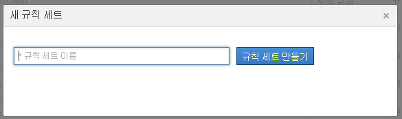

# 분류 규칙 세트

규칙 세트는 특정 변수에 대한 분류 규칙 그룹입니다. 규칙 세트에 변수를 적용합니다. 1개의 변수에 여러 규칙 세트를 만들려면 각 규칙 세트를 여러 보고서 세트에 적용해야 합니다.

## Classification rule sets {#concept_CD3D510F5070486584F3BB535AE41524}

규칙 세트는 특정 변수에 대한 분류 규칙 그룹입니다. 규칙 세트에 변수를 적용합니다. 1개의 변수에 여러 규칙 세트를 만들려면 각 규칙 세트를 여러 보고서 세트에 적용해야 합니다.

## 분류 규칙 빌더 페이지 {#section_C60B0888C76D49C596EF19F11808B718}

**[!UICONTROL Analytics]** &gt; **[!UICONTROL 관리]** &gt; **[!UICONTROL 분류 규칙 빌더]**

다음 필드와 옵션은 [!UICONTROL 분류 규칙 빌더]에서 사용할 수 있습니다.

<table id="table_A5D92409969747E39E041216A5AA32CD"> 
 <thead> 
  <tr> 
   <th colname="col1" class="entry"> 요소 </th> 
   <th colname="col2" class="entry"> 설명 </th> 
  </tr> 
 </thead>
 <tbody> 
  <tr> 
   <td colname="col1"> 
<a href="../../../components/c-classifications2/crb/classification-rule-set.md#task_86F216DFD2534FA181E64ABDF306782B" format="dita" scope="local"> 규칙 세트 추가</a> 
 </td> 
   <td colname="col2"> 
규칙 세트를 만듭니다. 
 </td> 
  </tr> 
  <tr> 
   <td colname="col1"> 
규칙 
 </td> 
   <td colname="col2"> 세트에 포함된 규칙 수를 표시합니다. </td> 
  </tr> 
  <tr> 
   <td colname="col1"> 
상태 
 </td> 
   <td colname="col2"> 초안 또는 활성과 같은 규칙 세트의 활동 상태를 표시합니다. 활성 규칙은 매일 처리되며, 일반적으로 한 달 이전의 분류 데이터를 조사합니다. 이 규칙은 자동으로 새로운 값을 확인하고 분류를 업로드합니다. </td> 
  </tr> 
  <tr> 
   <td colname="col1"> 
마지막 변경 
 </td> 
   <td colname="col2"> 규칙 세트가 언제 편집되었는지 나타냅니다. </td> 
  </tr> 
  <tr> 
   <td colname="col1"> 
복제 
 </td> 
   <td colname="col2"> 규칙 세트를 다른 변수에 적용하거나 다른 보고서 세트의 동일한 변수에 적용할 수 있도록 규칙 세트를 복제(복사)합니다. </td> 
  </tr> 
 </tbody> 
</table>

## Create a Classification Rule Set {#task_86F216DFD2534FA181E64ABDF306782B}

<!-- 

t_classification_rule_set.xml

 -->

분류 규칙 세트의 이름을 지정하고, 변수를 적용하고 덮어쓰기 설정을 지정합니다.

1. (Prerequisite) Define the classification structure in **[!UICONTROL Admin]** &gt; **[!UICONTROL Report Suites]**.

   (분류 추가에 대한 자세한 내용은 관리 도구 도움말의 [분류](https://marketing.adobe.com/resources/help/en_US/reference/index.html?f=classifications)를 참조하십시오.)

   변수에 대해 분류가 하나 이상 정의되어 있어야 변수가 [!UICONTROL 새 규칙 세트] 패널에 표시됩니다.

   **[!UICONTROL 관리]** &gt; **[!UICONTROL 보고서 세트]** &gt; **[!UICONTROL 트래픽]** &gt; **[!UICONTROL 트래픽 분류]** (또는 **[!UICONTROL 전환]** &gt; **[!UICONTROL 전환 분류]**) 에서 변수에 대한 분류를 만들 수 있습니다. 그런 다음, 변수를 선택하고 **[!UICONTROL 분류 추가를 클릭합니다]**.

1. To create the rule set, click **[!UICONTROL Admin]** &gt; **[!UICONTROL Classification Rule Builder]** &gt; **[!UICONTROL Add Rule Set]**.

   

1. Name the rule set, then click **[!UICONTROL Create Rule Set]**.
1. 편집할 규칙 세트를 선택합니다.

   

1. Click **[!UICONTROL Select Report Suites and Variables]**.

   보고서 세트 및 변수 목록은 로그인 회사의 모든 보고서 세트에서 사용할 수 있는 모든 분류된 변수로 채워집니다. 보고서 세트의 단일 변수는 하나의 규칙 세트에만 속할 수 있습니다.

   자세한 내용은 *`Variable`*([분류 규칙 빌더](../../../components/c-classifications2/crb/classification-rule-definitions.md#section_4D1A70A607C9419EB2116A5174EACB72) 페이지의 정의에서)를 참조하십시오.
1. Specify the report suites and variables to use, then click **[!UICONTROL Save]**.
1. Continue by [adding classification rules](../../../components/c-classifications2/crb/classification-rule-set.md#task_86F216DFD2534FA181E64ABDF306782B) to the rule set.
