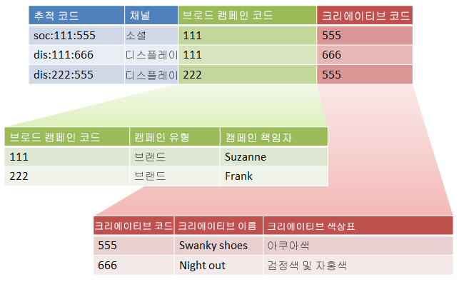
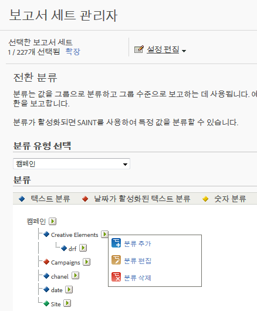

# 하위 분류 및 규칙 빌더 - 활용 사례

분류 규칙 빌더를 하위 분류와 결합하여 분류 관리를 단순화하고 필요한 규칙 수를 줄일 수 있습니다. 추적 코드가 따로 분류하려는 코드로 구성되어 있는 경우 이러한 작업을 원할 수 있습니다.

## 하위 분류 및 규칙 빌더 - 활용 사례 {#concept_6C8672C242544D7487E82886BBFABE6E}

분류 규칙 빌더를 하위 분류와 결합하여 분류 관리를 단순화하고 필요한 규칙 수를 줄일 수 있습니다. 추적 코드가 따로 분류하려는 코드로 구성되어 있는 경우 이러한 작업을 원할 수 있습니다.

See [Sub-Classifications](../../../components/c-classifications2/c-sub-classifications.md#concept_19EE5513A7DC43C38CC396E96F306CFE) for conceptual information about sub-classifications.

**예**

다음 추적 코드를 가정해보십시오.

`channel:broad_campaign:creative`

A classification hierarchy allows you to apply a classification to a classification (called *`sub-classification`*). 즉, 다중 테이블에 관계형 데이터베이스와 같은 가져오기 기능을 사용할 수 있음을 의미합니다. 하나의 테이블이 전체 추적 코드를 키에 매핑하고, 다른 테이블이 해당 키를 다른 테이블에 매핑합니다.

이 구조를 작성한 후에 [분류 규칙 빌더](../../../components/c-classifications2/crb/classification-rule-builder.md)를 사용하여 조회 테이블(이전 이미지에서 녹색 및 빨간색 테이블)만 업데이트하는 작은 파일을 업로드할 수 있습니다. 그런 후 규칙 빌더를 사용하여 주 분류 테이블을 최신 상태로 유지할 수 있습니다.

다음 작업은 해당 방법을 설명합니다.

## Set up Sub-Classifications using the Rule Builder{#task_2D9016D8B4E84DBDAF88555E5369546F}

<!-- 

t_rule_builder_subclass.xml

 -->

규칙 빌더를 사용하여 하위 분류를 업로드하는 방법을 설명하는 예제 단계입니다.

>[!NOTE]
>
>이 단계에서는 하위 분류 및 규칙 빌더에 설명된 사용 [사례를 수행하는 방법을 설명합니다](../../../components/c-classifications2/crb/sub-classification-rule-builder.md).

1. Create classifications and sub-classifications in the [Classification Manager](https://marketing.adobe.com/resources/help/en_US/reference/classifications.html).

   예:

   

1. In the [Classifications Rule Builder](../../../components/c-classifications2/crb/classification-rule-builder.md#concept_C1F219E622044D43852EF5168FF7192A), classify the sub-classification key from the original tracking code.

   정규 표현식을 사용하여 이 작업을 수행합니다. 이 예제에서 *`Broad Campaign code`*&#x200B;를 채우기 위한 규칙은 다음 정규 표현식을 사용합니다.

   | `#` | 규칙 유형 | 일치 | 분류 설정 | 종료 |
   |---|---|---|---|---|
   |  | 정규 표현식 | `[^\:]:([^\:]):([^\:]`) | 브로드 캠페인 코드 | `$1` |
   |  | 정규 표현식 | `[^\:]:([^\:]):([^\:]`) | 크리에이티브 코드 | `$2` |

   >[!NOTE]
   >
   >At this point, you do not populate the sub-classifications *`Campaign Type`* and *`Campaign Director`*.

1. 지정된 하위 분류만 포함하는 분류 파일을 업로드합니다.

   복수 [수준 분류를 참조하십시오](../../../components/c-classifications2/c-sub-classifications.md#concept_35AD906CDDC4441DAAF70664CF76AA0A).

   예:

   | 키 | 채널 | 브로드 캠페인 코드 | 광범위한 캠페인 코드&amp;Hat;캠페인 유형 | 광범위한 캠페인 코드&amp;Hat;캠페인 디렉터 | ... |
   |---|---|---|---|---|---|
   | * |  | 111 | 브랜드 | Suzanne |  |
   | * |  | 222 | 브랜드 | Frank |  |

1. 조회 테이블을 유지 관리하려면 작은 파일(위에 표시)을 업로드합니다. 

   You would upload this file, for example, when a new *`Broad Campaign code`* is introduced. 이 파일은 이전에 분류한 값이 적용될 수 있습니다. 마찬가지로 새 하위 분류(예: 의 *`Creative Theme`* 하위 분류로 *`Creative code`*&#x200B;전체 분류 파일이 아닌 하위 분류 파일만 업로드합니다.

   보고 기능에서 이러한 하위 분류는 최고급 분류와 정확히 동일하게 작동합니다. 따라서 이러한 분류를 사용하는 데 필요한 관리 부담이 줄어듭니다.
