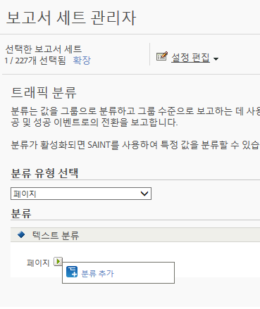

# 트래픽 분류

트래픽 분류를 사용하면 트래픽 변수(prop)를 분류할 수 있습니다. 트래픽 분류에는 텍스트 분류만 사용할 수 있습니다.

## Traffic classifications {#concept_028079B29A9C412AA68910A87E11176F}

트래픽 분류를 사용하면 트래픽 변수(prop)를 분류할 수 있습니다. 트래픽 분류에는 텍스트 분류만 사용할 수 있습니다.

트래픽 분류 페이지에서 선택된 보고서 세트에 대한 분류를 만들 수 있습니다. 한 번 분류하면, 키 데이터를 사용하여 생성할 수 있는 모든 보고서를 연관된 속성을 사용하여 생성할 수 있습니다.

분류를 활성화한 후에 [분류 가져오기](../../components/c-classifications2/c-classifications-importer/c-working-with-saint.md#concept_08ED8C7A86C64E7DA5DE3044BB94B2EA)를 사용하여 해당 분류에 특정 값을 할당할 수 있었습니다.

## Add a Traffic Classification {#task_4DB49CCB1D764483907BC33A5CEB7315}

<!-- 

t_classification_add_traffic.xml

 -->

선택한 보고서 세트의 분류를 추가 또는 편집하는 방법을 설명하는 단계입니다.

1. Click **[!UICONTROL Admin]** &gt; **[!UICONTROL Report Suites]** in the Suite header.
1. 보고서 세트를 선택합니다.
1. **분류 유형 선택** 필드에서 분류를 추가하려는 변수를 선택합니다.
1. Click **[!UICONTROL Edit Settings]** &gt; **[!UICONTROL Traffic]** &gt; **[!UICONTROL Traffic Classifications]**.

   

1. Mouse over the **[!UICONTROL Edit Classification]** icon, then select **[!UICONTROL Add Classification]** or **[!UICONTROL Edit Classification]**.
1. **[!UICONTROL 텍스트 분류]** 대화 상자에서 원하는 대로 분류를 구성합니다.

   **[!UICONTROL 이름:]** 분류 이름을 지정합니다.

   **[!UICONTROL 설명]**: 더 자세한 설명을 제공합니다.
1. **[!UICONTROL 저장을 클릭합니다]**.
