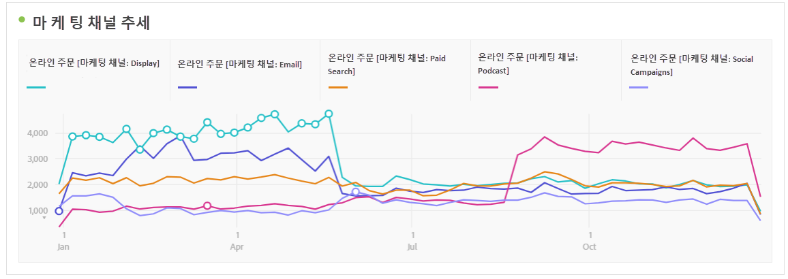

# 마케팅 채널 분석

어느 마케팅 채널이 가장 효과적인지 알고 싶을 것입니다. 그러한 채널을 이용하여 노력을 향상시키고 최적의 마케팅 효과를 얻을 수 있습니다. Adobe Analytics에서는 작업 공간의 마케팅 채널 차원 및 지표가 주문, 매출 등에 대한 다양한 채널의 영향을 추적하는 데 도움이 되는 도구 중 하나이며, 유용한 채널 인사이트를 제공합니다. 마케팅 채널과 관련하여 사용할 수 있는 차원 및 지표는 다음과 같습니다.

| 차원/지표 | 정의 |
|---|---|
| 마케팅 채널 | 권장되는 마케팅 채널 차원입니다. 런타임 시 속성 IQ 모델을 적용할 수 있습니다. 범용 마케팅 채널 차원은 마지막 터치 채널 차원과 동일하게 동작하지만 다른 속성 모델과 함께 마케팅 채널을 사용할 때 혼동을 방지하기 위해 다르게 레이블이 지정됩니다. |
| 마지막 터치 채널 | 속성 모델이 사전 적용되어 변경할 수 없는 기존 차원입니다. |
| 첫 번째 터치 채널 | 속성 모델이 사전 적용되어 변경할 수 없는 기존 차원입니다. |
| 마케팅 채널 인스턴스 | 이 지표... |
| 새 참여 횟수 | 채널에 &#39;첫 번째 터치&#39; 할당이 적용되는 경우에만 증가하는 기존 지표입니다. |

## 기본 분석

이 자유 형식 테이블은 각 마케팅 채널에 대한 온라인 주문, 온라인 매출 및 전환율 지표를 보여줍니다.

여기서는 도넛형 차트에 나와 있는 각 마케팅 채널의 온라인 주문 및 온라인 매출을 확인할 수 있습니다.

이 선 차트는 시간에 따른 다양한 채널에 대한 온라인 주문 트렌드를 보여줍니다.

## 고급 분석

마케팅 채널 세부 사항은 각 채널을 더 깊이 있게 분석하여 특정 캠페인, 배치 등을 보여줍니다. 각 마케팅 채널을 다음과 같이 세부적으로 분류할 수 있습니다.

## 속성 모델 적용

[속성 IQ](https://docs.adobe.com/content/help/ko-KR/analytics/analyze/analysis-workspace/panels/attribution/use-attribution.html)를 사용하여 다른 속성 모델을 즉시 적용할 수 있습니다.

서로 다른 속성 모델을 적용할 때 동일한 지표(온라인 주문)가 다른 결과를 어떻게 생성하는지 확인하십시오.

다음은 속성 IQ를 자세히 설명하는 몇 가지 비디오입니다. [속성 IQ 재생 목록](https://www.youtube.com/playlist?list=PL2tCx83mn7GuDzYEZ8jQlaScruZr3tBTR)입니다.

## 교차 탭 마케팅 분석

기존의 첫 번째 접촉 채널과 마지막 접촉 채널을 사용하여 채널 상호 작용에 대한 유용한 보기를 얻을 수 있습니다.

[이 비디오](https://www.youtube.com/watch?v=M3EOdONa-3E)에서 교차 탭 마케팅 분석에 대해 자세히 알아보십시오.